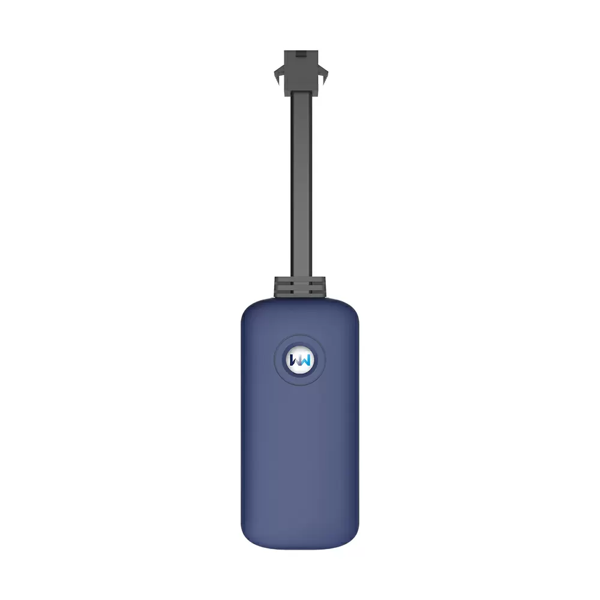

# WanWay - G19

El WanWay G19 es un rastreador GPS pequeño y compacto que combina tecnología GSM y GPS en una carcasa ligera. Cuenta con antena y sensores integrados y ofrece rastreo en tiempo real, reproducción de rutas, notificaciones por SMS y múltiples alertas, como alarma por exceso de velocidad. El dispositivo tiene clasificación IP67 para protección contra el agua, mide 74 mm de largo x 35 mm de ancho x 13 mm de alto y pesa aproximadamente 29 g, lo que facilita su ocultación e instalación en una amplia variedad de vehículos y activos. El G19 opera en bandas cuádruples y reporta la ubicación con una precisión GPS declarada de alrededor de 5 metros, además de aceptar un amplio rango de voltaje de entrada.

Como dispositivo compatible con Plaspy, el G19 ofrece las funciones esenciales que la mayoría de los administradores de flotas y responsables de activos esperan en un rastreador conectado. Su factor de forma compacto y su diseño impermeable lo hacen adecuado para entornos de flotas mixtas y uso exterior, mientras que funciones estándar como la ubicación en vivo, la reproducción de trazas y las alertas encajan de forma natural con las capacidades de monitoreo e informes de Plaspy. Plaspy puede ingerir los datos del G19 para proporcionar visibilidad centralizada, supervisión operacional y reproducción histórica para análisis y seguimiento.

## Aspectos clave

- Perfil compacto y ligero de aproximadamente 74 × 35 × 13 mm y 29 g para fácil ocultamiento
- Clasificación IP67 que protege contra agua y condiciones de vadeo en vehículos
- Rastreo en tiempo real y reproducción de trazas para revisar rutas históricas
- Antena y sensores integrados con chip GPS MTK y precisión aproximada de 5 m
- Múltiples protecciones y alertas, incluida alarma por exceso de velocidad y notificaciones por SMS
- Amplio rango de voltaje de operación compatible con instalaciones vehiculares típicas

## Cómo funciona con Plaspy

Cuando usted conecta el G19 a Plaspy, el dispositivo transmite información de ubicación y eventos que Plaspy muestra, almacena y utiliza en flujos operacionales. Plaspy centraliza las señales de los dispositivos para que los equipos puedan monitorizar activos desde una única interfaz y combinar los eventos del G19 con otros datos de la flota.

- Visualización en tiempo real de las unidades G19 sobre los mapas de Plaspy para visibilidad inmediata
- Reproducción histórica de trazas en Plaspy para revisar rutas y líneas de tiempo
- Reenvío de alertas y gestión de notificaciones para que alarmas como exceso de velocidad aparezcan en los paneles de Plaspy
- Supervisión y agrupamiento a nivel de flota para administrar múltiples dispositivos G19 en conjunto
- Opciones de informes y exportación en Plaspy que incorporan posiciones y el historial de eventos del G19

## Casos de uso típicos

- Rastreo de vehículos personales con instalaciones discretas y compactas
- Monitoreo de flotas pequeñas y medianas para entregas y vehículos de servicio
- Seguimiento de vehículos de alquiler y compartidos con historial de reproducción y alertas
- Protección de equipos y activos en exteriores que requieren resistencia al agua
- Escenarios donde se prefieren dispositivos livianos y discretos

## Por qué elegir este rastreador con Plaspy

El WanWay G19 es una opción práctica para organizaciones que requieren un rastreador pequeño y resistente con las funciones básicas para monitoreo de ubicación y alertas. Su clasificación impermeable y su tamaño compacto lo hacen versátil tanto para uso en carretera como para activos al aire libre, mientras que funcionalidades como la reproducción de trazas y las alarmas por exceso de velocidad cubren necesidades operativas comunes sin añadir complejidad innecesaria.

Al integrarlo con Plaspy, el G19 forma parte de un flujo de gestión de flotas más amplio: Plaspy centraliza los datos del dispositivo, destaca las alertas y ofrece informes históricos que facilitan la toma de decisiones y la supervisión. Para flotas y propietarios de activos que buscan un rastreador liviano que encaje en una plataforma de monitoreo ya establecida, el G19 ofrece una opción sencilla y alineada con los casos de uso habituales.

Para obtener más información sobre Plaspy y cómo dispositivos compatibles como el WanWay G19 se integran en nuestra plataforma visite https://www.plaspy.com. Las especificaciones del producto, disponibilidad y datos del fabricante pueden cambiar con el tiempo, por lo que le recomendamos verificar las especificaciones actuales en el sitio oficial de WanWay https://www.wanwaytech.net/.
