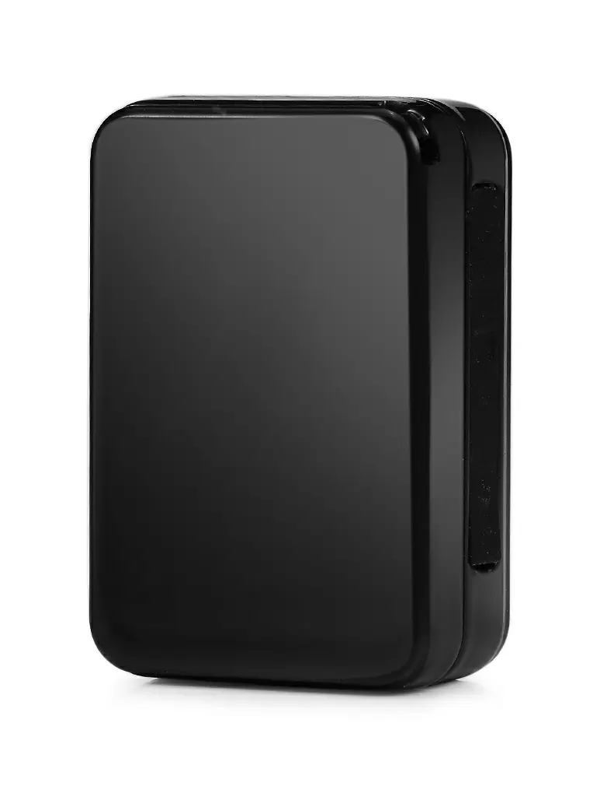

# WanWay - GP10

El WanWay GP10 es un dispositivo de localización y seguimiento personal compacto diseñado para necesidades diarias. Con unas dimensiones de 48x33x17 mm, es lo suficientemente pequeño para uso personal y tan portátil que puede colocarse en objetos, llevarse para seguridad personal o mantenerse en mascotas. Entre sus funciones principales destacan actualizaciones de ubicación en tiempo real, geocercas configurables por el usuario, notificaciones por SMS para eventos clave y monitoreo de voz remoto.

Este modelo figura como compatible con Plaspy, lo que lo convierte en una opción práctica para quienes desean centralizar el seguimiento y las alertas en una sola plataforma de gestión. Con Plaspy usted puede visualizar actualizaciones de ubicación en mapas, administrar geocercas, recibir notificaciones de eventos y conservar un historial de la actividad del dispositivo, lo que hace al GP10 útil tanto para usuarios particulares como para escenarios de flota ligera donde la visibilidad y las alertas oportunas son importantes.

## Características principales

- Factor de forma compacto ideal para llevar personalmente o adherir a pequeños activos
- Rastreo en tiempo real para visibilidad de ubicación actualizada
- Geocercas configurables por el usuario con notificaciones instantáneas de entrada y salida
- Alertas por SMS para batería baja, eventos de geocerca y señales SOS
- Monitoreo de voz remoto para mayor conocimiento situacional
- Batería integrada de 800 mAh para uso prolongado de seguimiento y posicionamiento

## Cómo funciona con Plaspy

El GP10 transmite información de ubicación y eventos que Plaspy presenta en su interfaz, permitiendo monitoreo y alertas centralizadas entre dispositivos. Plaspy actúa como la plataforma para visualizar ubicaciones, gestionar geocercas y encaminar notificaciones para que los equipos puedan responder a los eventos de forma eficiente.

- Vea la ubicación del dispositivo en tiempo real en los mapas de Plaspy y revise el historial de movimiento
- Configure y administre geocercas en Plaspy para recibir alertas de entrada y salida
- Envíe notificaciones por SMS y eventos del dispositivo mediante las opciones de notificación de Plaspy para mantener la conciencia situacional
- Mantenga un registro de eventos e historial de ubicaciones en Plaspy para reportes y revisiones operativas
- Monitoree el estado del dispositivo y las alertas de batería desde el panel de Plaspy para una supervisión proactiva

## Casos de uso típicos

- Seguimiento de seguridad personal para niños, personas mayores o trabajadores solitarios
- Localización de objetos pequeños de valor y activos portátiles
- Rastreo de mascotas cuando se requiere un dispositivo compacto
- Monitoreo y supervisión de artículos en alquiler por periodos cortos
- Visibilidad de la ubicación del personal de campo en operaciones de baja intensidad

## Por qué elegir este rastreador con Plaspy

El WanWay GP10 combina un tamaño físico reducido con funciones esenciales de seguimiento que encajan en la supervisión personal y de pequeños activos. Su reporte en tiempo real, capacidad de geocercas, alertas por SMS y monitoreo de voz remoto ofrecen un conjunto de funciones útil para quienes necesitan visibilidad de ubicación y notificaciones de eventos sin hardware complejo.

Al integrarlo con Plaspy, el GP10 pasa a formar parte de un flujo de trabajo más amplio de monitoreo y gestión. Plaspy consolida ubicaciones de dispositivos, alertas e historial para que organizaciones e individuos mantengan conciencia situacional, revisen actividad previa y configuren notificaciones acordes a sus necesidades operativas. Gracias al diseño portátil del GP10 y su conjunto de funciones, es una opción práctica para quienes buscan un rastreo simple y confiable integrado en Plaspy.

Para obtener más información sobre cómo Plaspy puede gestionar dispositivos WanWay visite https://www.plaspy.com. Las especificaciones del producto, la disponibilidad y los detalles del fabricante pueden cambiar con el tiempo, por lo que se recomienda verificar la información técnica y los términos de garantía actuales en el sitio oficial de WanWay https://www.wanwaytech.net/.
