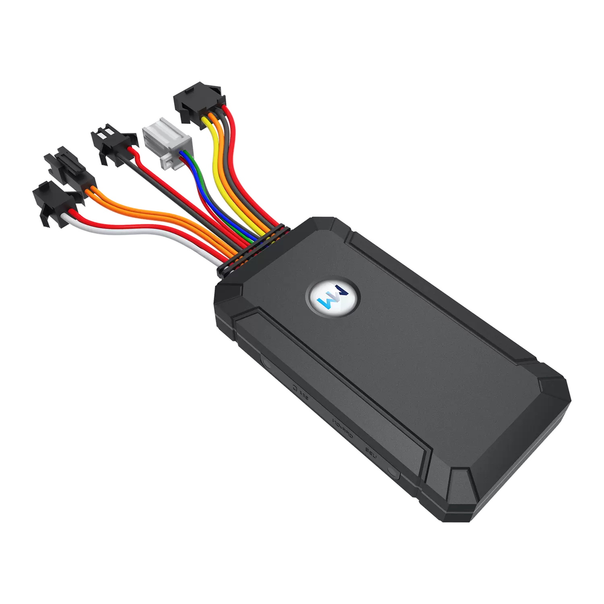

# WanWay - GS05

El GS05 de WanWay es un rastreador GPS 3G compacto pensado para ofrecer rastreo vehicular sencillo y gestión de flotas. Integra posicionamiento GPS, conectividad 3G GSM, antena interna, varios sensores a bordo y un conector de 11 pines en un formato reducido. Existe la opción de un micrófono incorporado para escucha remota cuando la legislación y la privacidad locales lo permiten.

Como dispositivo compatible con Plaspy, el GS05 se integra fácilmente en los paneles y vistas móviles de Plaspy. Permite a propietarios de vehículos y administradores de flotas recibir datos de ubicación, telemetría y eventos a través de Plaspy para obtener visibilidad en tiempo real, informes básicos de telemetría y flujos de trabajo comunes como alertas antirrobo y revisión de rutas.

## Aspectos destacados

- Compatible con Plaspy para rastreo centralizado en tiempo real y supervisión de flotas
- Conectividad 3G GSM con posicionamiento GPS y antena integrada para recepción confiable
- Factor de forma compacto y conector de 11 pines para instalación flexible en vehículos
- Soporte opcional de micrófono para monitoreo de audio remoto donde esté permitido
- Varios sensores a bordo que entregan telemetría integrable en Plaspy
- Batería interna de respaldo de 180 mAh para mantener informes básicos durante cortes temporales de energía
- Adecuado tanto para monitoreo de vehículos individuales como para despliegues de flota escalables

## Cómo funciona con Plaspy

El GS05 transmite ubicación y telemetría de sensores mediante la red celular para que Plaspy pueda procesar actualizaciones de posición y eventos para visualización, alertas e informes históricos. Plaspy consolida los datos entrantes en mapas en vivo, reproducción de rutas e informes configurables para apoyar la supervisión operativa.

- Las actualizaciones de ubicación y telemetría en tiempo real aparecen en Plaspy para seguimiento en vivo y historial de rutas
- La entrada de micrófono puede utilizarse para monitoreo de audio situacional cuando se dispone del micrófono y de los permisos legales correspondientes
- Los reportes de sensores y eventos como movimiento e ignición, cuando están disponibles por cableado, se agregan a los flujos de datos de Plaspy
- Los paneles y alertas configurables de Plaspy soportan notificaciones antirrobo, eventos de geocerca y resúmenes de actividad
- La integración con las herramientas de flota de Plaspy permite combinar el rastreo GPS con informes operativos y supervisión de rutas

## Casos de uso habituales

- Gestión de flotas con flujos de ubicación en vivo y telemetría consolidada para despacho
- Monitoreo antirrobo con alertas y rápida localización para recuperación
- Supervisión de conductores y registro de viajes con reproducción de rutas para revisión de incidentes
- Conciencia situacional mediante la entrada de micrófono opcional para seguridad o investigaciones cuando esté permitido
- Monitoreo de activos para vehículos ligeros o equipos donde se prefiera un rastreador compacto

## Por qué elegir este rastreador con Plaspy

El GS05 ofrece una combinación práctica de conectividad, telemetría básica y opciones de instalación que se ajustan a las necesidades habituales de rastreo vehicular. Su diseño compacto, antena integrada y conector de 11 pines facilitan la adaptación a muchas instalaciones, mientras que la batería de respaldo ayuda a mantener los reportes durante breves interrupciones de energía. El soporte opcional de micrófono añade una capa adicional de capacidad situacional cuando se utiliza conforme a la normativa aplicable.

Si busca un dispositivo sencillo y compatible con Plaspy para rastreo de vehículos y flotas en tiempo real, el GS05 es una opción sensata para organizaciones que requieren servicios de ubicación confiables sin complejidad innecesaria. Para obtener más información sobre Plaspy y su compatibilidad con dispositivos visite https://www.plaspy.com. Las especificaciones del producto y los datos del fabricante pueden cambiar con el tiempo por lo que verifique las especificaciones actuales en el sitio de WanWay https://www.wanwaytech.net/.
