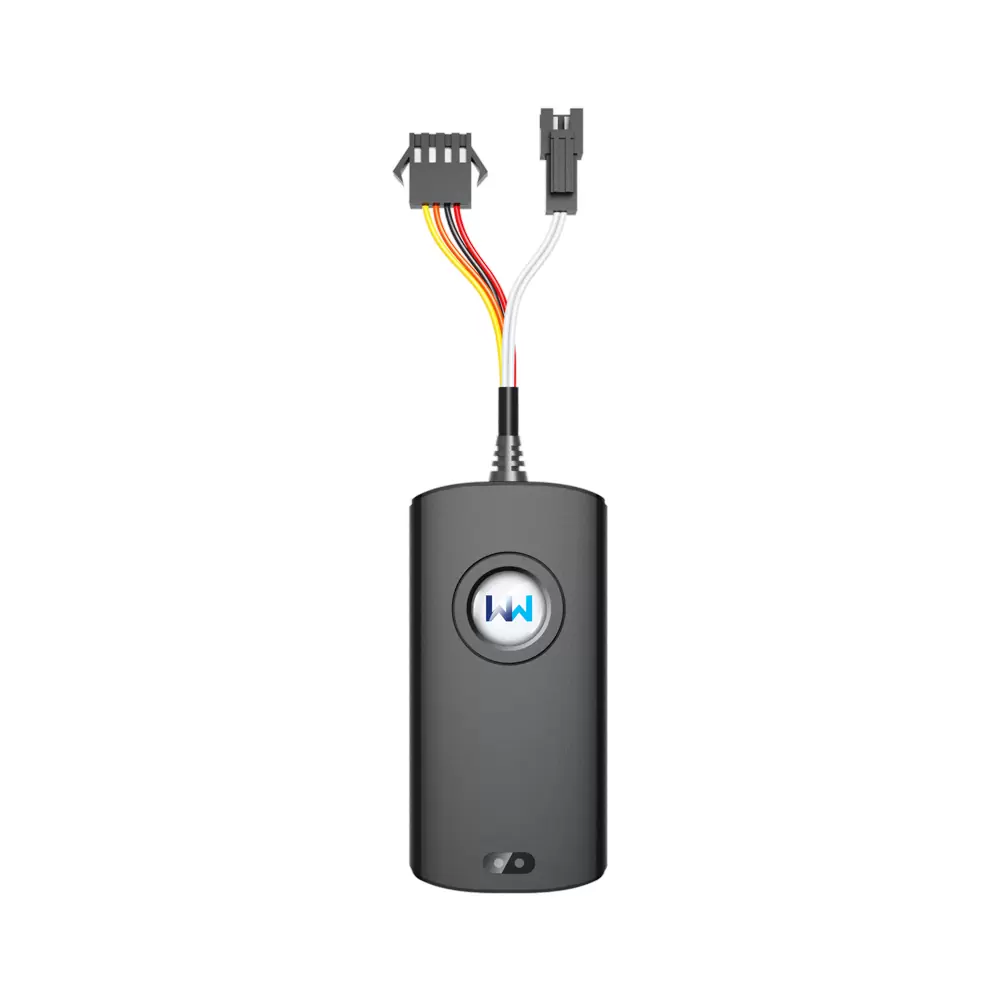

# WanWay - GS10

El WanWay GS10 es un rastreador GPS vehicular inteligente que combina comunicación inalámbrica 4G full netcom con navegación por satélite GPS y BDS. Diseñado como un equipo compacto y ligero, el GS10 está pensado para una amplia variedad de vehículos y sectores, entre ellos aseguradoras, flotas empresariales, fabricantes y concesionarios, propietarios particulares, flotas de vehículos eléctricos, automóviles de pasajeros, taxis y empresas de alquiler. Ofrece seguimiento en tiempo real y funciones de supervisión que cubren necesidades comunes de seguridad y operación.

Como dispositivo compatible con Plaspy, el GS10 integra su información de ubicación y estado dentro de la plataforma de gestión y seguimiento de Plaspy para proporcionar visibilidad y control centralizado. Funciones clave como el reporte de posición en tiempo real, la detección de ACC y el corte remoto de suministro (gasolina o electricidad) se traducen en acciones dentro de Plaspy para alertas, monitoreo y flujos operativos. Su tamaño reducido y su amplio rango de voltaje de entrada lo hacen práctico para despliegues mixtos gestionados desde Plaspy.

## Puntos clave

- Comunicación inalámbrica 4G full netcom para conectividad de datos confiable
- Navegación por satélite GPS y BDS para información de posición precisa
- Seguimiento en tiempo real para visibilidad actualizada de la ubicación
- Función de corte remoto para inmovilizar el suministro de gasolina o electricidad cuando sea necesario
- Detección de ACC para registrar eventos de encendido y apagado
- Factor de forma compacto y liviano apto para instalación discreta
- Amplio rango de voltaje de entrada y batería de respaldo integrada para operación continua

## Cómo funciona con Plaspy

Cuando se conecta a Plaspy, el GS10 transmite a la plataforma sus datos de ubicación y eventos, de modo que los administradores de flota y operadores pueden supervisar los vehículos desde una única interfaz. Plaspy utiliza esas señales del dispositivo para mostrar mapas, alertas y registros históricos útiles en las operaciones diarias y la respuesta a incidentes.

- Visualización en vivo de la ubicación en los mapas de Plaspy para visibilidad en tiempo real de la flota
- Registro de eventos como encendido y apagado de ACC para analizar patrones de uso del vehículo
- Alertas y notificaciones en Plaspy cuando se cumplen reglas predefinidas
- Control de inmovilización remota disponible a través de Plaspy cuando el dispositivo lo soporta
- Reproducción histórica de rutas e informes para revisiones operativas y auditorías

## Casos de uso habituales

- Telemática para aseguradoras y monitoreo para recuperación de vehículos
- Seguimiento y supervisión operativa de flotas empresariales
- Seguridad y control de activos en flotas de vehículos de alquiler
- Monitoreo de taxis y vehículos de pasajeros para despacho y seguridad
- Gestión de flotas de vehículos eléctricos donde se prefieren dispositivos de seguimiento compactos

## Por qué elegir este rastreador con Plaspy

El WanWay GS10 ofrece un equilibrio entre diseño compacto y funciones prácticas para vehículos, lo que lo hace adecuado para los casos de uso comunes de Plaspy. Su seguimiento en tiempo real, la detección de ACC y la capacidad de corte remoto proporcionan las herramientas básicas necesarias para seguridad, control de flota y respuesta a incidentes sin añadir complejidad innecesaria. Para organizaciones con flotas mixtas, su amplio rango de voltaje y su tamaño reducido lo convierten en una opción adaptable que puede gestionarse junto a otros dispositivos dentro de Plaspy.

Si desea conocer más sobre cómo el GS10 puede integrarse en su implementación de Plaspy, visite el sitio web de Plaspy en https://www.plaspy.com para explorar las funciones de la plataforma y las capacidades de gestión de flotas. Las especificaciones y la disponibilidad de producto pueden cambiar con el tiempo, por lo que recomendamos verificar los detalles técnicos actuales y la compatibilidad en la documentación del fabricante en https://www.wanwaytech.net/ antes de tomar decisiones de compra.
