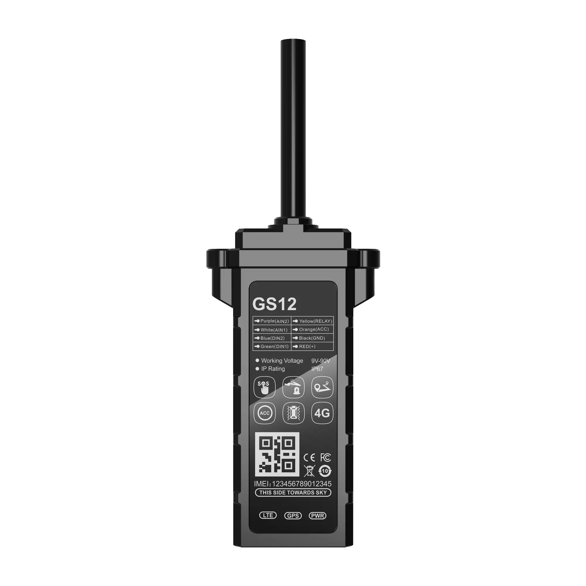

# WanWay - GS12

El WanWay GS12 es un rastreador GPS vehicular inteligente diseñado para ofrecer seguimiento fiable en tiempo real y seguridad del vehículo. Basado en comunicación inalámbrica 4G full netcom y navegación satelital GPS BDS, el GS12 reporta posición y telemetría de eventos del vehículo como detección de ACC, alarma por desensamblaje, alertas de exceso de velocidad, estadísticas de kilometraje y corte remoto de gasolina o electricidad. Su conjunto de funciones está orientado a despliegues vehiculares que requieren datos de ubicación constantes y controles antirrobo prácticos.

Como dispositivo compatible con Plaspy, el GS12 se integra con la plataforma para entregar flujos de ubicación, alertas basadas en eventos e informes operativos para administradores de flotas y activos. Al conectarlo a Plaspy, las actualizaciones de posición y los eventos de estado del rastreador se incorporan al monitoreo centralizado, ayudando a los equipos con despacho, respuesta ante robos y procesos de reporte sin añadir complejidad innecesaria.

## Aspectos clave

- Conectividad 4G full netcom para transmisión de datos consistente en amplias zonas con cobertura celular
- Navegación por satélite GPS y BDS para fijaciones de posición confiables en distintas regiones
- Funciones de seguridad integradas, incluyendo alarma por desensamblaje y corte remoto de gasolina o electricidad para intervenciones antirrobo
- Telemetría vehicular como detección de ACC, alertas de exceso de velocidad y estadísticas de kilometraje para respaldar reportes y supervisión operativa
- Diseñado para flotas, operaciones de alquiler, aseguradoras, taxis y propietarios particulares de vehículos
- Compatibilidad con Plaspy para habilitar seguimiento en tiempo real, alertas y gestión centralizada de dispositivos

## Cómo funciona con Plaspy

Una vez dado de alta en Plaspy, el GS12 envía ubicación GNSS y telemetría de eventos del vehículo a través de enlaces celulares para que Plaspy muestre posiciones en vivo y exponga eventos al personal de operaciones. Plaspy procesa los datos del dispositivo para poblar mapas, activar notificaciones basadas en reglas y generar informes que apoyan los flujos de trabajo de flotas y las respuestas de seguridad.

- Actualizaciones en tiempo real de ubicación y telemetría para seguimiento en mapas y visibilidad operativa
- Alertas por eventos como estado de encendido, alarmas por desensamblaje y excesos de velocidad para activar notificaciones y acciones de respuesta
- Estadísticas de kilometraje para apoyar reportes y procesos de control de combustible dentro de Plaspy
- Control remoto de inmovilizador mediante comandos de corte de gasolina o electricidad desde la plataforma para mitigar robos
- Gestión centralizada de dispositivos e informes para simplificar el monitoreo a escala de flotas y el análisis histórico

## Casos de uso típicos

- Gestión de flotas y supervisión de rutas para operadores de vehículos comerciales
- Telemática para aseguradoras, registro de eventos e historial de ubicaciones para evaluación de riesgos
- Flujos de trabajo de anti robo y recuperación de vehículos mediante alarmas por desensamblaje y controles remotos de corte
- Operaciones de alquiler y taxis que requieren monitoreo de uso y opciones de intervención remota
- Soporte para vehículos eléctricos y de nueva energía donde se necesitan funciones de kilometraje y control remoto

## Por qué elegir este rastreador con Plaspy

Combinar el GS12 con Plaspy ofrece una solución práctica para organizaciones que necesitan rastreo vehicular confiable y controles basados en eventos sin complejidad excesiva. El GS12 proporciona las corrientes esenciales de posición y telemetría que Plaspy utiliza para crear alertas, paneles e informes, mientras que las funciones de corte remoto y alarma por desensamblaje aportan herramientas directas para la respuesta ante robos y los procesos de inmovilización.

Si sus operaciones requieren visibilidad de ubicación en tiempo real, telemetría vehicular básica y monitoreo centralizado, el WanWay GS12 y Plaspy juntos cubren las necesidades principales de seguimiento y seguridad de flotas. Para saber más sobre Plaspy y cómo gestiona las integraciones de dispositivos, visite https://www.plaspy.com. Las especificaciones del producto, la disponibilidad y los detalles del fabricante pueden cambiar con el tiempo, por lo que recomendamos verificar las capacidades actuales del dispositivo en el sitio de WanWay https://www.wanwaytech.net/.
