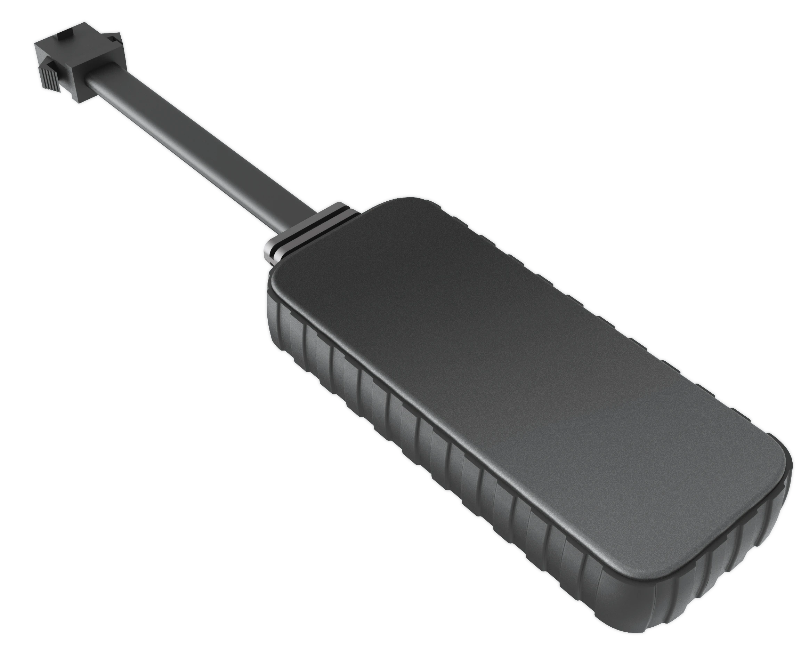

# WanWay - H29P

El WanWay H29P es un rastreador GPS orientado a la prevención de robo, diseñado para el mercado vehicular con especial enfoque en electromovilidad y protección de motocicletas. Combina telemetría concisa y reporte inmediato de alarmas con la capacidad de inmovilizador remoto, lo que permite a propietarios y operadores reaccionar con rapidez ante robos o manipulación. El equipo prioriza un rendimiento en línea rápido y un receptor GNSS de alta sensibilidad para ofrecer actualizaciones de posición fiables en el monitoreo diario y la respuesta a incidentes.

Como modelo compatible con Plaspy, el H29P entrega las señales clave que Plaspy necesita para seguimiento en tiempo real, alertas y supervisión de flotas. Al integrarlo con Plaspy, usted obtiene reglas basadas en el estado de encendido, alertas por vibración y manipulación, y reporte del estado del inmovilizador remoto, facilitando la incorporación de flujos de trabajo antifurto en sus rutinas de monitoreo e informes.

## Aspectos clave

- Compatible con Plaspy para una integración sencilla en paneles de seguimiento en tiempo real y gestión de flotas
- Funciones enfocadas en la prevención de robo, incluyendo detección de encendido ACC, alarma por vibración y manipulación, e inmovilizador remoto
- Receptor GPS de alta sensibilidad diseñado para adquisición más rápida de satélites y mayor fiabilidad en la posición
- Amplio rango de voltaje de operación de 9V a 90V que soporta diversas plataformas de dos ruedas y vehículos eléctricos ligeros
- Rendimiento en línea rápido para reducir el tiempo al primer fix y acelerar el envío de eventos a la plataforma
- Factor de forma compacto y de grado vehicular, apropiado para instalaciones discretas en motocicletas, scooters y vehículos eléctricos ligeros

## Cómo funciona con Plaspy

Una vez conectado a Plaspy, el H29P aporta actualizaciones de ubicación y estado que alimentan los mapas, alertas y funciones de reporte de Plaspy. La plataforma consume la telemetría del rastreador para ofrecer visibilidad en vivo, activar flujos de trabajo configurados y almacenar registros históricos para análisis operativo e investigación de incidentes.

- Ubicación GPS en tiempo real y estado de movimiento visibles en los mapas en vivo de Plaspy
- Detección de encendido ACC utilizada por Plaspy para aplicar reglas y reportes basados en el estado de ignición
- Alarmas por vibración y manipulación enviadas a Plaspy para generar alertas inmediatas ante posibles robos o actos vandálicos
- Estado del inmovilizador remoto reportado a Plaspy para que los operadores puedan ver el corte y considerarlo en sus flujos de respuesta
- Historial de eventos e informes en Plaspy que incorporan la telemetría del H29P para auditorías y análisis de desempeño

## Casos de uso típicos

- Protección antifurto de motocicletas y scooters eléctricos con alarma por vibración y control de inmovilizador remoto
- Gestión de flotas con vehículos de voltajes mixtos que se benefician de un solo rastreador compatible con sistemas de 9V a 90V
- Servicios de alquiler y micromovilidad donde el reporte rápido y la intervención remota reducen pérdidas
- Protección de vehículos de alto valor donde los fixes GPS rápidos y la detección de encendido mejoran las posibilidades de recuperación
- Operaciones comerciales ligeras que requieren rastreadores compactos para monitoreo discreto y disuasión de robos

## Por qué elegir este rastreador con Plaspy

El H29P es una opción práctica para operadores que necesitan capacidades concretas antifurto combinadas con señales de rastreo confiables. Su diseño se alinea con los flujos de trabajo de Plaspy al ofrecer estado de encendido, eventos de alarma y actualizaciones de posición fiables que Plaspy puede usar para alertas, reglas e informes. El amplio rango de voltaje de operación también hace al H29P flexible para diversos vehículos pequeños y eléctricos ligeros, reduciendo la necesidad de hardware distinto en una flota mixta.

Para organizaciones que priorizan la protección contra robos y una integración sencilla en una plataforma de seguimiento escalable, combinar el H29P con Plaspy ofrece una vía clara para implementar monitoreo con conciencia de encendido, alertas basadas en eventos y supervisión del inmovilizador remoto, manteniendo la visibilidad de la flota centralizada.

Obtenga más información sobre Plaspy en el sitio principal https://www.plaspy.com y verifique las especificaciones y disponibilidad actuales en el sitio del fabricante https://www.wanwaytech.net ya que los detalles del producto pueden cambiar con el tiempo y deben confirmarse con la información oficial del fabricante.
