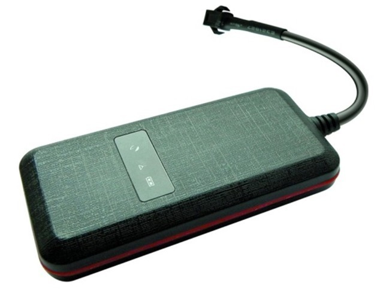

# Winrich - GT003

El Winrich GT003 es un rastreador GPS cableado y compacto diseñado para la supervisión continua de vehículos. Pensado para automóviles, motocicletas, camiones y otros activos móviles, el GT003 ofrece posicionamiento constante mediante GPS y conectividad GSM GPRS, entregando el rastreo en tiempo real y los datos de eventos que los gestores de flota necesitan. Su tamaño reducido y la conexión directa a la alimentación del vehículo lo convierten en una opción discreta para supervisión permanente de flotas y monitoreo antirrobo.

Como dispositivo compatible con Plaspy, el GT003 está optimizado para enviar ubicaciones, historial de rutas y datos de eventos a los paneles y herramientas de informes de Plaspy. Al integrarlo con Plaspy, la unidad proporciona visibilidad operativa mediante el reporte del estado de encendido, activadores de geocerca, alertas por exceso de velocidad y movimiento, para que los equipos de operaciones y seguridad puedan actuar con telemetría en vivo y registros históricos.

## Aspectos clave

- Rastreador compatible con Plaspy para rastreo en tiempo real y transmisión de telemetría continua.
- Diseño cableado y compacto, apto para automóviles, motocicletas, camiones y otros activos móviles.
- Posicionamiento GPS con conectividad GSM GPRS para actualizaciones de ubicación y entrega de datos.
- Detección de encendido ACC para registrar eventos de motor encendido/apagado y mejorar los informes de utilización.
- Alertas de geocerca, exceso de velocidad y movimiento para apoyar la protección antirrobo y la vigilancia perimetral.
- Bajo consumo de energía y antenas integradas que reducen la complejidad de la instalación.

## Cómo funciona con Plaspy

Cuando lo conecta a Plaspy, el GT003 transmite información de ubicación y eventos a su cuenta de Plaspy, de modo que los equipos pueden monitorear activos en mapas en vivo y generar informes operativos. Plaspy recibe la telemetría entrante y la pone a disposición para alertas, reproducción de rutas y análisis que apoyan la toma de decisiones en la gestión de flotas y la respuesta rápida.

- Actualizaciones de ubicación en tiempo real en Plaspy para mapeo y visibilidad del estado actual.
- Eventos de encendido ACC entregados a Plaspy para enriquecer los registros de viaje y los reportes de utilización.
- Alertas de geocerca y movimiento enviadas a Plaspy para vigilancia perimetral y respuesta ante robos.
- Historial de rutas y reproducción accesibles desde los paneles de Plaspy para auditorías y revisiones operativas.
- Informes basados en eventos para reducir transmisiones innecesarias garantizando alertas oportunas.

## Casos de uso típicos

- Monitoreo logístico de flotas para camiones y vehículos de reparto que requieren rastreo continuo.
- Gestión de autos de renta para registro de uso, verificación de devoluciones e historial de eventos.
- Seguridad para motocicletas, donde un rastreador cableado y discreto junto con alertas de movimiento mejora las posibilidades de recuperación.
- Supervisión de taxis y servicios de transporte para rastrear ubicación, estado del motor y eventos de seguridad.
- Seguimiento de activos móviles en general, como vehículos de construcción, flotas de servicio y equipos especializados.

## Por qué elegir este rastreador con Plaspy

El GT003 ofrece un conjunto de funciones práctico y centrado en las necesidades habituales de flotas y seguridad. Su diseño cableado y siempre activo junto con la detección ACC proporcionan la telemetría esencial que Plaspy utiliza para monitoreo en vivo, alertas y análisis histórico sin añadir complejidad innecesaria.

Si busca un dispositivo compacto y compatible con Plaspy para rastreo continuo de vehículos y supervisión operativa, el GT003 es una opción directa y eficiente. Conozca más sobre Plaspy y cómo la plataforma puede integrar datos de dispositivos para la gestión de flotas en https://www.plaspy.com. Las especificaciones del producto y su disponibilidad pueden cambiar con el tiempo, por lo que le recomendamos verificar los detalles actuales y la documentación con el fabricante en http://www.winrichgroup.com/en/
