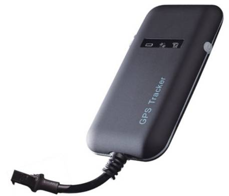

# Winrich - GT02A

El Winrich GT02A es un rastreador GPS compacto e inteligente, diseñado para ofrecer posicionamiento fiable de vehículos y supervisión remota de flotas. Combina un receptor GPS de alta sensibilidad con comunicaciones GSM y antenas integradas para proporcionar informes de ubicación continuos. Su factor de forma de bajo perfil y las opciones de alimentación sencillas lo hacen adecuado para automóviles, motocicletas, vehículos comerciales ligeros, vehículos eléctricos y embarcaciones pequeñas donde la instalación discreta y la operación sin complicaciones son importantes.

Como dispositivo compatible con Plaspy desde su configuración inicial, el GT02A transmite la posición y el estado usando los canales de datos nativos del equipo, de modo que Plaspy puede ingerir feeds en vivo, eventos y datos de salud del dispositivo. Esa compatibilidad convierte al GT02A en una opción práctica para operadores que desean visibilidad inmediata en los paneles de Plaspy, flujos de trabajo de geocercas y alertas, y reproducción histórica de rutas sin equipo intermedio complejo.

## Características principales

- Compatibilidad nativa con Plaspy para la ingestión directa de datos de ubicación y eventos.
- Diseño compacto y de bajo perfil, adecuado para instalaciones antirrobo discretas y espacios de montaje reducidos.
- Comunicaciones GSM cuatribanda y chipset GPS de alta sensibilidad con antenas integradas para una recepción de señal confiable en las regiones soportadas.
- Sensor de vibración incorporado para ayudar a reducir reportes de movimiento falsos y habilitar alertas basadas en movimiento.
- Indicadores de estado múltiples, incluyendo un LED tricolor para diagnósticos locales rápidos.
- Opciones de alimentación flexibles pensadas para una variedad de aplicaciones en vehículos ligeros.

## Cómo funciona con Plaspy

Al desplegarse, el GT02A obtiene fijaciones GPS y envía actualizaciones de ubicación y estado a Plaspy mediante los canales de comunicación disponibles en el rastreador. Plaspy recibe esos feeds y los mapea a seguimiento en vivo, alertas e informes, permitiendo que los equipos supervisen la ubicación del vehículo, eventos de movimiento y el estado del dispositivo desde una plataforma central.

- Seguimiento en mapa en tiempo real y actualizaciones de posición en Plaspy mediante el feed de datos del dispositivo.
- Detección de movimiento e informes de inactividad basados en el sensor de vibración integrado para reducir alertas falsas.
- Alertas de eventos y notificaciones de geocercas integradas en las reglas de alerta de Plaspy para la respuesta operativa.
- Estado del dispositivo y diagnósticos básicos reportados a Plaspy para apoyar la monitorización de la salud operativa.
- SMS como canal alternativo para eventos clave y notificaciones cuando la conectividad de datos no está disponible.

## Casos de uso típicos

- Seguimiento de flotas pequeñas y medianas para visibilidad de rutas, historial de viajes y supervisión operativa.
- Monitoreo antirrobo con instalación discreta y alertas activadas por vibración.
- Rastreo de vehículos particulares para propietarios que desean visibilidad clara de la ubicación y del historial.
- Monitoreo en comercios ligeros y entregas de última milla para mejorar la precisión de despacho y las estimaciones de tiempo de llegada.
- Rastreo de motocicletas y embarcaciones pequeñas donde el hardware compacto y la posición confiable son prioridad.

## Por qué elegir este rastreador con Plaspy

El GT02A ofrece un equilibrio entre hardware compacto y canales de telemetría prácticos que encajan bien con las capacidades centrales de Plaspy para visibilidad de ubicación y supervisión de flotas. Su compatibilidad lista para usar con Plaspy lo convierte en una opción conveniente para equipos que necesitan poner dispositivos en línea rápidamente y comenzar a recibir datos de posición, eventos y salud básica sin integraciones complejas.

Si su implementación requiere solo reportes de ubicación básicos, detección de movimiento y estado simple del dispositivo, el GT02A junto con Plaspy proporciona una solución económica y fácil de gestionar. Para organizaciones que requieren telemetría ampliada o entradas especializadas, el GT02A puede incorporarse en instalaciones más amplias junto a sensores o accesorios adicionales y gestionarse dentro de los flujos de trabajo de Plaspy.

Learn more about how Plaspy can use data from compatible trackers like the GT02A by visiting https://www.plaspy.com. Product specifications, availability and manufacturer details can change over time, so please verify current technical information and accessory options on the manufacturer website http://www.winrichgroup.com/en/.
