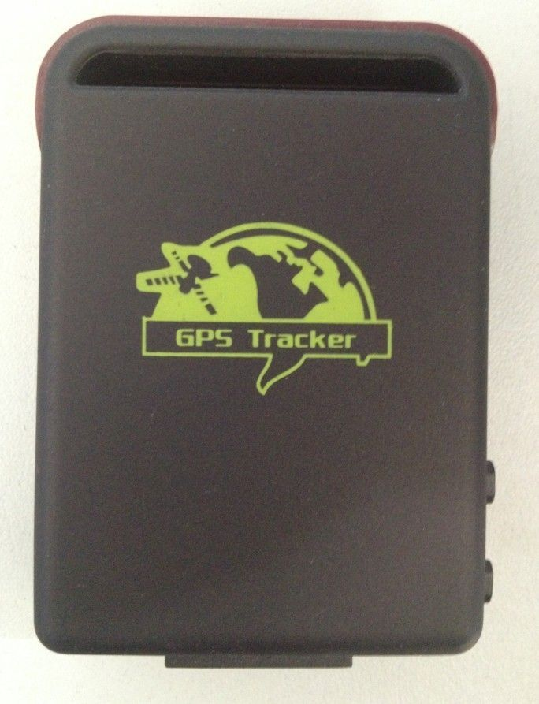

# Winrich - TK102

El Winrich TK102B es un rastreador GPS compacto que combina posicionamiento satelital con un respaldo de localización vía GSM. Diseñado para seguimiento continuo en distintos entornos, el TK102B cubre bandas GSM a nivel mundial y puede cambiar a posicionamiento por GSM cuando la señal GPS no está disponible. Además, ofrece respuestas de dirección en idioma local, sensor de choque integrado, soporte para tarjeta TF para almacenar rutas y una función de configuración automática del APN para simplificar la conexión a la red.

Como dispositivo compatible con Plaspy, el TK102B puede enviar información de posición y estado a la plataforma Plaspy para visualización en tiempo real y reproducción histórica. Su doble sistema de posicionamiento y el almacenamiento local de trayectos lo hacen una opción práctica para organizaciones que requieren seguimiento robusto en zonas con cobertura satelital variable. Plaspy puede recibir los reportes del TK102B y consolidarlos para monitoreo de flotas, alertas y registros junto con otros dispositivos.

## Características principales

- Posicionamiento dual GPS y GSM para reportes continuos en entornos variados
- Cobertura de frecuencias GSM a nivel global para amplia aplicabilidad
- Respuestas con direcciones reales en varios idiomas locales para mejorar la claridad de la ubicación
- Sensor de choque integrado para detección de movimiento o impactos
- Soporte para tarjeta TF que permite almacenamiento local de rutas cuando la cobertura es deficiente
- Diseño compacto y liviano ideal para seguimiento portátil
- Función de configuración automática del APN para agilizar la puesta en marcha en la red

## Cómo funciona con Plaspy

El TK102B se integra en Plaspy para ofrecer actualizaciones persistentes de ubicación y eventos que ayudan a los operadores a rastrear activos y personas en tiempo real o a revisar recorridos históricos. Plaspy agrega los reportes de posición y eventos del TK102B para mostrarlos en mapas, paneles y reportes destinados a los equipos operativos.

- Alimentación continua de ubicaciones a Plaspy para visualización en mapas y posición conocida más reciente
- Historial de rutas y trayectorias almacenadas disponible para reproducción y auditoría en Plaspy
- Eventos como la detección de choque pueden generarse como alertas o notificaciones
- Respuestas de dirección en idioma local que mejoran la claridad en interfaces y registros operativos
- El respaldo por GSM reduce las brechas en los datos de seguimiento cuando las señales satelitales son limitadas

## Casos de uso típicos

- Prevención e investigación de robos de vehículos mediante seguimiento en tiempo real
- Monitoreo de la seguridad y ubicación de niños, personas mayores y mascotas
- Gestión de personal móvil y verificación de rutas de equipos de campo
- Rastreo de activos portátiles que se trasladan entre ubicaciones
- Seguimiento discreto cuando se requiere un dispositivo de tamaño compacto y bajo peso

## Por qué elegir este rastreador con Plaspy

El Winrich TK102B es una opción práctica para organizaciones que necesitan un rastreador resistente y de pequeño tamaño que siga reportando cuando el GPS falla. Su respaldo por GSM y el almacenamiento en tarjeta TF ayudan a mantener un historial continuo de rutas, mientras que las respuestas de dirección en idioma local facilitan el trabajo de equipos que operan en distintas regiones y lenguas. Estas características hacen al TK102B un complemento útil para Plaspy cuando se busca visibilidad de ubicación sin perfiles de dispositivo complejos.

Dado que las capacidades del dispositivo y las necesidades de despliegue pueden variar, combinar el TK102B con Plaspy permite centralizar el monitoreo y las alertas junto con otros tipos de equipo. Plaspy aporta las capas de visualización e informes que convierten los datos de posición y eventos del TK102B en información operativa para administradores de flotas y gestores de activos.

Si desea conocer más sobre cómo Plaspy puede trabajar con el Winrich TK102B visite el sitio web de Plaspy en https://www.plaspy.com. Las especificaciones de producto disponibilidad y detalles del fabricante pueden cambiar con el tiempo por lo que le recomendamos verificar la información técnica actual en el sitio oficial de Winrich http://www.winrichgroup.com/en/.
