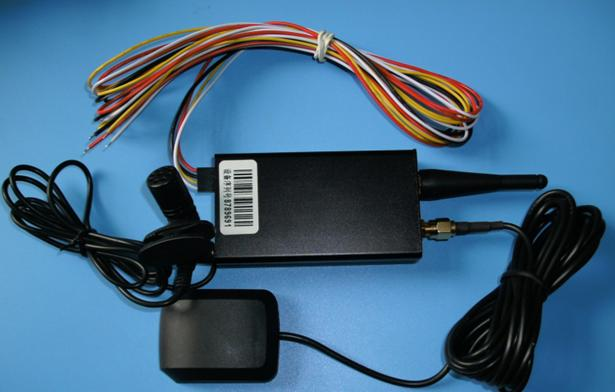

# Winrich - TK168

El Winrich TK168 es un rastreador GPS compacto y versátil diseñado para posicionamiento personal y vehicular, así como para la gestión de flotas. Integra un chipset GPS de alta sensibilidad y soporta modos de seguimiento por SMS y GPRS, ofreciendo reportes de ubicación precisos aun en zonas con señal débil. El TK168 incluye funciones de control remoto como corte de gasolina y alimentación, además de alarmas opcionales y función SOS para mayor seguridad.

Dado que el TK168 permite seguimiento en línea y reportes flexibles, puede integrarse con plataformas de monitoreo de vehículos como Plaspy para ofrecer visibilidad continua y supervisión operativa. Su tamaño compacto y compatibilidad con frecuencias a nivel mundial lo convierten en una opción práctica para organizaciones e individuos que requieren un rastreo discreto y confiable dentro de un flujo de trabajo de gestión de flotas.

## Aspectos clave

- Soporta posicionamiento personal y vehicular además de flujos de trabajo para gestión de flotas
- Chipset GPS de alta sensibilidad para mejor posicionamiento en entornos complicados
- Corte remoto de gasolina y alimentación para mayor control de activos
- Seguimiento en línea en tiempo real disponible para monitoreo continuo
- Soporta modos SMS y GPRS para conectividad flexible
- Factor de forma compacto ideal para instalaciones discretas y rastreo encubierto

## Cómo funciona con Plaspy

El TK168 puede utilizarse con Plaspy para incorporar la ubicación y el estado del dispositivo en una interfaz centralizada de gestión de flotas, permitiendo que usted monitoree activos y responda a eventos desde una sola plataforma. Plaspy consolida datos de posición y alertas de los dispositivos para que los equipos puedan seguir vehículos y personal a lo largo de regiones.

- Mostrar ubicaciones en vivo y rutas históricas dentro de los paneles de Plaspy
- Configurar alertas para eventos como movimiento, entrada o salida de geocercas y señales SOS
- Usar los informes de Plaspy para analizar la actividad de la flota y patrones operativos
- Combinar el estado y las funciones de control del TK168 con los flujos de trabajo de Plaspy para supervisión y respuesta
- Administrar una flota mixta de dispositivos y revisar la conectividad y el rendimiento de rastreo en un solo lugar

## Casos de uso habituales

- Monitoreo de vehículos de flotas para operaciones comerciales pequeñas y medianas
- Seguimiento de vehículos particulares y apoyo en recuperación
- Rastreo discreto de activos valiosos en tránsito
- Monitoreo de emergencia con alertas SOS opcionales para la seguridad del conductor
- Implementaciones internacionales donde es útil el soporte de frecuencias amplias

## Por qué elegir este rastreador con Plaspy

El Winrich TK168 es una opción práctica para organizaciones que necesitan un dispositivo de rastreo sencillo con opciones de reporte tanto en línea como por SMS. Su combinación de posicionamiento preciso en entornos con señal difícil y funciones de control remoto aporta valor operativo a supervisores de flota y equipos de seguridad. Al integrarlo con Plaspy, los datos del TK168 forman parte de un sistema más amplio de monitoreo e informes que respalda las operaciones diarias de la flota.

Los usuarios de Plaspy se benefician al reunir la ubicación y las alertas del TK168 en una sola plataforma para visibilidad, informes y respuesta coordinada. Si usted necesita un rastreador compacto que soporte seguimiento en tiempo real y capacidades de control remoto, el TK168 es una opción compatible a considerar.

Para obtener más información sobre cómo Plaspy puede trabajar con dispositivos como el Winrich TK168 visite https://www.plaspy.com. Las especificaciones del producto, disponibilidad y detalles del fabricante pueden cambiar con el tiempo, por lo que le recomendamos verificar la información actual en el sitio oficial del fabricante http://www.winrichgroup.com/en/.
