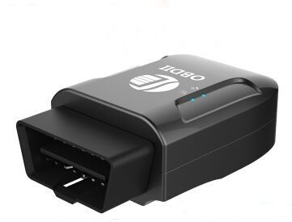

# Winrich - TK206 OBD

El Winrich TK206 OBD es un rastreador GPS plug and play diseñado para facilitar la supervisión de vehículos. Combina posicionamiento por satélite GPS con conectividad GSM/GPRS y se integra al vehículo a través del puerto OBD. Sus antenas internas y su diseño enchufable eliminan la necesidad de un arnés de cableado externo, lo que facilita su despliegue en automóviles, taxis y muchas flotas. El equipo también lee parámetros OBD desde la ECU del vehículo y transmite datos de ubicación y telemetría a un servidor backend para acceso remoto.

Como dispositivo compatible con Plaspy, el TK206 OBD permite integrar visibilidad de ubicación y diagnóstico remoto en una única plataforma de gestión de flotas. Plaspy puede recibir y procesar los datos de seguimiento y de vehículo que envía el equipo, habilitando supervisión centralizada, alertas e informes. Esta compatibilidad hace del TK206 una opción práctica para organizaciones que buscan un rastreador OBD sencillo que alimente datos a Plaspy para control operativo.

## Características destacadas

- Interfaz OBD plug and play para una instalación rápida sin cableado adicional
- GPS y conectividad GSM integrados para reporte de ubicación y transmisión remota
- Capacidad de lectura de parámetros OBD desde la ECU para diagnósticos básicos
- Soporta un amplio rango de voltaje, adecuado para automóviles, taxis y flotas mixtas
- Localización en tiempo real con LBS y reportes GPS para mejor cobertura
- Alarmas integradas, incluyendo geocercas, movimiento, exceso de velocidad y alertas de alimentación

## Cómo funciona con Plaspy

Al conectarse a Plaspy, el TK206 OBD envía datos de ubicación y parámetros del vehículo a la plataforma, donde los administradores de flota pueden visualizarlos y tomar acciones. Plaspy recibe la información del backend y la presenta junto con otros dispositivos de la flota para que los equipos supervisen las operaciones desde un solo lugar.

- Visualización de la ubicación del vehículo en tiempo real y casi en tiempo real en los mapas y paneles de Plaspy
- Monitoreo de parámetros del vehículo a partir de lecturas OBD mostradas en Plaspy para diagnóstico remoto
- Alertas de geocerca y movimiento reenviadas a Plaspy para notificación inmediata
- Reproducción histórica de rutas e informes de viaje para análisis operativo y cumplimiento
- Alertas y resúmenes a nivel de flota por exceso de velocidad, pérdida de alimentación y otras condiciones de alarma
- Uso de los datos del rastreador en los informes de Plaspy para apoyar la planificación de mantenimiento y el seguimiento de la utilización

## Casos de uso típicos

- Gestión de flotas mixtas y operaciones de taxis
- Diagnóstico remoto y monitoreo del estado del vehículo para equipos de servicio
- Monitoreo basado en ubicación para seguridad de activos y recuperación
- Supervisión de exceso de velocidad y movimiento para programas de control de conductores
- Rastreo de autos de renta y telemetría operativa básica para equipos de operaciones

## Por qué elegir este rastreador con Plaspy

El TK206 OBD es una opción pragmática para equipos que requieren un despliegue de baja fricción y desean datos vehiculares basados en OBD sin instalaciones complejas. Su diseño plug and play reduce el tiempo de instalación, mientras que las antenas integradas mantienen el dispositivo compacto y fácil de reubicar entre vehículos compatibles. Para organizaciones que usan Plaspy, el rastreador aporta flujos de datos de ubicación y parámetros del vehículo que mejoran la visibilidad de las operaciones diarias.

Los usuarios de Plaspy encontrarán el TK206 OBD útil cuando necesiten un rastreador OBD sencillo que se integre en un flujo de trabajo de monitoreo de flota más amplio. La combinación de reporte de ubicación, datos básicos de diagnóstico y funciones de alarma integradas lo convierte en una opción sensata para monitoreo, generación de informes y alertas a través de la plataforma Plaspy.

Para saber más sobre cómo Plaspy puede trabajar con dispositivos como el Winrich TK206 OBD visite https://www.plaspy.com. Las especificaciones del producto y la disponibilidad pueden cambiar con el tiempo, por lo que le recomendamos verificar los detalles técnicos y la información de soporte actuales en el sitio del fabricante http://www.winrichgroup.com/en/.
