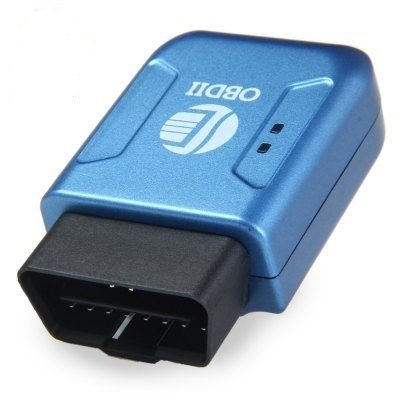

# Winrich - TK207 OBD

El Winrich TK207 OBD es un rastreador vehicular plug and play diseñado para conectarse directamente al puerto OBDII de un automóvil. Combina posicionamiento por GPS con transmisión de datos GSM GPRS para ofrecer monitoreo remoto de ubicación y datos básicos de diagnóstico del vehículo. El dispositivo envía la información recopilada a un servidor backend y es compatible con alarmas habituales como geocerca, movimiento, exceso de velocidad, batería baja, corte de alimentación externa, impacto y alarma de ACC en modo ARM.

Como dispositivo compatible con Plaspy, el TK207 OBD puede enviar su ubicación e información de diagnóstico a la plataforma Plaspy para una gestión y visibilidad centralizadas. Esto lo convierte en una opción práctica para propietarios de vehículos y operadores de flotas que buscan una implementación rápida sin cableado adicional, además de poder visualizar el estado del vehículo y las alertas dentro de Plaspy para monitoreo, reportes y supervisión operativa.

## Características principales

- Diseño plug and play que se conecta directamente al puerto OBDII del vehículo para una instalación rápida
- Rastreo de ubicación GPS en tiempo real combinado con enlace de datos GSM GPRS al servidor backend
- Lectura de parámetros OBDII desde la ECU del vehículo para ofrecer información de diagnóstico remoto
- Compatible con vehículos de 12 a 24 V, apto para automóviles y flotas ligeras
- Alarmas integradas como geocerca, movimiento, exceso de velocidad, batería baja, corte de alimentación externa, impacto y ACC en modo ARM
- Pensado para casos de gestión vehicular sencillos sin necesidad de cableado permanente

## Cómo funciona con Plaspy

Al integrarse con Plaspy, el TK207 OBD transmite su ubicación y datos de diagnóstico al backend de gestión de dispositivos de Plaspy, de modo que los operadores pueden ver posiciones en vivo, recorridos históricos y eventos de alarma en un único lugar. Plaspy puede utilizar estos datos para generar alertas, elaborar informes y ofrecer una vista operativa unificada en flotas con dispositivos mixtos.

- Visualización de ubicación en tiempo real y historial de viajes de cada vehículo en el mapa de Plaspy
- Lecturas de diagnóstico e indicadores de estado disponibles junto a los datos de localización para apoyar decisiones de mantenimiento
- Alertas configurables de geocerca y movimiento entregadas a través de Plaspy para notificar eventos no autorizados
- Eventos de exceso de velocidad y otras alarmas encaminados a Plaspy para la atención inmediata del operador
- Informes agregados y opciones sencillas de exportación para apoyar revisiones de desempeño de flota y supervisión operativa

## Casos de uso típicos

- Seguridad y recuperación de vehículos particulares
- Monitoreo de vehículos de flota para operaciones pequeñas y medianas
- Supervisión de taxis y vehículos de transporte privado incluyendo ubicación y alertas
- Diagnóstico remoto para apoyar la planificación de mantenimiento preventivo
- Rastreo de autos de alquiler para controlar uso y recibir alertas oportunas

## Por qué elegir este rastreador con Plaspy

El TK207 OBD ofrece una vía de despliegue de baja fricción para organizaciones que prefieren un rastreador plug and play con capacidad para mostrar datos de diagnóstico del vehículo. Su conjunto de funciones cubre necesidades básicas de seguridad y monitoreo operativo, eliminando la necesidad de una instalación con cableado dedicado, lo que acelera el despliegue en múltiples vehículos.

Al combinarse con Plaspy, el dispositivo se integra en un flujo de trabajo más amplio de gestión y monitoreo de flotas. Plaspy aporta mapas centralizados, manejo de alertas y generación de informes que ayudan a convertir los datos del rastreador en supervisión operativa y conocimiento para el mantenimiento, manteniendo la configuración y el estado del dispositivo visibles en una sola plataforma.

Para obtener más información sobre cómo Plaspy puede funcionar con dispositivos como el Winrich TK207 OBD visite https://www.plaspy.com. Las especificaciones del producto, la disponibilidad y los datos del fabricante pueden cambiar con el tiempo, por lo que le recomendamos verificar la información técnica actual en el sitio oficial de Winrich http://www.winrichgroup.com/en/.
