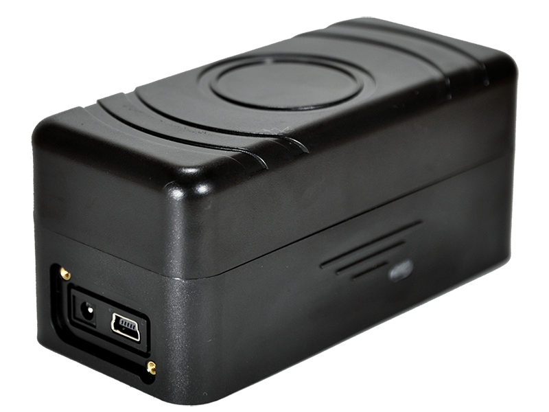

# WP - M7

El WP M7 es un dispositivo de rastreo GPS portátil diseñado para ofrecer seguimiento de vehículos de forma confiable y práctica. Su tamaño compacto y la opción de montaje magnético facilitan la instalación o el ocultamiento en un vehículo, mientras que los módulos GPS y GSM GPRS integrados permiten reportes continuos de posición. El M7 también incorpora funciones como alerta por desprendimiento, notificación por movimiento, aviso de batería baja y una carcasa con certificación IP67 adecuada para uso exterior.

Como dispositivo compatible con Plaspy, el M7 puede enviar sus datos de ubicación y estado a la plataforma Plaspy para obtener visibilidad y supervisión operativa. Las múltiples opciones de transmisión y la larga autonomía en modo espera hacen que sea una opción práctica para administradores de flota y usuarios particulares que requieren reportes flexibles, notificaciones por manipulación y monitoreo a largo plazo a través de Plaspy.

## Aspectos principales

- Diseño portátil y compacto con montaje magnético para despliegue rápido
- Módulos GPS y GSM GPRS integrados para reportes de posición confiables
- Varias opciones de transmisión de datos como SMS, GPRS, UDP y TCP
- Alerta por desprendimiento y reportes de movimiento para detección de manipulación y estado de desplazamiento
- Consumo extremadamente bajo en modo reposo con hasta más de 3 años de autonomía en espera
- Carcasa con grado de protección IP67 para protección en exteriores y ambientes exigentes
- Alertas de batería baja y ajustes de gestión de energía para uso prolongado

## Cómo funciona con Plaspy

Plaspy recibe los informes de posición y estado enviados por el M7 y los muestra en mapas, paneles y reportes para que los equipos puedan monitorear vehículos y activos casi en tiempo real. Las alertas configurables y los modos de reporte del M7 se integran naturalmente con las funciones de Plaspy para supervisión operativa y manejo de excepciones.

- Seguimiento de ubicación en vivo y reproducción de historial en los paneles de Plaspy
- Alertas de estado del dispositivo y batería baja que se incorporan a los flujos de notificación de Plaspy
- Alertas de manipulación y desprendimiento disponibles como eventos para atención inmediata
- Reportes basados en movimiento para reducir ruido y enfocarse en eventos de desplazamiento relevantes
- Visibilidad a nivel de flota y agrupación sencilla para supervisión operativa y despacho
- Reportes y registros exportables que incluyen datos de posición y eventos suministrados por el M7

## Casos de uso típicos

- Seguimiento rutinario de vehículos de flota para supervisión de rutas e historial de ubicaciones
- Monitoreo temporal o encubierto donde el montaje magnético y la discreción son necesarios
- Vigilancia prolongada de vehículos estacionados aprovechando la extensa autonomía en espera
- Protección de activos como remolques y equipos usados en exteriores y condiciones adversas
- Control de vehículos de alquiler o compartidos donde las notificaciones de manipulación y el bajo consumo son importantes

## Por qué elegir este rastreador con Plaspy

El WP M7 es una opción práctica para organizaciones que requieren un rastreador compacto y resistente con métodos de transmisión flexibles y larga vida en modo espera. Sus funciones de alerta por manipulación y los reportes de movimiento ayudan a reducir falsas alarmas mientras generan eventos relevantes que Plaspy puede procesar. La certificación IP67 y el montaje magnético hacen que el M7 sea adecuado para muchas aplicaciones en vehículos y activos exteriores donde la durabilidad y la colocación discreta son importantes.

En conjunto con Plaspy, el M7 ofrece beneficios operativos claros: visibilidad consolidada de ubicaciones, alertas configurables y herramientas de reporte que ayudan a los equipos a responder más rápido y mantener una supervisión más eficiente. Si su implementación valora una larga autonomía en espera, montaje sencillo y reportes de posición confiables, el M7 es un candidato compatible a considerar para usar con Plaspy.

Para obtener más información sobre cómo Plaspy puede integrarse con rastreadores compatibles como el WP M7 visite https://www.plaspy.com. Las especificaciones del producto, la disponibilidad y los datos del fabricante pueden cambiar con el tiempo, por favor verifique las especificaciones actuales en el sitio oficial del fabricante http://www.wondeproud.com/.
