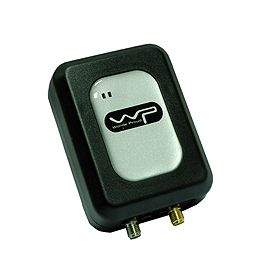

# WP - SPT-10

El WP SPT-10 es un rastreador GPS portátil y compacto diseñado para ofrecer ubicación en tiempo real y funciones de seguridad para personas y activos. Está pensado para uso con niños, adultos mayores, mascotas, bienes y vehículos, combinando un chipset GPS de alta sensibilidad con un formato reducido y un botón de pánico para alertas inmediatas. El equipo admite varios modos de rastreo y puede registrar un historial extenso de trayectos para revisión posterior.

Como dispositivo compatible con Plaspy, el SPT-10 envía información de ubicación y eventos a Plaspy para monitoreo y generación de informes centralizados. La compatibilidad facilita incluir al SPT-10 en flujos de trabajo de gestión de vehículos o activos en Plaspy, permitiendo visibilidad en vivo, supervisión de geocercas, notificaciones y revisión de rutas históricas junto con otros dispositivos en la plataforma.

## Características principales

- Diseño portátil y ligero, apto para uso personal y en activos
- Alta sensibilidad GPS para mejorar fijaciones de posición en entornos difíciles
- Botón de pánico para alertas de emergencia inmediatas
- Múltiples modos de rastreo, incluyendo intervalos por tiempo, por distancia y modo inteligente
- Gran capacidad de registro de trayectos con más de 100,000 waypoints para historial y revisión
- Geocercas, reporte de kilometraje y eventos definidos por el usuario para supervisión operativa
- Gestión inteligente de energía para extender el tiempo de espera

## Cómo funciona con Plaspy

Cuando se integra con Plaspy, el SPT-10 transmite actualizaciones de ubicación y alertas de eventos a la plataforma para que los operadores puedan supervisar los dispositivos desde una única interfaz. Plaspy consolida los datos del dispositivo para ofrecer visibilidad en tiempo real y contexto histórico útil para revisiones de seguridad y decisiones operativas.

- Visualización de ubicación en vivo y seguimiento de movimiento por dispositivo o grupos
- Manejo de alertas para eventos de pánico, batería baja, movimiento y otras notificaciones configuradas
- Gestión de geocercas y reportes de kilometraje visibles en los paneles de Plaspy
- Revisión de rutas y waypoints históricos usando los registros de viaje del dispositivo
- Informes consolidados y exportación de registros para apoyar el análisis operativo
- Configuración remota del dispositivo y actualizaciones OTA cuando el equipo lo soporta

## Casos de uso típicos

- Seguimiento de seguridad personal para niños, adultos mayores o trabajadores solitarios
- Rastreo de mascotas para dueños que requieren dispositivos portátiles discretos
- Seguimiento temporal de activos para equipos en alquiler o artículos de alto valor
- Monitoreo de vehículos para flotas pequeñas o automóviles individuales
- Verificación de rutas y registro de kilometraje para necesidades administrativas

## Por qué elegir este rastreador con Plaspy

El SPT-10 es una opción práctica para organizaciones y particulares que necesitan un rastreador compacto y confiable que combine portabilidad con un conjunto completo de reportes de eventos e historial. Su amplia capacidad de waypoints y sus múltiples modos de rastreo lo hacen útil cuando es importante contar con un historial detallado de movimiento, y el botón de pánico aporta un beneficio claro en escenarios de monitoreo personal.

Usar el SPT-10 con Plaspy integra esos datos en una vista operativa más amplia donde los equipos pueden gestionar alertas, revisar trayectos y generar informes junto con otros dispositivos. Si necesita un rastreador discreto que se integre a una plataforma de seguimiento centralizada, Plaspy le permite aprovechar los datos del SPT-10 tanto para seguridad como para supervisión operativa.

Para más información sobre cómo Plaspy soporta integraciones de dispositivos y monitoreo de flotas visite https://www.plaspy.com. Las especificaciones del producto, la disponibilidad y los datos del fabricante pueden cambiar con el tiempo, por lo que le recomendamos verificar las especificaciones actuales en el sitio web oficial del fabricante http://www.wondeproud.com/.
