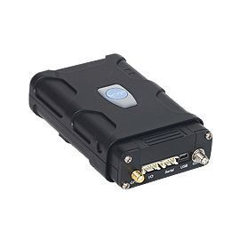

# WP - VT-300

El WP VT-300 es un rastreador GPS versátil diseñado específicamente para el seguimiento de vehículos. Ofrece múltiples opciones de comunicación para voz, SMS y datos en las generaciones habituales de redes móviles, e incluye una interfaz expandible de usuario (UDI) para ampliar el hardware según necesidades. Los modos de rastreo configurables abarcan intervalos por tiempo y distancia, cambios de rumbo y velocidad, y estado del encendido. Entre las alertas a bordo se encuentran manipulación de antena, detección opcional de interferencia, control de geocercas, reporte de kilometraje, alertas de batería baja y remolque, notificaciones por exceso de velocidad y ajustes de preferencia de roaming. El equipo además permite configuración remota y actualización de firmware por aire.

Como dispositivo compatible con Plaspy, el VT-300 puede enviar la ubicación del vehículo, estados y alertas al entorno de gestión de flotas de Plaspy. Su capacidad de reporte flexible y la interfaz expandible lo hacen una opción práctica para organizaciones que requieren comportamiento de rastreo adaptable y visibilidad centralizada a través de una plataforma como Plaspy. Plaspy puede mostrar los datos del VT-300 junto con otros dispositivos para ofrecer supervisión operativa e informes para flotas mixtas.

## Características principales

- Diseñado específicamente para rastreo vehicular con amplias opciones de comunicación
- Interfaz expandible definida por el usuario para personalizar según requerimientos
- Reportes configurables por tiempo, distancia, cambio de velocidad, cambio de rumbo y estado de encendido
- Conjunto amplio de alertas que incluye manipulación de antena, alerta opcional por interferencia, geocercas, remolque y aviso de batería baja
- Reporte de kilometraje y controles de preferencia de roaming para supervisión operativa
- Configuración remota y actualizaciones de firmware por aire para facilitar el mantenimiento
- Acceso a internet por USB para conexión directa e intercambio de datos

## Cómo funciona con Plaspy

Al integrarse con Plaspy, el VT-300 suministra datos de ubicación y eventos que Plaspy utiliza para seguimiento en tiempo real, alertas y reportes históricos. La información del rastreador puede visualizarse en mapas, asociarse a geocercas e incluirse en reportes de flota para apoyar las operaciones diarias y la toma de decisiones.

- Ubicación en vivo y actualizaciones de posición visibles en mapas y paneles de Plaspy
- Reenvío de alertas a Plaspy para eventos de geocercas, remolque, manipulación, exceso de velocidad y energía
- Reportes agregados de kilometraje y viajes para contabilidad de flota y auditorías
- Perfiles de reporte configurables que alinean el comportamiento del dispositivo con las necesidades de monitoreo de Plaspy
- Gestión centralizada de dispositivos y configuración remota cuando el dispositivo y la plataforma lo soportan
- Reproducción histórica y reportes exportables para revisión de incidentes y análisis operativo

## Casos de uso típicos

- Monitoreo de operaciones de flotas pequeñas y medianas
- Disuasión y recuperación ante robo con alertas de manipulación y remolque
- Control de vehículos de renta y compartidos, incluyendo seguimiento de kilometraje y control de roaming
- Entregas y logística donde los reportes configurables y las geocercas aportan valor
- Reportes de rutas y uso para planificación de mantenimiento y control de costos

## Por qué elegir este rastreador con Plaspy

El VT-300 es una opción práctica para organizaciones que requieren un rastreador vehicular con modos de reporte flexibles y una interfaz personalizable. Su combinación de alertas en el dispositivo, comportamiento de rastreo configurable y soporte para actualizaciones remotas lo hace adecuado para flotas que necesitan un equilibrio entre funcionalidad inmediata y posibilidades de adaptación a flujos de trabajo específicos.

Si desea visibilidad centralizada y reportes operativos, combinar el VT-300 con Plaspy integra los eventos a nivel de dispositivo en un único entorno de gestión de flotas para monitoreo, alertas y análisis histórico. Para conocer más sobre Plaspy y cómo dispositivos compatibles como el VT-300 pueden encajar en sus operaciones visite https://www.plaspy.com. Las especificaciones de producto, disponibilidad y detalles del fabricante pueden cambiar con el tiempo, por lo que verifique la información técnica y las opciones actuales en el sitio del fabricante http://www.wondeproud.com/.
