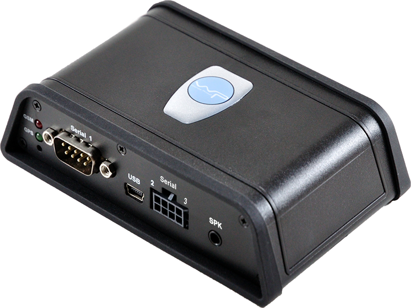

# WP - VT-360 — Rastreador vehicular compacto

El WP VT-360 es un dispositivo de seguimiento vehicular compacto que combina posicionamiento GPS y GLONASS con conectividad celular 2G y 3G para ofrecer seguimiento y monitoreo en tiempo real de forma continua. Diseñado para instalación en vehículos, el VT-360 incluye registro de viajes con capacidad para almacenar una gran cantidad de puntos de ruta, detección de encendido y diversas alertas orientadas a mejorar la visibilidad operativa.

Como dispositivo compatible con Plaspy, el VT-360 puede enviar datos de ubicación y estado a Plaspy para gestión de flotas, generación de reportes y flujos de alertas. Su flexibilidad de reporte y el soporte para configuración remota por aire (OTA) lo convierten en una opción práctica para organizaciones que requieren comportamiento de rastreo configurable junto con la supervisión y el análisis centralizados que ofrece Plaspy.

## Características principales

- Posicionamiento dual GPS y GLONASS para datos de ubicación fiables.
- Conectividad celular 2G y 3G para reportes continuos en tiempo real.
- Gran capacidad de registro de viajes con soporte para más de 100,000 puntos de ruta.
- Detección de encendido y alertas configurables por exceso de velocidad, remolque y cambios en entradas digitales.
- Geocercas y alertas de bloqueo/interferencia GSM para apoyar la seguridad operativa.
- Soporte para monitoreo de voz remoto, comunicación bidireccional por voz y configuración OTA del dispositivo.
- Factor de forma compacto y liviano que permite instalación flexible en distintos tipos de vehículos.

## Cómo funciona con Plaspy

El VT-360 transmite información de ubicación y eventos que Plaspy puede ingerir para ofrecer mapas en vivo, rutas históricas y alertas basadas en eventos. Una vez conectado a Plaspy, el dispositivo envía el estado del vehículo y los datos de los viajes a un panel central donde los operadores pueden supervisar activos, generar reportes y configurar alertas.

- Ubicación en vivo y reproducción de rutas mostradas en los mapas de Plaspy para visibilidad en tiempo real.
- Historial de viajes y datos de puntos de ruta utilizados en los reportes de Plaspy para análisis de kilometraje y trayectos.
- Alertas de eventos como encendido/apagado, exceso de velocidad, remolque y violaciones de geocercas dirigidas a los canales de notificación de Plaspy.
- Configuración del dispositivo y frecuencia de reporte ajustadas en el VT-360 y reflejadas en los reportes de Plaspy para un flujo de datos consistente.
- Alertas y resúmenes agrupados en Plaspy para supervisión operativa y cumplimiento normativo.

## Casos de uso típicos

- Seguimiento de vehículos de flota para operaciones logísticas y de entrega que requieren visibilidad continua de la ubicación.
- Monitoreo de vehículos de alquiler y compartidos donde el registro de viajes y los eventos de encendido son importantes.
- Supervisión de vehículos de servicio de campo para optimizar rutas y verificar el historial de visitas.
- Seguridad y recuperación de activos aprovechando geocercas y alertas antiinterferencia.
- Reportes de millaje y actividad empresarial usando datos almacenados de puntos de ruta y viajes.

## Por qué elegir este rastreador con Plaspy

El VT-360 combina funciones de rastreo prácticas con opciones flexibles de reporte y alerta que encajan bien con los casos de uso de Plaspy. Su soporte para registros de viaje extensos y actualizaciones en tiempo real ayuda a los equipos a mantener una visión operativa clara, mientras que las alertas configurables ofrecen notificaciones oportunas sobre eventos comunes en la flota. Dado que el dispositivo admite configuración por aire y funciones de voz, puede adaptarse a requisitos operativos cambiantes sin intervención manual frecuente.

Si usted necesita un rastreador compacto que pueda alimentar datos confiables de ubicación y eventos a una plataforma de gestión de flotas, el VT-360 es una opción adecuada para considerar junto a Plaspy. Para confirmar especificaciones técnicas detalladas y revisar opciones de accesorios, consulte al fabricante del dispositivo y tenga en cuenta las capacidades del VT-360 al planificar su implementación con Plaspy.

Para obtener más información sobre cómo Plaspy puede integrarse con rastreadores compatibles visite https://www.plaspy.com. Las especificaciones del producto, la disponibilidad y los detalles del fabricante pueden cambiar con el tiempo, por lo que verifique las especificaciones actuales y las opciones de accesorios con la documentación oficial del fabricante en http://www.wondeproud.com/.
