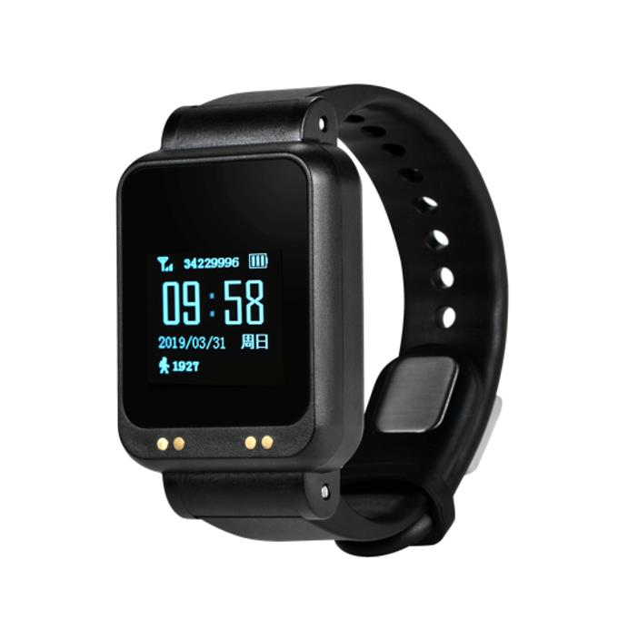

# Xexun - DDX04

El DDX04 es un reloj rastreador portátil antimanipulación diseñado para supervisión, seguridad y monitoreo remoto. Combina posicionamiento multifuente con detección de manipulación y telemetría de salud en un formato compacto de muñeca. El dispositivo está pensado para soportar seguimiento continuo en tiempo real, consultas de ubicación bajo demanda y reproducción histórica, además de proporcionar alertas y datos de sensores útiles para programas de cumplimiento y seguimiento del bienestar.

Como dispositivo compatible con Plaspy, el DDX04 puede enviar datos de posición, eventos de manipulación y telemetría de salud a la plataforma, de modo que los operadores puedan monitorear sujetos, aplicar reglas de geocercas y revisar el historial de movimientos desde un único panel. Su correa antimanipulación, construcción robusta con clasificación IP68 y funciones de gestión remota lo hacen adecuado para programas supervisados y otros flujos de trabajo que Plaspy ayuda a administrar.

## Características principales

- Posicionamiento multifuente que incluye GPS y BeiDou, junto con métodos auxiliares para mejorar la fiabilidad de la localización.
- Detección de manipulación integrada en la correa que genera alarmas inmediatas ante retiro o interferencia.
- Seguimiento continuo en tiempo real con reportes por intervalos, consultas bajo demanda y reproducción histórica para auditorías.
- Telemetría de salud incorporada, que incluye monitoreo de ritmo cardiaco y presión arterial para apoyar la supervisión de usuarios vulnerables.
- Construcción resistente con clasificación IP68 y pantalla compacta para uso diario en condiciones reales.
- Soporte de gestión remota para actualizaciones por aire (OTA) e instrucciones desde la plataforma, reduciendo el mantenimiento manual.

## Cómo funciona con Plaspy

Al integrarse con Plaspy, el DDX04 transmite su ubicación, telemetría de sensores y eventos de alerta a la plataforma, permitiendo que los operadores mantengan una adecuada conciencia situacional y gestionen los flujos de trabajo de cumplimiento. Plaspy procesa los datos del dispositivo y los presenta mediante herramientas de monitoreo, notificaciones e informes.

- Actualizaciones de posición en vivo mostradas en el panel de Plaspy para el seguimiento inmediato de los sujetos.
- Alertas de manipulación y retiro enviadas a los operadores para posibilitar una respuesta rápida y la gestión de casos.
- Telemetría de salud, como ritmo cardiaco y presión arterial, disponible junto a los datos de movimiento para informar verificaciones de bienestar.
- Notificaciones de batería baja y de conectividad para apoyar el mantenimiento proactivo del dispositivo y garantizar la continuidad.
- Reproducción del historial e informes para reconstruir movimientos y generar registros útiles en auditorías y supervisión.

## Casos de uso habituales

- Programas de monitoreo electrónico y cumplimiento para correcciones comunitarias y personas bajo supervisión judicial.
- Monitoreo remoto de salud y actividad para programas de cuidado de personas mayores y pacientes que requieren supervisión de ubicación y signos vitales.
- Seguridad del personal institucional y monitoreo de trabajadores en solitario, donde se necesitan alertas rápidas y visibilidad de ubicación.
- Supervisión en instalaciones o programas en los que la reproducción de historial, la aplicación de geocercas y la detección de manipulación facilitan el control operativo.

## Por qué elegir este rastreador con Plaspy

El DDX04 combina hardware resistente a la manipulación y posicionamiento multifuente con telemetría de salud y funciones de gestión remota, lo que lo convierte en una opción práctica para organizaciones que necesitan un rastreo supervisado y confiable. Su diseño de uso en la muñeca y su protección ambiental reducen el mantenimiento diario y permiten el monitoreo continuo dentro de Plaspy.

Usado con Plaspy, el DDX04 ofrece un flujo unificado de datos de ubicación y eventos que respalda alertas configurables, reglas de geocerca y reproducción de historial lista para auditoría. Esta combinación ayuda a los programas a mantener el cumplimiento, responder con mayor rapidez a incidentes y gestionar despliegues más amplios sin requerir intervención manual excesiva.

Para obtener más información sobre cómo Plaspy puede apoyar implementaciones con el DDX04, visite https://www.plaspy.com. Las especificaciones del producto y la disponibilidad pueden cambiar con el tiempo, por lo que le recomendamos verificar los detalles actuales y la documentación oficial en el sitio del fabricante https://www.xexun.com/.
