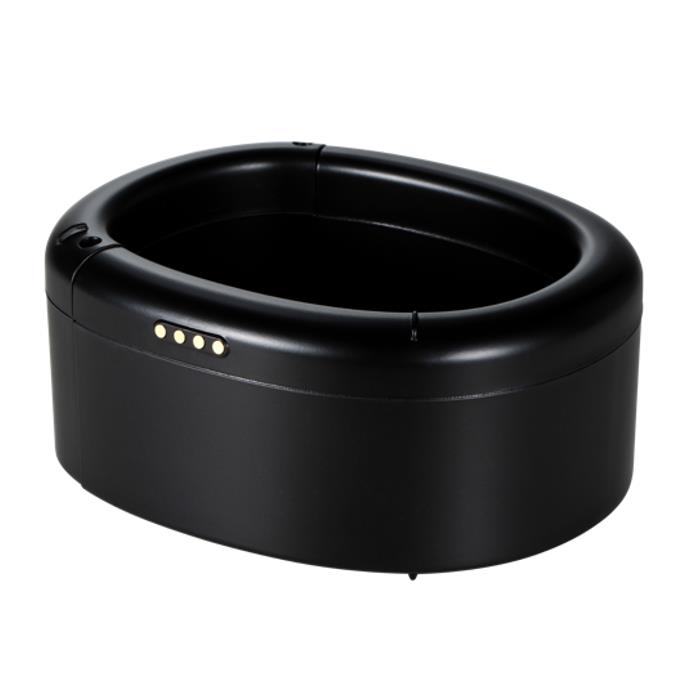

# Xexun - DDX14

La pulsera de tobillo DDX14 GPS/Beidou a prueba de manipulación es un rastreador GPS diseñado específicamente para Plaspy, compatible con correcciones comunitarias, supervisión de atención médica y monitoreo en industrias especiales. Diseñado para un seguimiento fiable y continuo, el DDX14 fusiona señales GPS y Beidou con posicionamiento WiFi y LBS y transmite datos de ubicación y alarmas de forma segura a través de redes celulares domésticas 2G/3G/4G a Plaspy para seguimiento en tiempo real y gestión de casos.

El DDX14 está optimizado para escenarios que requieren medidas antifraude fuertes y detección de proximidad precisa. Un lazo de correa conductiva activa alarmas de manipulación de inmediato, y un módulo UWB opcional ofrece medición de rango con precisión de centímetros cuando se despliega con estaciones base de monitoreo. Emparejado con Plaspy, el DDX14 ofrece alertas en tiempo real, reproducción histórica, geocercas configurables y un manejo fiable de datos offline para supervisión continua y visión de telemetría.

## Aspectos clave

- Rastreador GPS compatible con Plaspy: integración fluida en Plaspy para seguimiento en tiempo real centralizado y flujos de trabajo de casos.
- Posicionamiento híbrido: GPS + Beidou fusionados con WiFi y LBS para fijaciones más rápidas y mayor precisión \(\<10 m típico\).
- Diseño antifraude: el lazo de correa conductiva activa alarmas de manipulación de inmediato y un núcleo de cerradura de nivel B para disuadir apertura no autorizada.
- Proximidad de alta precisión \(opcional\): módulo de rango UWB integrado para ~0.3 m de precisión cuando se usa con estaciones base.
- Comportamiento offline fiable: almacenamiento en zona ciega con retransmisión automática tras la recuperación de la red.
- Recarga cómoda: batería móvil inalámbrica tipo clip permite cargarse mientras el usuario se mueve.
- Alertas personalizadas y avisos de voz: altavoz de 80 dB reproduce mensajes de voz personalizados al activarse la alarma.

## Cómo funciona con Plaspy

Cuando se integra con Plaspy, el DDX14 pasa a ser un punto final gestionado dentro de una solución de supervisión segura o monitoreo de atención médica. El rastreador recopila señales mixtas de satélites y señales locales, reúne la telemetría de ubicación y estado, y envía paquetes a través de redes celulares a Plaspy para visualización inmediata, alertas y archivo. Plaspy puede ingerir alarmas y telemetría del DDX14 para automatizar notificaciones, hacer cumplir las políticas de geocerca y proporcionar a los responsables de casos o cuidadores un seguimiento en tiempo real actualizado.

- Actualizaciones de ubicación y telemetría en tiempo real transmitidas vía 2G/3G/4G a los paneles de Plaspy.
- Alarma de manipulación/lazo conductivo de la correa reportada al instante, con alerta de voz personalizada a través del altavoz de 80 dB.
- Proximidad UWB y alarmas de distancias excesivas cuando se empareja con estaciones base de monitoreo \(detección a nivel de centímetros\).
- Almacenamiento local en zona ciega y reenvío automático de trayectorias y alarmas tras la recuperación de la red.
- Intervalos de seguimiento programados, alertas de geocerca, detección de desvío de ruta y consulta de trayectorias históricas dentro de Plaspy.
- Actualización de firmware remota \(FOTA\) y gestión del dispositivo a través de la plataforma para mantenimiento continuo.

## Resumen técnico

| Modelo | DDX14 \(DDX15 opcional\) |
| --- | --- |
| Posicionamiento | Fusión GPS + Beidou + WiFi + LBS |
| Precisión de posicionamiento | &lt;10 m típico \(dependiente del entorno\) |
| Rango de alta precisión | Módulo UWB integrado opcional — ~0.3 m de precisión con estación base |
| Conectividad | Soporta redes celulares domésticas 2G/3G/4G |
| Batería | Batería interna recargable de polímero de litio 2500 mAh |
| Carga | Batería móvil inalámbrica dedicada tipo clip \(cargada por separado; admite carga durante el uso\) |
| Potencia y tiempo de carga | Voltaje de operación DC 5V; tiempo de carga ~2 horas |
| Modo de espera típico | ~24 horas \(con 1 lectura cada 10 segundos\) |
| Alarmas y sensores | Lazo de correa conductivo antifraude, altavoz \(80 dB\), sensores de movimiento de estación base \(cuando se despliega\) |
| Integridad de datos | Almacenamiento en zona ciega con retransmisión automática tras la recuperación de la red |
| Gestión remota | Capacidad de actualización remota de firmware \(FOTA\) |
| Construcción y formato | Correa de metal + carcasa de plástico respetuosa con el medio ambiente; espacio interior 72 × 95 × 50 mm \(L × A × P\) |
| Peso | Aproximadamente 200 g |
| Entorno de operación | -30°C a +60°C; humedad 10%–90% HR \(sin condensación\) |
| Bluetooth | No se especifican sensores Bluetooth en la documentación del producto |

## Casos de uso

- Monitoreo de libertad condicional y libertad vigilada: alarmas de manipulación, aplicación de geocercas y alertas de desvío de ruta para correcciones comunitarias.
- Arresto domiciliario y supervisión de liberación controlada: seguimiento satelital confiable con UWB opcional para comprobaciones de proximidad de alta precisión en interiores.
- Cuidado de personas mayores con demencia y personas vulnerables: seguimiento en tiempo real, alertas de caídas/movimiento mediante sensores de movimiento de la estación base y historial de ubicaciones para cuidadores.
- Monitoreo de pacientes psiquiátricos y supervisión institucional: hardware antifraude y retransmisión automática de datos para garantizar la continuidad de la telemetría.
- Cumplimiento de cuarentena o aislamiento: límites configurables, alarmas de sobre-distancia y avisos de voz para reforzar reglas y documentar el cumplimiento.

## Por qué elegir este rastreador con Plaspy

Como rastreador GPS compatible con Plaspy, el DDX14 ofrece una combinación equilibrada de características duraderas antifraude, ubicación basada en satélite fiable y detección de proximidad UWB de alta precisión opcional. Su correa conductiva antifraude, almacenamiento local fuera de línea y la retransmisión automática lo hacen adecuado para flujos de trabajo de supervisión que no toleran la pérdida de datos. La integración con Plaspy garantiza que supervisores y cuidadores reciban seguimiento en tiempo real, reproducción histórica y alertas configurables en una única plataforma.

Mientras que el DDX14 se centra en la monitorización centrada en la persona en lugar de telemetría de vehículos, las organizaciones que utilizan Plaspy para la gestión de flotas pueden usar paneles unificados: Plaspy admite diversas fuentes de telemetría, incluidas rastreadores de vehículos con encendido, inmovilizador y monitorización de combustible. Esto permite a las agencias consolidar datos de dispositivos de supervisión personal como el DDX14 y rastreadores GPS de vehículos para una visión situacional integral.

