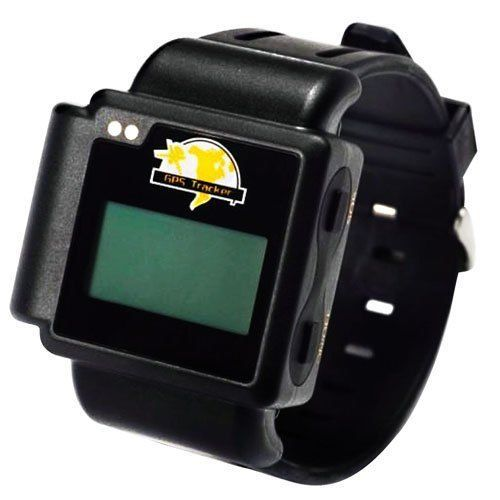

# Xexun - TK-203

El Xexun TK-203 es un rastreador GPS compacto diseñado para ofrecer monitoreo de ubicación confiable de personas y bienes. Combina posicionamiento por GPS con comunicación GSM y GPRS para enviar la ubicación vía SMS o transmisión de datos. La unidad está protegida por una carcasa impermeable e incluye un botón SOS para alertas de emergencia, reportes automáticos de posición y la capacidad de almacenar o reenviar la última ubicación conocida si se pierde la cobertura GPS.

Como dispositivo compatible con Plaspy, el TK-203 puede alimentar la plataforma de Plaspy con reportes de posición y actualizaciones básicas de estado. Esa compatibilidad lo hace apropiado para usuarios que desean centralizar la visibilidad de personas, pequeñas flotas o activos en una sola interfaz de monitoreo. Plaspy puede recibir y mostrar los datos del TK-203 para soportar seguimiento en vivo, alertas y reportes rutinarios sin necesidad de cambios de hardware especializados.

## Características principales

- Soporta reportes de ubicación por GPS con comunicación GSM y GPRS para actualizaciones remotas
- Carcasa impermeable adecuada para uso exterior y exposición a condiciones húmedas
- Alerta de emergencia SOS para notificación rápida en situaciones de auxilio
- Reporte automático y función de última ubicación conocida para mantener visibilidad en áreas de señal débil
- Alertas integradas como geocerca, detección de movimiento, exceso de velocidad y batería baja
- Capacidad de monitoreo remoto para supervisión continua de los objetos rastreados

## Cómo funciona con Plaspy

El TK-203 transmite su ubicación y actualizaciones de estado mediante sus métodos estándar de reporte, que Plaspy puede procesar y mostrar en la plataforma. Una vez que los datos del TK-203 llegan a Plaspy, la plataforma ofrece visualización en mapa, alertas configurables y herramientas de reporte para convertir esas actualizaciones en información operativa.

- Vista centralizada en el mapa de Plaspy para posiciones en tiempo real e históricas reportadas por el TK-203
- Manejo configurable de alertas para eventos SOS, entradas o salidas de geocerca, movimiento y batería baja
- Informes programados o bajo demanda para resumir la actividad del dispositivo y el historial de ubicaciones
- Herramientas de supervisión operativa para agrupar dispositivos, monitorear estado y exportar datos de seguimiento
- Integración en los paneles de Plaspy para apoyar flujos de trabajo de despacho o respuesta

## Usos habituales

- Monitoreo de seguridad personal para niños, adultos mayores o trabajadores solitarios
- Seguimiento y supervisión de trabajadores remotos y personal de campo móvil
- Rastreo de activos pequeños donde se requiere protección impermeable y alertas básicas
- Escenarios de seguimiento discreto que necesitan un factor de forma compacto
- Monitoreo básico de flotas para motocicletas, scooters o vehículos ligeros

## Por qué elegir este rastreador con Plaspy

El Xexun TK-203 es una opción práctica para organizaciones o familias que requieren reportes de posición sencillos con funciones de alerta útiles y un diseño resistente e impermeable. Su soporte para reportes automáticos y alertas de emergencia se alinea bien con los casos de uso de Plaspy en los que la visibilidad continua y las notificaciones oportunas son importantes. Debido a que el TK-203 ofrece mensajes de ubicación y estado en formato estándar, Plaspy puede presentar esas actualizaciones junto con otros dispositivos para proporcionar a los equipos una claridad situacional consistente.

Si está evaluando dispositivos para usar con Plaspy, el TK-203 merece consideración cuando necesita un rastreador compacto y duradero con capacidad SOS y geocerca. Para obtener más información sobre Plaspy y cómo puede presentar y gestionar los datos del TK-203, visite https://www.plaspy.com. Las especificaciones y la disponibilidad del producto pueden cambiar con el tiempo, así que verifique los detalles actuales con el fabricante en https://www.xexun.com/.
