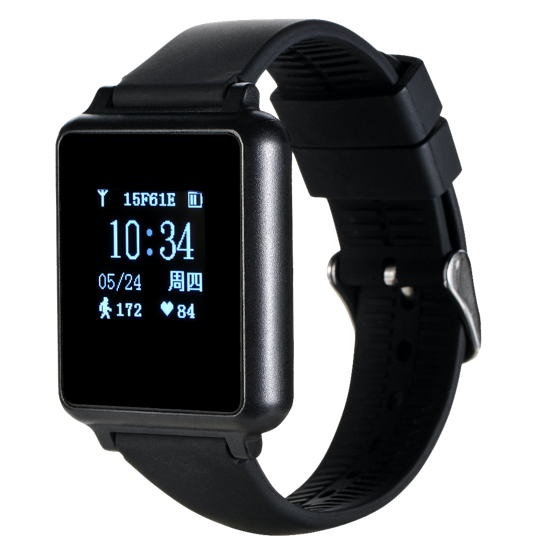

# Xexun - U01

El Xexun U01 es un reloj de posicionamiento de alta precisión basado en UWB, diseñado con la estética y ergonomía de un reloj profesional para implementaciones empresariales e institucionales. Ofrece precisión centimétrica en interiores cuando se combina con una red de anclas UWB y un motor de posicionamiento, y además transmite de manera continua telemetría fisiológica como frecuencia cardíaca, presión arterial y SpO2, junto con métricas de movimiento y actividad para supervisión centralizada.

Como dispositivo diseñado para ser compatible con Plaspy, usted puede incorporar el U01 en sus despliegues para integrar ubicación precisa en interiores y datos de seguridad en tiempo real dentro de una única plataforma de gestión. Su formato tipo reloj, protección robusta IP68, emisiones configurables, botón SOS y gestión de ciclo de vida OTA lo convierten en un endpoint idóneo para seguimiento de personal, flujos de trabajo de seguridad y aplicaciones de control de asistencia o activos en entornos interiores controlados.

## Características principales

- Posicionamiento interior con precisión centimétrica mediante anclas UWB y servidor de posicionamiento para seguimiento de ubicación de alta exactitud.
- Telemetría vital continua que incluye frecuencia cardíaca, presión arterial y SpO2, además de sensores básicos de actividad y sueño para monitoreo de seguridad.
- Resistencia de grado empresarial con protección IP68 y tolerancia ambiental adecuada para entornos industriales e institucionales.
- Funciones de seguridad integradas como botón SOS, alertas por vibración y intervalos de transmisión configurables para reportes oportunos de eventos.
- Larga autonomía en espera y recarga rápida con carga magnética para facilitar la operación y el mantenimiento en campo.
- Gestión remota de dispositivos con actualizaciones de firmware OTA para simplificar la administración de configuración y ciclo de vida.

## Cómo funciona con Plaspy

El U01 se integra en Plaspy suministrando datos posicionales de alta precisión desde la infraestructura UWB junto con telemetría continua y reportes de eventos. Plaspy ingestará las corrientes de ubicación y sensores del U01 para mostrar mapas en vivo, líneas de tiempo y alertas que apoyen la supervisión operativa, la respuesta a incidentes y el análisis histórico.

- Ubicación y telemetría en tiempo real en los paneles de Plaspy para conciencia situacional y visualización en mapas.
- Alertas SOS y de eventos dirigidas a los flujos de alarmas de Plaspy para notificar a despachadores y activar procedimientos de respuesta.
- Señales vitales y datos de actividad cargados en Plaspy para monitoreo de salud, generación de tendencias y revisión de incidentes.
- Estados del dispositivo y eventos de batería reportados a Plaspy para apoyar la planificación de mantenimiento y minimizar tiempos de inactividad.
- Eventos de proximidad RFID y NFC disponibles en Plaspy para control de acceso, registros de entrada/salida y auditoría de eventos.

## Casos de uso habituales

- Seguimiento de personal y control de asistencia en fábricas, hospitales, escuelas y entornos institucionales similares.
- Monitoreo de seguridad y respuesta a emergencias donde la ubicación combinada con telemetría fisiológica acelera la gestión de incidentes.
- Patrullaje, control de acceso y flujos basados en proximidad usando interacciones integradas de RFID o NFC.
- Movimiento de activos y optimización de flujos mediante trayectorias históricas y análisis de actividad.

## Por qué elegir este rastreador con Plaspy

El U01 es ideal para organizaciones que requieren posicionamiento interior preciso combinado con telemetría humana, en lugar de un rastreador tradicional basado en GNSS. Emparejado con Plaspy, el reloj ofrece una solución enfocada en seguridad del personal, control de asistencia y flujos por proximidad dentro de edificios donde el GPS no es efectivo. Su diseño robusto, comportamiento de transmisión configurable y soporte OTA facilitan el despliegue y la gestión a escala.

Aunque el U01 cubre roles de posicionamiento interior y monitoreo de personal, no está diseñado como un rastreador GPS para vehículos y no sustituye la telemática vehicular para uso en flotas. En su lugar, utilice el U01 junto con dispositivos basados en GPS para complementar la visión operativa y ofrecer una cobertura más completa en entornos interiores y exteriores.

Para obtener más información sobre cómo Plaspy puede integrar el Xexun U01 en sus despliegues visite https://www.plaspy.com. Las especificaciones del producto, la disponibilidad y los detalles del fabricante pueden cambiar con el tiempo, por lo que le recomendamos verificar las especificaciones y la documentación actuales con el fabricante en https://www.xexun.com/ antes de finalizar la compra.
