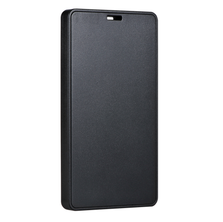

# Xexun - U03

El Xexun U03 es una insignia compacta diseñada para posicionamiento interior de alta precisión y seguimiento de personal en instalaciones gestionadas. Basado en la medición por ultra wideband (UWB) y con un módulo RFID integrado, el U03 ofrece ubicaciones con precisión centimétrica y datos de presencia en tiempo real para entornos donde el GPS no es fiable. Su formato tipo placa, resistencia al agua y funciones de seguridad lo hacen apto para uso continuo en fábricas, hospitales, escuelas y otros espacios supervisados.

Como dispositivo compatible con Plaspy, el U03 puede alimentar despliegues de Plaspy con localizaciones interiores y telemetría de estado precisas. Esta compatibilidad permite a las organizaciones integrar las insignias U03 en mapas, alertas y reportes de Plaspy para supervisión en vivo, reproducción histórica y gestión operativa, manteniendo además capacidades de control de acceso y respuesta ante emergencias.

## Características principales

- Posicionamiento interior con precisión centimétrica gracias a mediciones UWB para localización en tiempo real donde el GPS no llega.
- Comunicación RFID integrada y mensajería bidireccional para notificaciones e intercambio de estado.
- Diseño de insignia para portar en el cuerpo con protección IP68 para uso fiable en entornos exigentes.
- Funciones de seguridad como botón SOS táctil, alertas por vibración y detección de actividad por movimiento para respuesta rápida ante incidentes.
- Larga autonomía en reposo y batería recargable para minimizar intervenciones de mantenimiento y tiempos fuera de servicio.
- Opciones de monitorización de manipulación y detección de desprendimiento para apoyar despliegues seguros y auditorías.

## Cómo funciona con Plaspy

El U03 se integra en una solución de posicionamiento interior gestionada por Plaspy al reportar ubicación y estado del dispositivo en los sistemas de mapeo y alertas de Plaspy. Anclas y motores de posición calculan las localizaciones de las insignias, mientras que la mensajería bidireccional permite a Plaspy recibir actualizaciones de estado y enviar notificaciones a los usuarios. Juntos, Plaspy y el U03 ofrecen a los equipos del sitio visibilidad continua y contexto operativo para la gestión de personal y activos.

- Las ubicaciones y la telemetría en vivo aparecen en los paneles de Plaspy para supervisión y mapeo en tiempo real.
- Los eventos del botón SOS y las alertas por vibración se enrutan a los canales de notificación de Plaspy para una respuesta rápida.
- Avisos de batería baja, manipulación y movimiento alimentan los flujos de trabajo de mantenimiento y seguridad dentro de Plaspy.
- La reproducción histórica de posiciones y los registros de eventos facilitan la revisión de incidentes y la elaboración de informes de cumplimiento.
- Las interacciones RFID y NFC pueden incorporarse a los flujos de Plaspy para control de asistencia, eventos de acceso e inspecciones.

## Casos de uso típicos

- Seguimiento de personal en tiempo real y coordinación de respuesta a emergencias en plantas de manufactura y almacenes.
- Automatización de asistencia y control de presencia en escuelas, hospitales e instalaciones gestionadas.
- Control de acceso y registro de entradas en zonas mediante interacciones de insignia con RFID o NFC.
- Seguridad e investigación de incidentes en sitios sensibles con alertas por manipulación y reproducción histórica de trayectos.
- Monitoreo de ubicación y actividad del personal para asignación rápida de recursos durante eventos críticos.

## Por qué elegir este rastreador con Plaspy

El U03 cubre la necesidad específica de posicionamiento interior con precisión centimétrica cuando las tecnologías exteriores no son suficientes. Al combinarse con Plaspy, la insignia pasa a formar parte de una plataforma operacional más amplia que convierte la localización precisa y el estado del dispositivo en monitorización accionable, alertas y reportes. Su diseño para portar y sus funciones de seguridad lo hacen especialmente valioso para organizaciones que priorizan la protección del personal, registros de acceso auditables y bajos costes de mantenimiento.

Para obtener más información sobre Plaspy y cómo admite despliegues de seguimiento interior con dispositivos compatibles como el Xexun U03 visite https://www.plaspy.com. Product specifications, availability and manufacturer details can change over time; verify current technical information with the manufacturer at https://www.xexun.com/.
