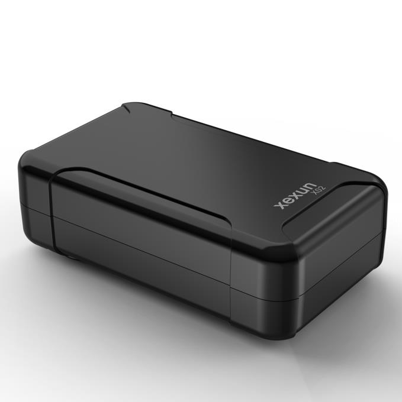

# Xexun - X02

El X02 es un rastreador compacto y recargable de Xexun con GNSS Beidou, diseñado para la gestión de localización de vehículos industriales y el seguimiento de activos. Robusto y portátil, el equipo combina posicionamiento GNSS híbrido con asistencia por Wi‑Fi y LBS, además de un enlace celular multinetwork para ofrecer ubicación en tiempo real, reproducción de históricos y telemetría básica para vehículos, motocicletas y activos portátiles. Un imán interno potente y una batería recargable de alta capacidad hacen que el X02 sea adecuado cuando no es práctico realizar un cableado fijo.

Como dispositivo compatible con Plaspy, el X02 envía datos de ubicación y alarmas directamente a la plataforma en la nube y a la aplicación móvil de Plaspy. Esta compatibilidad permite a los operadores ver posiciones en vivo, generar informes históricos, recibir alertas de geocerca y de manipulación, e integrar el X02 en flujos de trabajo de flota gestionados desde Plaspy para mejorar la visibilidad operativa y la respuesta ante incidentes.

## Características principales

- Compatibilidad nativa con Plaspy para seguimiento en tiempo real, reproducción de históricos e informes en la nube.
- Posicionamiento GNSS híbrido mediante GPS y Beidou, con asistencia Wi‑Fi y LBS para obtener fijaciones más rápidas.
- Batería recargable de alta capacidad e imán interno potente para instalaciones flexibles sin cableado.
- Alertas por geocerca y detección de manipulación para respaldar procesos de seguridad y anti robo.
- Almacenamiento en búfer en zonas sin cobertura con retransmisión automática para proteger la continuidad de los datos.
- Funciones de gestión remota, incluidas actualizaciones de firmware OTA para simplificar el mantenimiento.
- Diseñado para enlace celular multinetwork que ofrece cobertura amplia para operaciones de flota.

## Cómo funciona con Plaspy

El X02 transmite ubicaciones y telemetría procedentes de múltiples fuentes a Plaspy a través de su enlace celular. Plaspy procesa posiciones GNSS y fijaciones asistidas, almacena recorridos históricos y muestra esos datos en mapas, paneles y vistas móviles para que los operadores puedan monitorear activos en tiempo real y revisar incidentes posteriormente.

- Ubicación y telemetría en tiempo real en Plaspy para visibilidad de la flota y supervisión operativa.
- Reproducción de históricos y consultas de trayecto para verificación de rutas y revisión de incidentes.
- Alertas de violación de geocerca y alarmas por manipulación o batería baja enviadas a Plaspy para notificaciones y activación de flujos de trabajo.
- Almacenamiento en el dispositivo durante desconexiones con retransmisión automática a Plaspy cuando se restablece la conectividad.
- Gestión remota de dispositivos y actualizaciones de firmware coordinadas desde Plaspy para reducir el mantenimiento en campo.

## Casos de uso típicos

- Gestión de flotas para automóviles, furgonetas y vehículos comerciales ligeros que requieren posición en tiempo real e historial.
- Seguridad de activos y monitoreo anti robo con detección de manipulación y alertas.
- Motocicletas y bicicletas eléctricas donde se prefiere montaje compacto y recargable en lugar de instalaciones con cableado.
- Activos temporales o de alquiler, como remolques y equipos estacionales, que requieren fácil redepliegue.
- Protección de vehículos personales y monitoreo remoto de ubicación sin necesidad de alimentación cableada permanente.

## Por qué elegir este rastreador con Plaspy

El X02 combina características de hardware prácticas con las capacidades de la plataforma Plaspy para ofrecer un rastreo de ubicación confiable cuando no hay acceso a alimentación cableada. Su combinación de posicionamiento GNSS híbrido, fijaciones asistidas, autonomía de batería robusta y montaje magnético lo convierte en una opción versátil para operadores que requieren visibilidad en tiempo real y alertas de seguridad a través de Plaspy.

Plaspy puede consumir los datos básicos de ubicación, alarmas y estado del X02 para habilitar informes, gestión de geocercas y notificaciones automatizadas en toda la flota. Para organizaciones que más adelante requieran telemetría ampliada o integraciones, Plaspy soporta la extensión de flujos de trabajo con periféricos adicionales y funciones de plataforma, manteniendo al X02 como solución para monitoreo de ubicación y seguridad.

Para conocer más sobre Plaspy y las funciones de la plataforma visite https://www.plaspy.com. Las especificaciones y la disponibilidad del producto pueden cambiar; por favor verifique los detalles actuales y la documentación oficial en el sitio del fabricante https://www.xexun.com/.
