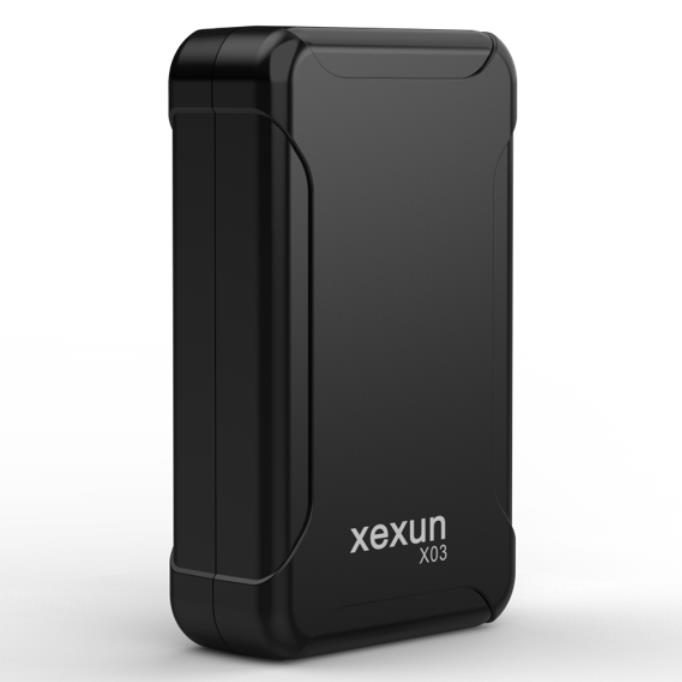

# Xexun - X03

# X03 Long-Standby GPS/BeiDou Tracker

El X03 Long-Standby GPS/BeiDou Tracker es un rastreador GPS compacto, de grado industrial, diseñado para el monitoreo a largo plazo de activos vehiculares y una compatibilidad fluida con Plaspy. Diseñado para automóviles, motocicletas y bicicletas eléctricas, el X03 combina posicionamiento de múltiples fuentes \(GPS, BeiDou, Wi‑Fi y LBS\) con reportes nacionales 2G/3G/4G para ofrecer seguimiento en tiempo real confiable, de bajo mantenimiento y telemetría hacia la plataforma de gestión en la nube de Plaspy.

Con hasta tres años de capacidad de espera bajo perfiles de reporte conservadores, una instalación magnética sencilla, alertas de geocerca, detección de manipulación y actualizaciones de firmware remotas, el X03 está diseñado para operadores que requieren visibilidad continua, preparación anti‑robos y una integración sencilla en los flujos de trabajo de gestión de flotas en Plaspy.

## Key Highlights

- Compatibilidad con Plaspy: transmite ubicación y telemetría a través de 2G/3G/4G para una integración inmediata con los paneles y las apps móviles de Plaspy.
- Posicionamiento híbrido: fusión GPS / BeiDou / Wi‑Fi / LBS ofrece fijaciones más rápidas y una precisión mejorada \(\<10 m típico\), ideal para entornos urbanos y mixtos.
- Autonomía de ultra larga duración: arquitectura de ultra bajo consumo y una batería de 4000 mAh permiten operación prolongada sin mantenimiento—hasta 3 años en ciertos perfiles de reporte.
- Alertas anti‑robo robustas: notificaciones de geocerca \(geovalla\) y eventos de manipulación/desmontaje mediante sensor de luz/inclinación integrado y avisos de batería baja para apoyar la prevención proactiva de robos.
- Almacenamiento y reenvío: almacenamiento en caché de áreas sin cobertura automáticamente guarda el historial de ubicación y lo sube cuando la conectividad se restablece.
- Escucha remota y gestión: módulo de voz integrado y soporte para actualizaciones de firmware por aire permiten diagnóstico remoto y actualizaciones OTA a través de Plaspy.
- Instalación rápida: montaje magnético robusto y formato compacto facilitan la instalación del X03 en vehículos y activos sin cableado complejo.

## Cómo funciona con Plaspy

El X03 envía posicionamiento fusionado y telemetría de eventos a un servidor en la nube a través de redes nacionales 2G/3G/4G. Cuando se configura con Plaspy, la ubicación del dispositivo, alertas de eventos e informes de estado aparecen en tiempo real en el mapa, la línea de tiempo y las herramientas de reporte de Plaspy. Plaspy interpreta los datos del X03 para impulsar flujos de trabajo de gestión de flotas, alertas de seguridad y reproducción histórica de rutas.

- Actualizaciones de ubicación y telemetría en tiempo real entregadas a Plaspy para el seguimiento en vivo y la visualización en mapas.
- Alertas de geocerca \(geovalla\) y eventos de manipulación/desmontaje enviados a Plaspy para notificaciones instantáneas.
- Avisos de batería baja y reportes programados/periódicos permiten a Plaspy activar flujos de mantenimiento y reemplazo de baterías.
- El almacenamiento y reenvío en áreas sin cobertura garantiza que Plaspy reciba posiciones en caché y el historial de rutas una vez que la conectividad se restablece.
- Escucha remota y actualizaciones de firmware disponibles a través de herramientas en la nube gestionadas por Plaspy para el diagnóstico y las actualizaciones del dispositivo.

## Resumen técnico

| Model | X03 |
| --- | --- |
| Posicionamiento | Fusión GPS / BeiDou / Wi‑Fi / LBS |
| Precisión de posicionamiento | &lt;10 m \(típico; varía según el entorno\) |
| Conectividad de red | Soporta redes 2G / 3G / 4G nacionales |
| Batería | Batería integrada de 4000 mAh; modo de espera de consumo ultra bajo \(hasta 3 años en perfiles de reporte específicos\) |
| Alimentación | Voltaje de funcionamiento DC 5V |
| Carcasa y montaje | Caja de plástico ecológica; montaje magnético robusto para adherirse de forma segura a superficies metálicas |
| Dimensiones y peso | 82 × 49 × 25 mm \(L × A × H\); aprox. 60 g |
| Funcionamiento y almacenamiento | Funcionamiento: -20°C a +75°C; Almacenamiento: -40°C a +85°C |
| Sensores y características a bordo | Sensor de luz/inclinación integrado para detección de manipulación; geocerca, almacenamiento y reenvío en áreas sin cobertura, módulo de voz para escucha remota |
| Gestión remota | Actualizaciones de firmware por aire compatibles \(FOTA\) |

## Casos de uso

- Gestión de flotas: seguimiento continuo de vehículos, reproducción de rutas y programación para flotas pequeñas y medianas utilizando Plaspy para la monitorización centralizada.
- Protección anti‑robo: montaje magnético oculto y alarmas de manipulación que ayudan a proteger coches particulares, motocicletas y e-bikes de robos.
- Monitoreo de vehículos de alquiler: rastrear ubicación, historial y estado de la batería de coches de alquiler, scooters y e-bikes con bajo costo de mantenimiento.
- Logística y seguimiento de activos: rastrear remolques, contenedores y activos de alto valor donde la larga autonomía y el almacenamiento y reenvío son críticos en áreas con cobertura intermitente.
- Diagnóstico remoto y planificación de mantenimiento: avisos de batería baja y actualizaciones de firmware remotas reducen el tiempo de inactividad y las visitas in situ.

## Por qué elegir este rastreador con Plaspy

Cuando se combina con Plaspy, el X03 ofrece un equilibrio práctico entre autonomía a largo plazo, posicionamiento híbrido preciso y una implementación sencilla. Su diseño de ultra bajo consumo reduce el mantenimiento y la frecuencia de reemplazo, mientras que el montaje magnético y su huella compacta facilitan la instalación en diferentes tipos de vehículos. La plataforma de Plaspy aprovecha la ubicación en tiempo real, las geocercas y los datos de manipulación del X03 para proporcionar gestión de flotas, notificaciones anti‑robos y análisis de rutas históricas.

Aunque el X03 se centra en un posicionamiento robusto y una larga autonomía en lugar de cableado del vehículo o interfaces de control integradas, Plaspy puede correlacionar la telemetría del X03 con otros sistemas a bordo que ya tenga—como monitoreo de combustible, estado de encendido o módulos inmovilizador—para que pueda construir flujos de trabajo integrales de gestión de flotas y seguridad sin sobredimensionar el rastreador en sí. Elija el X03 por su rendimiento confiable de rastreo GPS, costos de mantenimiento bajos y una integración con Plaspy sencilla que escala desde un solo vehículo hasta flotas gestionadas.

