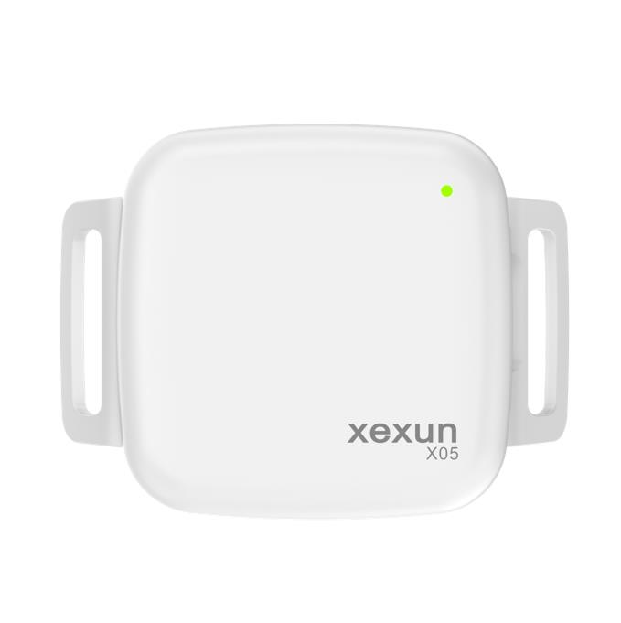

# Xexun - X05

El X05 es un rastreador GPS recargable y compacto diseñado para colocarse en collares y arneses de mascotas. Emplea posicionamiento híbrido que combina GPS y BeiDou con respaldo por Wi‑Fi y LBS, y transmite la ubicación y la telemetría del dispositivo a través de redes celulares nacionales hacia una plataforma en la nube. Su tamaño reducido y carcasa liviana hacen que el X05 sea adecuado para el uso cotidiano en mascotas, ofreciendo monitoreo continuo de la ubicación y reproducción histórica de recorridos.

Como dispositivo compatible con Plaspy, el X05 se integra al panel de seguimiento en tiempo real y a las aplicaciones móviles de Plaspy para entregar actualizaciones de ubicación en vivo, alertas configurables y reproducción de rutas históricas. Plaspy añade gestión centralizada de dispositivos, intervalos de reporte configurables, notificaciones por geocercas y batería baja, además de soporte para actualizaciones de firmware remotas, lo que hace del X05 una opción práctica para propietarios y administradores que buscan visibilidad y alertas en la nube para la seguridad de sus mascotas.

## Características destacadas

- Rastreador GPS para mascotas compatible con Plaspy para seguimiento en tiempo real y gestión de alertas
- Posicionamiento híbrido con GPS y BeiDou más respaldo por Wi‑Fi y LBS para mejor cobertura
- Diseño compacto y apto para collar con dimensiones aproximadas de 51 x 51 x 16 mm y alrededor de 45 g
- Sensor de movimiento integrado y batería recargable de 600 mAh para extender la autonomía en espera
- Alertas por geocerca, avisos de batería baja y reproducción histórica de rutas para supervisión
- Almacenamiento de datos sin conexión con retransmisión automática cuando se recupera la señal
- Monitoreo de audio remoto y posibilidad de actualizar el firmware vía servicios en la nube

## Cómo funciona con Plaspy

Cuando se conecta a Plaspy, el X05 opera como un endpoint de seguimiento gestionado: las posiciones y la telemetría se envían a la nube de Plaspy, donde se procesan, se muestran en mapas en tiempo real y quedan disponibles para alertas e informes. Plaspy organiza los datos entrantes, aplica reglas de geocercas y enruta las notificaciones para que usted, como propietario o administrador, pueda monitorear a sus mascotas y recibir actualizaciones oportunas.

- Ubicación y telemetría en tiempo real entregadas a Plaspy para visualización en mapas en vivo
- Alertas de geocerca que notifican cuando una mascota entra o sale de un área configurada
- Intervalos de reporte configurables para equilibrar frecuencia de actualizaciones y duración de batería
- Buffer en zonas sin cobertura para conservar puntos de ubicación y retransmitirlos cuando vuelva la conectividad
- Reproducción histórica e informes para revisar paseos, rutas y patrones de actividad
- Enrutamiento centralizado de alertas y vista general de dispositivos para facilitar la supervisión operativa

## Casos de uso típicos

- Localización en tiempo real y monitoreo antirrobo para mascotas domésticas y animales de trabajo
- Cobertura en interiores y zonas urbanas donde Wi‑Fi y LBS complementan la señal satelital
- Seguimiento de actividad y rutas durante paseos, sesiones de entrenamiento y análisis de comportamiento
- Monitoreo remoto durante viajes o alojamiento con alertas de batería baja y detección de movimiento
- Rastreo ligero para animales pequeños o montaje discreto en collares y arneses

## Por qué elegir este rastreador con Plaspy

El X05 combina hardware compacto y posicionamiento híbrido con la plataforma en la nube de Plaspy para ofrecer una solución sencilla de rastreo de mascotas. Su tamaño reducido y la gestión de energía basada en movimiento lo hacen ideal para uso en collares, mientras que Plaspy aporta el panel centralizado, las alertas y los informes históricos que facilitan el monitoreo continuo y la supervisión de dispositivos para propietarios, refugios y operadores a pequeña escala.

Para obtener más información sobre el uso del X05 con Plaspy visite Plaspy en el sitio principal https://www.plaspy.com. Nota sobre precisión editorial: las especificaciones del producto, la disponibilidad y los detalles del fabricante pueden cambiar con el tiempo; verifique las especificaciones actuales y la documentación oficial en el sitio del fabricante https://www.xexun.com/.
