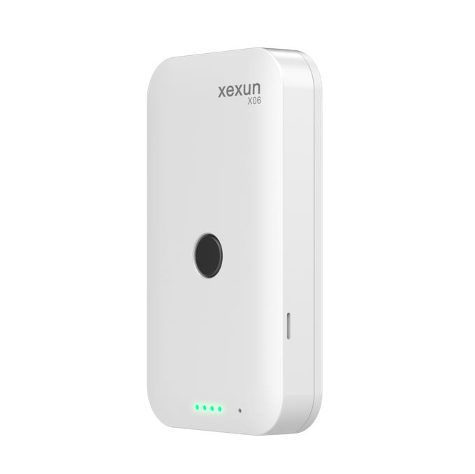

# Xexun - X06

El Xexun X06 es una credencial wearable con posicionamiento GPS y Beidou diseñada para la gestión de ubicación de personas. Su formato compacto integra posicionamiento multimodal con asistencia por WiFi y LBS, un módulo de voz y una alarma SOS, ofreciendo una solución práctica para el monitoreo continuo y discreto en ámbitos educativos, cuidado de adultos mayores, control de asistencia corporativa y seguridad.

Como dispositivo compatible con Plaspy, el X06 transmite actualizaciones de posición, alarmas y estado hacia servicios en la nube y hacia Plaspy, lo que permite a los equipos visualizar ubicaciones en vivo, revisar trazas históricas y recibir alertas de geocerca o SOS. Su capacidad de almacenamiento local y reenvío ayuda a mantener la continuidad de los datos de rastreo durante breves cortes de cobertura, lo que lo hace adecuado para supervisión centralizada de personal desde la plataforma Plaspy.

## Características principales

- Rastreador en formato credencial que combina GPS y BeiDou con asistencia por WiFi y LBS para obtener fijaciones más rápidas en entornos mixtos.
- Diseñado para uso en personas, con alarma SOS integrada y comunicación por voz bidireccional para comunicación directa.
- Larga autonomía en espera y batería recargable pensada para uso continuo diario.
- Alertas por geocerca y almacenamiento local para preservar eventos durante pérdidas temporales de señal.
- Factor de forma compacto y liviano que facilita el uso discreto y el despliegue a gran escala.
- Soporte para actualización de firmware OTA y lista blanca de llamadas entrantes para simplificar la gestión remota.

## Cómo funciona con Plaspy

Cuando se configura como dispositivo compatible, el X06 envía su posición, alarmas y actualizaciones de estado a través de redes celulares hacia la nube y hacia Plaspy. Plaspy presenta esas actualizaciones mediante paneles y herramientas de reporte para que los responsables mantengan conciencia situacional, activen reglas y coordinen respuestas. El dispositivo guarda registros localmente si la conectividad se interrumpe y los reenvía cuando el servicio se restablece, evitando huecos en los datos.

- Actualizaciones de posición en tiempo real y reproducción de trayectos históricos disponibles dentro de Plaspy para monitoreo y revisión.
- Eventos de alarma SOS y comunicaciones de voz bidireccionales mostrados como alertas para acelerar la respuesta ante incidentes y la comunicación con cuidadores.
- Notificaciones por geocerca e informes periódicos configurables dentro de los conjuntos de reglas de Plaspy para monitoreo por zonas.
- Almacenamiento local y reenvío que preservan eventos durante cortes temporales, mejorando la continuidad de datos.
- Gestión remota de dispositivos y actualizaciones de firmware administradas desde la plataforma en la nube en conjunto con Plaspy.

## Casos de uso típicos

- Seguridad estudiantil y seguimiento en campus con alertas por geocerca para zonas de recogida y entrega.
- Monitoreo de adultos mayores donde la alarma SOS y la comunicación por voz facilitan una respuesta rápida del cuidador.
- Control de asistencia corporativa y localización de personal para la gestión de la fuerza laboral y conteos de emergencia.
- Patrullaje de seguridad y protección de trabajadores solitarios mediante una credencial wearable con voz y funciones de alarma.
- Rastreo discreto de equipos portátiles o elementos etiquetados donde un dispositivo compacto es adecuado.

## Por qué elegir este rastreador con Plaspy

El X06 está pensado específicamente para el rastreo centrado en personas y se integra de forma natural con las capacidades de monitoreo y alertas centralizadas de Plaspy. Su combinación de posicionamiento multimodal, funciones de SOS y voz, y el almacenamiento local ayudan a las organizaciones a mantener una conciencia situacional confiable sobre su personal, reducir verificaciones manuales y mejorar los tiempos de respuesta mediante los flujos de trabajo de Plaspy.

Si desea explorar la integración con Plaspy o evaluar el X06 para un programa específico, obtenga más información sobre Plaspy en el sitio principal https://www.plaspy.com. Las especificaciones del producto, la disponibilidad y los detalles del fabricante pueden cambiar con el tiempo, por lo que es recomendable verificar las especificaciones actuales y la documentación oficial en el sitio web de Xexun https://www.xexun.com/.
