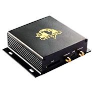

# Xexun - XT008

El Xexun XT008 es un dispositivo de rastreo GPS versátil diseñado para la monitorización de vehículos y activos. Combina rastreo en tiempo real con opciones de seguimiento por intervalos y proporciona respuestas de dirección a nivel de calle para facilitar la localización precisa. El XT008 también soporta rastreo híbrido de ubicación para mantener las actualizaciones de posición cuando la recepción satelital es limitada, e incluye diversas alertas como geocercas, detección de movimiento y exceso de velocidad para apoyar la supervisión operativa.

Como dispositivo compatible con Plaspy, el XT008 puede enviar sus datos de ubicación y alertas a Plaspy para su monitoreo y generación de informes centralizados. Su frecuencia de actualización configurable, alertas por evento y extensiones opcionales como sensores externos y capacidades multimedia permiten que las organizaciones ajusten el rastreo a sus necesidades, usando a Plaspy como la plataforma para visibilidad, reproducción histórica y flujos de trabajo de gestión de flotas.

## Características principales

- Rastreo en tiempo real con actualizaciones por intervalos configurables para vigilancia flexible
- Respuesta de dirección a nivel de calle para obtener ubicaciones legibles
- Rastreo híbrido de ubicación para mantener el seguimiento cuando la cobertura GPS es limitada
- Alertas de geocerca, movimiento, exceso de velocidad, SOS y bajo nivel de batería para conciencia operativa
- Complementos opcionales como tarjeta SD, RFID, control remoto de motor (corte/arranque), monitoreo de combustible y temperatura, y soporte para cámara
- Doble SIM para mejorar la disponibilidad de red y continuidad en los reportes

## Cómo funciona con Plaspy

Cuando usted conecta el XT008 a Plaspy, el equipo suministra puntos de ubicación y notificaciones de eventos que Plaspy utiliza para mostrar la ubicación en vivo, reproducción de historial y alertas en un panel unificado. Plaspy puede procesar los datos del XT008 para generar informes, activar notificaciones y apoyar la supervisión a nivel de flota sin que cambie la forma en que el rastreador genera sus eventos.

- Mostrar la ubicación en vivo del vehículo o activo y los movimientos recientes en los mapas de Plaspy
- Reproducir recorridos históricos para investigaciones y verificación de rutas
- Recibir alertas de geocerca, exceso de velocidad, movimiento y SOS dentro de Plaspy para una respuesta oportuna
- Usar la configuración de rastreo por intervalos del dispositivo para equilibrar frecuencia de actualización y necesidades de visibilidad en Plaspy
- Mostrar telemetría opcional como lecturas de combustible o temperatura como puntos de datos personalizados en los informes y paneles de Plaspy
- Centralizar alertas e informes de estado de múltiples unidades XT008 para supervisión a nivel de flota

## Casos de uso típicos

- Localización y monitoreo de rutas de vehículos de flota para logística y distribución
- Rastreo de activos como remolques, equipos y objetos portátiles de alto valor
- Control de vehículos de renta y compartidos mediante geocercas y alertas de movimiento
- Seguimiento de equipos de servicio en campo y visibilidad de asignaciones de trabajo
- Monitoreo de carga sensible a temperatura al combinarse con sensores externos de temperatura
- Seguridad y recuperación en sitios remotos habilitada por alertas SOS y de manipulación

## Por qué elegir este rastreador con Plaspy

El XT008 ofrece un conjunto amplio de funciones que se ajustan a las necesidades comunes de gestión de flotas y activos. Su combinación de actualizaciones en tiempo real, respuestas de dirección y múltiples tipos de alerta brinda herramientas prácticas para organizaciones que requieren visibilidad continua de la ubicación y notificaciones basadas en eventos. Las extensiones de hardware opcionales permiten que el equipo aborde requisitos más especializados sin alterar las funciones básicas de rastreo.

En conjunto con Plaspy, el XT008 forma parte de un flujo de trabajo centralizado de monitoreo e informes. Plaspy recoge los datos de ubicación y eventos de las unidades XT008 compatibles para ofrecer mapas en vivo, reproducción histórica, enrutamiento de alertas e informes operativos que ayudan a los equipos a tomar decisiones informadas y mantener supervisión sobre vehículos y activos.

Learn more about Plaspy on our main website https://www.plaspy.com. Product specifications, availability, and manufacturer details can change over time, so please verify the current specifications and optional features on the Xexun official site https://www.xexun.com/.
