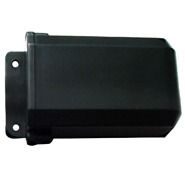

# Xexun - XT009

El Xexun XT009 es un rastreador GPS compacto diseñado para el monitoreo discreto de motocicletas. Integra un receptor GPS y un módulo de comunicaciones GSM GPRS para ofrecer seguimiento remoto de ubicación y funciones básicas de control a distancia. Su tamaño reducido y la antena integrada facilitan la ocultación en vehículos de dos ruedas, mientras que la certificación IP67 garantiza funcionamiento en entornos húmedos o con barro.

Como dispositivo compatible con Plaspy, el XT009 puede enviar información de ubicación y eventos en tiempo real a la plataforma Plaspy para visibilidad centralizada y supervisión de la flota. Admite consultas puntuales de ubicación y seguimiento continuo, además de alarmas como exceso de velocidad, movimiento, SOS y batería baja, lo que lo convierte en una opción práctica para quienes necesitan monitorear motocicletas dentro de Plaspy para seguridad, operaciones e informes.

## Características principales

- Diseño compacto y discreto ideal para montaje y ocultamiento en motocicletas
- Clasificación IP67 para operación fiable en distintas condiciones climáticas y de vía
- GPS integrado y comunicaciones GSM GPRS para actualizaciones remotas de ubicación y acceso por SMS
- Amplio rango de compatibilidad de alimentación para integrarse con sistemas eléctricos de motocicletas
- Múltiples tipos de alarma: alerta de velocidad, alarma por movimiento/choque, batería baja y corte de alimentación principal
- Botón SOS para compartir ubicación rápidamente y hasta cinco números móviles autorizados para recibir alertas y consultas
- Funciones adicionales como ranura para tarjeta SD para almacenamiento de datos y corte remoto de combustible o energía

## Cómo funciona con Plaspy

Al conectarse con Plaspy, el XT009 transmite ubicaciones y eventos que la plataforma muestra en mapas en vivo, en notificaciones y en reportes históricos. Plaspy centraliza los datos del dispositivo para ofrecer visibilidad uniforme y simplificar el monitoreo de flotas de motocicletas o activos individuales.

- Visualización de ubicación en tiempo real y seguimiento en mapas dentro de Plaspy para conocimiento situacional inmediato
- Reproducción de rutas históricas e informes básicos para revisar trayectos y patrones de movimiento
- Enrutamiento de alertas por eventos como movimiento, batería baja, SOS o corte de energía para que el personal responda rápidamente
- Soporte de consultas puntuales de ubicación o modos de seguimiento continuo para equilibrar visibilidad y uso de datos
- Acciones de control remoto disponibles desde Plaspy cuando el dispositivo soporta corte remoto u otros comandos
- Acceso multiusuario y notificaciones para compartir actualizaciones de ubicación con personal autorizado

## Casos de uso típicos

- Detección y recuperación ante robo de motocicletas particulares o comerciales
- Flotas de reparto y mensajería que usan motocicletas y requieren rastreo discreto y supervisión operativa
- Servicios de alquiler o vehículos compartidos que necesitan monitoreo remoto y controles básicos de inmovilización
- Propietarios individuales que desean acceso por SMS y en línea a la ubicación, además de función SOS
- Pequeñas flotas que buscan un rastreador económico que se integre en una plataforma centralizada

## Por qué elegir este rastreador con Plaspy

El XT009 es una opción práctica para organizaciones y particulares que requieren un rastreador compacto y resistente a la intemperie pensado para motocicletas. Su combinación de diseño discreto, compatibilidad amplia de alimentación y un conjunto útil de alarmas lo hace adecuado para despliegues enfocados en seguridad y monitoreo rutinario de flotas. Al integrarlo con Plaspy, esas capacidades del dispositivo pasan a formar parte de un entorno único de supervisión e informes que facilita la gestión de múltiples activos.

Plaspy suma visibilidad centralizada, gestión de alertas y reproducción histórica al flujo de datos del XT009 sin necesidad de equipos adicionales más allá de lo que el rastreador ya ofrece. Para equipos que administran motocicletas o flotas ligeras, esta combinación permite unir características fiables a nivel de dispositivo con funciones de plataforma para monitoreo y respuesta.

Para saber más sobre Plaspy y cómo dispositivos compatibles como el Xexun XT009 pueden integrarse en sus operaciones visite https://www.plaspy.com. Las especificaciones del producto, disponibilidad y funciones del fabricante pueden cambiar con el tiempo, así que verifique los detalles técnicos y la compatibilidad actuales en el sitio oficial del fabricante https://www.xexun.com/.
