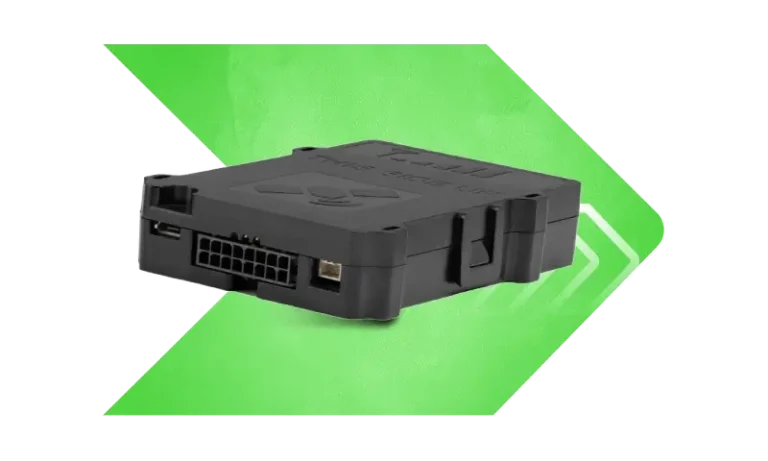

# Xirgo - LX40

El Xirgo LX40 es un rastreador GPS y plataforma telemática de nueva generación, desarrollado como evolución de la serie XG37. Diseñado para implementaciones centradas en vehículos y flotas, el LX40 ofrece una solución escalable y configurable para rastreo, recopilación de telemetría y gestión del ciclo de vida del dispositivo. Su diseño lo hace una opción práctica para flotas mixtas y proyectos de adaptación, al ofrecer opciones de instalación flexibles, I/O programable y variantes compatibles con CANBUS cuando se requiere acceso a datos vehiculares más completos.

Como dispositivo compatible con Plaspy, el LX40 se integra estrechamente con la plataforma para ofrecer rastreo en tiempo real, telemetría avanzada y administración remota de equipos. Con un motor de scripting profesional, un amplio conjunto de objetos de telemetría y soporte para actualizaciones OTA, el LX40 puede configurarse para reportar los eventos del vehículo y del conductor que importan a sus operaciones, mientras Plaspy centraliza esos datos en paneles, alertas e informes para visibilidad y control operativo.

## Puntos clave

- Plataforma compatible con Plaspy para rastreo en tiempo real y gestión centralizada de flotas
- Motor de scripting profesional con más de 500 parámetros y objetos controlables para flujos de trabajo personalizados
- Variantes con capacidad CANBUS para capturar telemetría vehicular cuando el vehículo lo soporta
- I/O programable y múltiples opciones de arnés para soportar instalaciones en retrofit y flotas mixtas
- Soporte Bluetooth Low Energy 5.4 para sensores inalámbricos y accesorios de identificación de conductor
- Gestión remota de dispositivos y capacidad de actualizaciones OTA para mantener los equipos actualizados
- Funciones avanzadas de identificación de conductor y geocercas para responsabilidad y manejo automatizado de eventos

## Cómo funciona con Plaspy

Cuando se integra con Plaspy, los dispositivos LX40 envían ubicación, eventos de conductor y telemetría a la plataforma, donde los datos se normalizan, visualizan y se utilizan para activar alertas e informes. Plaspy ofrece herramientas centralizadas de gestión de dispositivos y operaciones para que los equipos de flota monitoreen el desempeño, respondan a excepciones y mantengan los dispositivos de forma remota.

- Flujos de ubicación y telemetría en tiempo real dirigidos a paneles y APIs de Plaspy para visibilidad operativa
- Eventos de identificación de conductor y geocercas enviados a Plaspy para alertas automatizadas y evaluación de desempeño
- Telemetría CANBUS de las variantes compatibles integrada en informes y flujos de mantenimiento en Plaspy
- Configuración remota y actualizaciones de firmware OTA gestionadas mediante las herramientas compatibles con Plaspy
- Sensores y balizas Bluetooth integrados como entradas suplementarias para vigilancia de temperatura de carga o presencia del conductor

## Casos de uso típicos

- Gestión de flotas con rastreo en tiempo real, identificación de conductor y alertas por geocerca para mejorar rutas y cumplimiento
- Instalaciones retrofit y flotas mixtas donde se requieren I/O configurables y diversas opciones de arnés
- Telemetría y diagnóstico vehicular usando variantes con CANBUS para informar mantenimiento y reportes de utilización
- Monitoreo basado en sensores combinando accesorios BLE con datos de ubicación para supervisión de carga o condiciones ambientales
- Responsabilidad de conductores y flujos de eventos automatizados mediante reglas de scripting y alertas en Plaspy

## Por qué elegir este rastreador con Plaspy

El LX40 es ideal para organizaciones que necesitan una plataforma telemática configurable junto con un sistema centralizado de gestión de flotas. Su motor de scripting y amplio conjunto de parámetros permiten a los integradores adaptar el comportamiento del dispositivo y el manejo de eventos a requisitos operativos específicos, mientras que Plaspy centraliza y actúa sobre esos flujos de datos mediante paneles, alertas e informes. La gestión remota de dispositivos y las actualizaciones OTA ayudan a reducir la carga operativa y a soportar despliegues escalables en distintos tipos de vehículos.

Conozca más sobre Plaspy en el sitio principal https://www.plaspy.com. Las especificaciones del producto, la disponibilidad y los datos del fabricante pueden cambiar con el tiempo, por lo que le recomendamos verificar las especificaciones actuales y la información de variantes en la documentación oficial del fabricante en https://xirgo.com/.
