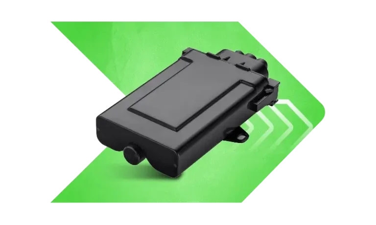

# Xirgo - XG37

El XG37 es un rastreador telemático robusto para vehículos de flota, diseñado para la gestión profesional de flotas y procesos de cumplimiento. Como predecesor probado del LX40, el XG37 ofrece localización junto con telemetría completa CANBUS, notificaciones inmediatas de geocerca, capacidad de descarga remota de tacógrafo y un SDK para escenarios personalizados en el dispositivo. Está construido para proporcionar datos vehiculares confiables y telemetría organizada para las operaciones de flota.

Gracias a su capacidad para transmitir telemetría de forma segura y eficiente, el XG37 es una opción práctica compatible con Plaspy para organizaciones que buscan consolidar seguimiento en tiempo real, diagnóstico de vehículos y datos de cumplimiento en una sola plataforma de gestión de flotas. Su soporte para transporte basado en MQTT con TLS 1.2 y la personalización en el dispositivo facilita enviar posiciones mapeadas, señales CANBUS y alertas de eventos a Plaspy para monitoreo, informes y supervisión operativa.

## Aspectos clave

- Dispositivo compatible con Plaspy diseñado para entregar seguimiento y telemetría en tiempo real a la plataforma
- Acceso completo a datos CANBUS para estado del motor, encendido y señales relacionadas con combustible cuando están disponibles
- Telemetría segura basada en MQTT con TLS 1.2 para transferencia cifrada de datos a sistemas back end
- Descarga remota de tacógrafo para apoyar la administración de horas de conducción y procesos regulatorios
- Notificaciones instantáneas de geocerca para cumplimiento de rutas y monitoreo anti robo
- SDK integrado y configuraciones opcionales de batería para despliegues flexibles y lógica en el dispositivo

## Cómo funciona con Plaspy

La integración con Plaspy está pensada para reunir posición, telemetría del vehículo y eventos de cumplimiento en un único entorno de monitoreo e informes. El XG37 puede configurarse para enviar a Plaspy la telemetría necesaria, mientras que las reglas en el dispositivo reducen el ruido y mejoran la relevancia de los eventos entrantes.

- Actualizaciones de ubicación en tiempo real enviadas a Plaspy para mapeo y monitoreo en vivo de la flota
- Telemetría CANBUS reenviada a Plaspy para diagnóstico, monitoreo de combustible y análisis a nivel vehicular
- Eventos de geocerca y alertas instantáneas que llegan a Plaspy para apoyar cumplimiento de rutas y flujos de seguridad
- Recuperación remota de tacógrafo entregada en Plaspy para auditoría e informes de horas de conductor
- Transporte cifrado vía MQTT con TLS 1.2 para proteger la telemetría en tránsito hacia Plaspy
- Escenarios personalizados en el dispositivo implementados con el SDK para ajustar el muestreo y la generación de eventos para consumo por Plaspy

## Casos de uso típicos

- Gestión de flotas y optimización de rutas usando ubicación en vivo y telemetría del vehículo
- Cumplimiento normativo y administración de horas de conductor con recolección remota de tacógrafos
- Anti robo y monitoreo seguro de predios mediante alertas de geocerca y seguimiento en tiempo real
- Mantenimiento basado en telemetría y monitoreo de combustible a partir de datos CANBUS
- Despliegues de flotas mixtas donde se requiere telemetría segura y configurable

## Por qué elegir este rastreador con Plaspy

El XG37 es una opción práctica para organizaciones que usan Plaspy y necesitan una unidad telemática madura que aporte datos vehiculares completos, funciones de cumplimiento y transporte seguro. Sus capacidades CANBUS y el soporte para descarga remota de tacógrafos reducen la carga administrativa para flotas que deben controlar horas de conducción y el estado del vehículo, mientras que MQTT y TLS 1.2 ofrecen un canal moderno y seguro para la transmisión de datos a Plaspy.

Si su flota requiere actualizaciones de posición confiables, telemetría integrada del vehículo y lógica configurable en el dispositivo, combinar el XG37 con Plaspy le brinda una plataforma consolidada para monitoreo, alertas e informes. Learn more about Plaspy on the main website https://www.plaspy.com. Product specifications and availability can change over time, so verify current device details and regional support with the manufacturer at https://xirgo.com/.
