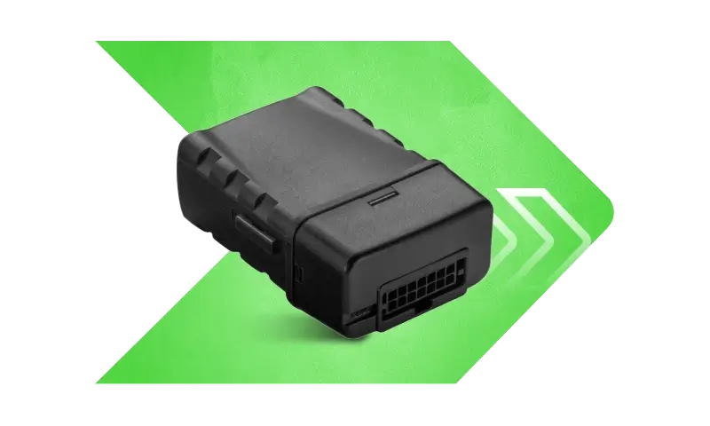

# Xirgo - XT21

El XT21 es un rastreador GPS económico diseñado para la telemática de activos remotos. Integra un receptor GPS con conectividad celular LTE para entregar actualizaciones de ubicación en tiempo real y telemetría esencial para remolques, equipos portátiles y otros activos remotos de alto valor donde la alimentación puede ser intermitente o limitada. Su formato compacto y su enfoque en señales indispensables lo hacen adecuado para despliegues que priorizan bajo consumo de energía y monitoreo sencillo.

Como un dispositivo totalmente compatible con Plaspy, el XT21 puede enviar los datos de posición y la telemetría básica directamente a la plataforma Plaspy para una supervisión unificada de flotas y activos. Las dos entradas digitales multipropósito y la entrada analógica interna para el voltaje de la batería suministran las señales centrales que Plaspy necesita para generar alertas, registrar el estado del activo y soportar flujos de trabajo de reportes sin complejidad innecesaria.

## Características principales

- Diseñado para activos remotos con un diseño compacto y de bajo consumo que soporta entornos con alimentación intermitente.
- Posicionamiento GPS integrado combinado con conectividad LTE para actualizaciones de ubicación consistentes.
- Dos entradas digitales multipropósito para detección básica de eventos y reporte de estado.
- Entrada analógica interna para monitoreo continuo del voltaje de la batería y alertas por bajo voltaje.
- Enfoque económico centrado en la telemática esencial para remolques y equipos portátiles.
- Perfil y conjunto de funciones simples que reducen el esfuerzo de instalación y la gestión continua.

## Cómo funciona con Plaspy

Al desplegarse con Plaspy, el XT21 transmite su ubicación y telemetría para que los datos del activo sean visibles junto con la información de la flota en una sola plataforma. Plaspy ingiere la posición del XT21, los eventos de entradas digitales y las lecturas de voltaje de batería para habilitar monitoreo en vivo, alertas y reportes históricos que apoyen la toma de decisiones operativas.

- Seguimiento de ubicación en vivo y reproducción histórica en los mapas y líneas de tiempo de Plaspy.
- Mapeo de eventos de entradas digitales a notificaciones de Plaspy para flujos de trabajo como puerta abierta, manipulación o eventos auxiliares.
- Telemetría de voltaje de batería dirigida a Plaspy para alertas automáticas de batería baja y análisis de tiempo de actividad.
- Alertas basadas en geocercas y en el estado impulsadas por la ubicación y señales de entrada del XT21.
- Inclusión de los datos del XT21 en los reportes y paneles de Plaspy para respaldar revisiones de utilización y seguridad.

## Casos de uso típicos

- Rastreo de remolques y contenedores para detectar movimiento y mantener el historial de ubicaciones.
- Monitoreo de equipos portátiles de alto valor como bombas, herramientas o maquinaria rentada.
- Supervisión de flotas de alquiler para confirmar devoluciones y detectar manipulación o uso no autorizado.
- Monitoreo de activos en sitios remotos donde la alimentación de red no está garantizada y se requiere telemetría mínima.

## Por qué elegir este rastreador con Plaspy

El XT21 entrega la telemetría esencial que la mayoría de las organizaciones necesitan para supervisar activos distribuidos sin añadir complejidad innecesaria. Su combinación de posicionamiento, entradas digitales y monitoreo de voltaje de batería se alinea bien con las fortalezas de Plaspy en visibilidad basada en mapas, generación de alertas y reportes a nivel de flota. Para operaciones que requieren actualizaciones de posición confiables y señales de evento sencillas desde un dispositivo de bajo consumo, el XT21 es una opción práctica.

Si sus prioridades son el seguimiento remoto económico, alertas antirrobo y monitoreo básico del estado del activo dentro de una plataforma unificada, la combinación del XT21 con Plaspy ofrece una solución enfocada. Conozca más sobre Plaspy en el sitio principal https://www.plaspy.com. Las especificaciones del producto y la disponibilidad pueden cambiar con el tiempo, por lo que le recomendamos verificar los detalles técnicos y la compatibilidad actuales en el sitio del fabricante https://xirgo.com/.
