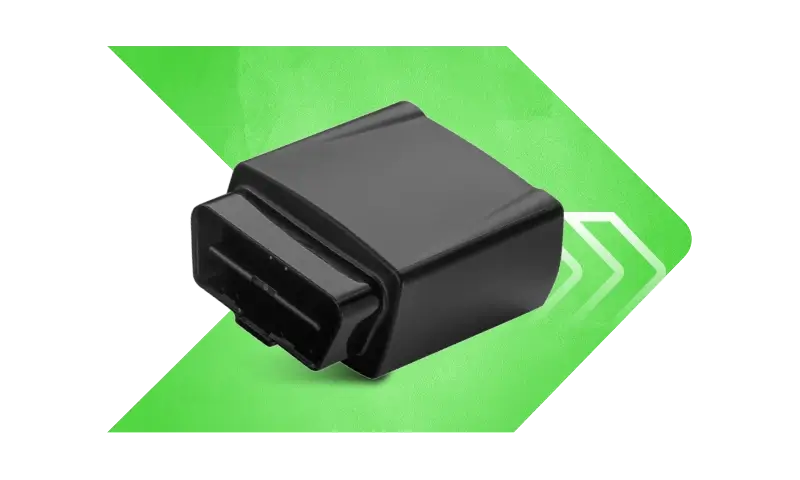

# Xirgo - XT24

El XT24 es un rastreador OBD compacto plug-and-play diseñado para vehículos de pasajeros y de servicio ligero. Integra un receptor GNSS con comunicaciones celulares y una interfaz directa OBD para proporcionar ubicación, velocidad y telemetría del bus del vehículo. El dispositivo está pensado para desplegarse rápidamente en flotas donde la instalación por el propio usuario y la monitorización continua del vehículo son prioritarias.

Como dispositivo compatible con Plaspy desde el primer momento, el XT24 transmite posición GNSS, parámetros del bus del vehículo y eventos de movimiento a la plataforma Plaspy. Esta compatibilidad convierte al XT24 en una opción práctica para organizaciones que desean centralizar el seguimiento de ubicación, la telemetría relacionada con combustible y motor, y las alertas de movimiento dentro de Plaspy para obtener visibilidad operativa en tiempo real.

## Puntos clave

- Factor de forma OBD plug-and-play para una instalación rápida por el propio usuario en vehículos de pasajeros y servicio ligero
- Compatibilidad nativa con Plaspy para la ingestión en tiempo real de GPS y telemetría vehicular
- Reporte de posición GNSS combinado con datos del bus del vehículo para ofrecer un contexto más completo del seguimiento
- Detección de movimiento mediante acelerómetro de 3 ejes para soportar alertas por movimiento e impactos
- Soporta parámetros OBD estándar y muchos PID propietarios de OEM cuando el vehículo los expone
- Indicadores LED que simplifican la puesta en marcha y permiten verificar el estado básico del dispositivo durante el despliegue

## Cómo funciona con Plaspy

Una vez conectado al vehículo, el XT24 lee los parámetros del vehículo soportados y transmite esos flujos de telemetría junto con la posición GNSS y los eventos de movimiento a Plaspy. Plaspy ingiere los mensajes entrantes y los pone a disposición para monitoreo en vivo, alertas e informes, de modo que las flotas puedan actuar sobre la ubicación y el estado del vehículo casi en tiempo real.

- Actualizaciones de ubicación y telemetría en tiempo real a Plaspy para seguimiento y mapeo de flotas en vivo
- Parámetros relacionados con el encendido y el motor leídos desde el bus del vehículo aparecen en Plaspy cuando el vehículo los expone
- PIDs relacionados con combustible y diagnóstico pueden mostrarse y analizarse en Plaspy cuando el vehículo provee esos valores
- Eventos de movimiento e impacto detectados por el acelerómetro permiten activar alertas de movimiento y flujos de trabajo de incidentes
- Flujos antirrobo y respuestas remotas pueden coordinarse combinando la telemetría del XT24 con reglas de Plaspy y hardware de control compatible

## Casos de uso típicos

- Gestión de flotas de vehículos de pasajeros y de servicio ligero para supervisar ubicación y utilización
- Monitoreo antirrobo y apoyo en recuperación usando posición y alertas de movimiento en tiempo real
- Monitoreo de combustible y diagnósticos básicos capturando parámetros del bus del vehículo cuando estén disponibles
- Programas de comportamiento y seguridad del conductor que emplean eventos de movimiento para identificar maniobras bruscas
- Despliegues rápidos a gran escala donde la instalación plug-and-play reduce el tiempo de implementación

## Por qué elegir este rastreador con Plaspy

El XT24 combina un formato sencillo plug-and-play con acceso al bus del vehículo, aportando tanto posición GNSS como telemetría útil a Plaspy. Para operadores que necesitan instalación rápida y visibilidad continua, el XT24 suministra las entradas que Plaspy utiliza para presentar ubicación, parámetros del vehículo y alertas basadas en eventos en una vista unificada. Esa combinación ayuda a reducir la carga de instalación mientras habilita flujos de trabajo telemáticos comunes como visibilidad de rutas, monitoreo de combustible y alertas de movimiento.

Learn more about how Plaspy can use XT24 telemetry and features by visiting https://www.plaspy.com. Product specifications, availability, and manufacturer details can change over time so verify current device capabilities and documentation with the manufacturer at https://xirgo.com/.
