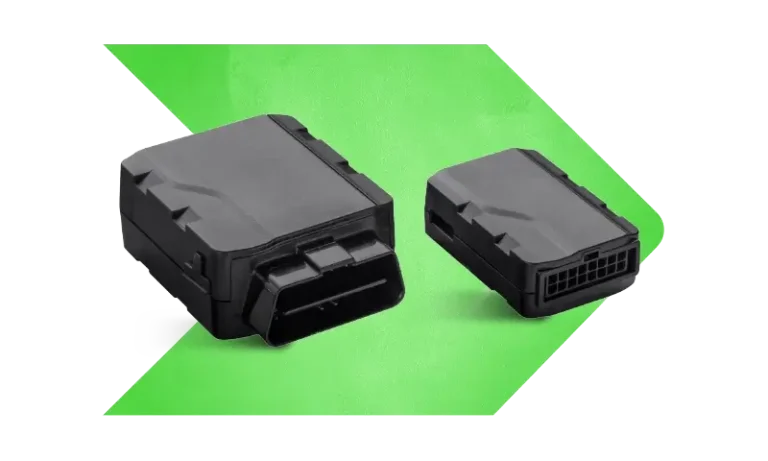

# Xirgo - XT25

El XT25 es una unidad de rastreo de vehículos \(VTU\) plug-and-play diseñada para vehículos ligeros y de pasajeros y fácilmente adaptable a instalaciones en camiones de servicio pesado. Construida para integradores y operadores de flotas que requieren un rastreador GPS compatible con Plaspy, el XT25 ofrece datos de ubicación y movimiento confiables con un factor de forma compacto, radios GPS y celulares integrados, y Bluetooth opcional para ELD y emparejamiento de sensores. Su combinación de compatibilidad con el protocolo OBD, acelerómetro integrado y batería interna opcional lo convierten en una opción práctica para la gestión de flotas, monitoreo antirrobo y telemetría a bordo.

El XT25 se conecta directamente a los puertos OBD del vehículo o se instala mediante cableado para instalaciones permanentes y puede ampliarse con una caja I/O externa cuando se requieren interfaces adicionales. Disponible para redes celulares de Norteamérica \(AT&T, Verizon, TMO\) y diseñado para conectividad 4G LTE Cat M1 y LTE Cat NB2, el XT25 está construido para transmitir datos de rastreo y telemetría en tiempo real a Plaspy para alertas, geocercas y reportes en flotas de vehículos mixtas.

## Aspectos clave

- Instalación plug-and-play para un despliegue rápido en vehículos ligeros y de pasajeros, con opciones adaptables para camiones de servicio pesado.
- Rastreador GPS compatible con Plaspy que admite seguimiento en tiempo real y flujos de gestión de flotas.
- Conectividad celular en 4G LTE Cat M1 y LTE Cat NB2 para telemetría de bajo consumo y confiable sobre las redes de AT&T, Verizon y TMO en Norteamérica.
- Interfaz Bluetooth opcional para aplicaciones ELD y conexión de sensores o balizas Bluetooth.
- Soporte de protocolo OBD y compatibilidad de voltaje del vehículo para acceder al encendido y al diagnóstico cuando esté disponible.
- Acelerómetro integrado para detección de movimiento, informes de eventos bruscos y alertas anti‑robo.
- Batería interna opcional y zumbador interno para admitir alertas de comportamiento del conductor y escenarios de pérdida de energía.
- Expansible mediante una caja I/O externa para añadir entradas/salidas digitales e integrar un inmovilizador o control de alarma según sea necesario.

## Cómo funciona con Plaspy

Cuando se empareja con Plaspy, el XT25 transmite lecturas de GPS, telemetría del vehículo y eventos de movimiento a la plataforma Plaspy para seguimiento en tiempo real, alertas automatizadas y reportes históricos. La integración compatible con Plaspy permite a las flotas visualizar ubicaciones en un mapa, activar notificaciones de geocerca y analizar telemetría para el rendimiento del conductor y la salud del vehículo. La integración de datos aprovecha los sensores a bordo del XT25 y las señales derivadas del OBD para que Plaspy pueda presentar el estado de encendido, códigos de fallo e informes basados en eventos junto con el rastreo de ubicación.

- Actualizaciones en tiempo real de ubicación y telemetría enviadas a Plaspy para seguimiento en mapa en vivo y reproducción de rutas históricas.
- Estado de encendido y diagnósticos básicos vía protocolos OBD cuando el vehículo lo admite, habilitando reglas basadas en el encendido e informes de motor encendido/apagado.
- Monitoreo de combustible y telemetría relacionada disponibles a través de canales OBD cuando el ECU del vehículo lo soporta; Plaspy puede mostrar tendencias de combustible y excepciones.
- Control de inmovilizador o alarma ampliable mediante la caja I/O externa para acciones antirrobo donde sea necesario.
- Sensores Bluetooth y emparejamiento ELD \(opcional\) para la integración de registros del conductor, telemetría de sensores BLE y conectividad de accesorios.
- Alertas de movimiento y eventos bruscos impulsados por el acelerómetro integrado para respaldar flujos de trabajo anti‑robo y comportamiento del conductor en Plaspy.

## Resumen técnico

| Modelo | XT25 |
| --- | --- |
| Conectividad | Celular \(4G LTE Cat M1, LTE Cat NB2\), GPS; Bluetooth opcional |
| Redes / Regiones | Norteamérica: AT&T, Verizon, TMO |
| Energía y batería | Compatibilidad de voltaje para vehículos ligeros y pesados; batería interna de respaldo opcional |
| Interfaces | Soporte de protocolo OBD; posibilidad de conectar a una caja I/O externa \(entradas/salidas adicionales\); zumbador interno opcional |
| GNSS | GPS \(antena integrada\) |
| Sensores | Acelerómetro integrado para detección de movimiento y eventos bruscos |
| Bluetooth | Interfaz Bluetooth opcional con antena interna \(para ELD y sensores Bluetooth\) |
| Gestión remota | Gestión de dispositivo/plataforma no especificada; integra datos con Plaspy para monitoreo e informes |
| Formato | VTU plug-and-play para vehículos de pasajeros y ligeros; adaptable para uso en camiones pesados con cableado y caja I/O |
| Certificaciones | FCC, PTCRB, IC |

## Casos de uso

- Gestión de flotas: datos de rastreador GPS en tiempo real y telemetría para monitoreo de rutas, informes de utilización y paneles de cumplimiento en Plaspy.
- Protección antirrobo: alertas de movimiento y violaciones de geocerca usando el acelerómetro y GPS, con integración opcional de inmovilizador mediante la caja I/O externa.
- Comportamiento y seguridad del conductor: zumbador interno y detección de eventos bruscos impulsados por el acelerómetro para resaltar conducción de riesgo y apoyar programas de capacitación.
- Flujos de trabajo ELD y sensores Bluetooth: interfaz Bluetooth opcional para registro electrónico y emparejamiento con sensores de temperatura o de carga para flotas con activos sensibles.
- Despliegues de flotas mixtas: soporte OBD y compatibilidad de voltaje permiten una implementación sencilla en automóviles, furgonetas y configuraciones para camiones pesados.

## Por qué elegir este rastreador con Plaspy

El XT25 ofrece un equilibrio entre simplicidad y capacidad de expansión para operaciones que requieren un rastreador GPS confiable compatible con Plaspy. Su diseño plug-and-play reduce el tiempo de instalación en vehículos ligeros y de pasajeros, mientras que el hardware opcional \(batería interna, zumbador, Bluetooth\) y una caja I/O externa permiten adaptar el dispositivo a la gestión de flotas, defensas anti‑robo y flujos de telemetría impulsados por datos. Con un amplio soporte celular en Norteamérica para LTE Cat M1 y NB2 y compatibilidad con el protocolo OBD, el XT25 proporciona los datos clave de seguimiento y telemetría en tiempo real que Plaspy requiere para alimentar alertas, reglas basadas en el encendido, monitoreo de combustible cuando esté disponible y reportes escalables para flotas mixtas. Elige el XT25 cuando necesites un rastreador práctico y certificado que se integre de forma limpia con Plaspy para convertir las señales del vehículo en información accionable.

