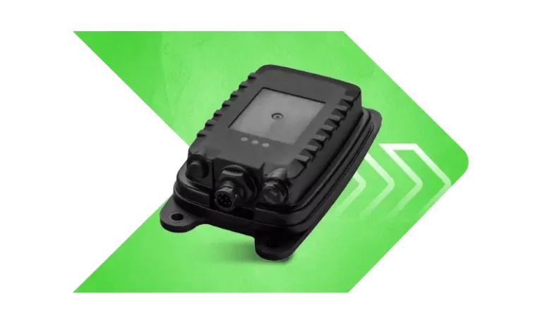

# Xirgo - XT45

El XT45 es un rastreador GPS robusto diseñado para la protección confiable de activos y el monitoreo remoto en entornos donde la alimentación eléctrica es intermitente. Con conectividad celular y GPS integradas, amplia tolerancia a temperaturas extremas y entradas y salidas de supervisión para control y telemetría, el XT45 mantiene el flujo de ubicación y estado en condiciones donde muchos dispositivos fallan. Su diseño prioriza la durabilidad y la consistencia en los reportes para activos expuestos a ambientes severos.

Como dispositivo compatible con Plaspy, el XT45 proporciona los datos constantes y accionables que esperan los usuarios de Plaspy para el seguimiento en tiempo real y la supervisión operativa. La integración con Plaspy facilita ver posiciones en vivo, recibir alertas por eventos e incluir la telemetría del XT45 en informes de flota y reproducción histórica, ayudando a los equipos a mantener visibilidad sobre remolques, maquinaria de construcción y otros activos remotos con alimentación intermitente.

## Aspectos principales

- Compatible con Plaspy para la entrega directa de ubicación y telemetría en paneles e informes
- Carcasa robusta y amplia tolerancia térmica adecuada para activos expuestos y ambientes hostiles
- Conectividad celular y GPS integradas que simplifican el reporte en la nube y reducen dependencias externas
- Entradas y salidas de supervisión que permiten detección de ignición, control de inmovilizador y flujos de trabajo basados en eventos
- Diseñado para operar de forma fiable con alimentación intermitente o parcial en equipos remotos
- Útil para anti robo en flotas, protección de activos y monitoreo remoto continuo

## Cómo funciona con Plaspy

El XT45 transmite posiciones GPS y telemetría de supervisión a Plaspy mediante su conectividad integrada, de modo que los operadores puedan monitorizar ubicaciones en tiempo real, recibir notificaciones de eventos y analizar datos históricos. Plaspy procesa esos datos y los presenta en mapas, alertas e informes para apoyar la toma de decisiones operativas y la respuesta a incidentes, incluso cuando los activos sólo disponen de ventanas cortas de alimentación.

- Ubicación y telemetría en tiempo real mostradas en mapas y paneles de Plaspy para visibilidad de la flota
- Alertas de eventos y estado basadas en entradas de supervisión como cambios de ignición o alarmas
- Geocercas y reproducción histórica para apoyar investigaciones y revisión de rutas
- Uso de salidas para acciones remotas de inmovilizador u otros controles iniciados desde Plaspy
- Correlación de datos de sensores externos, incluidos periféricos compatibles, con la ubicación y estado del XT45 para un contexto más completo

## Casos de uso típicos

- Seguimiento y protección de remolques y activos remolcados expuestos a la intemperie y a largos periodos de inactividad
- Monitoreo de maquinaria de obra donde la energía en sitio es intermitente y las condiciones son severas
- Visibilidad de equipos remotos y generadores para confirmar ubicación y estado operativo
- Flujos de trabajo anti robo en flotas mediante geocercas, alertas y acciones remotas de inmovilizador
- Protección de activos de alto valor que requiere hardware duradero y telemetría constante

## Por qué elegir este rastreador con Plaspy

El XT45 es una opción práctica para organizaciones que necesitan un rastreador resistente capaz de reportar con fiabilidad en despliegues exigentes. Su combinación de construcción robusta, entradas y salidas de supervisión y tolerancia a la alimentación intermitente se alinea con los requisitos comunes de flotas y protección de activos, convirtiéndolo en una solución natural para usuarios de Plaspy que requieren conciencia situacional continua y control por eventos sencillo.

Si sus operaciones incluyen remolques, maquinaria remota u otros activos expuestos, combinar el XT45 con Plaspy puede reducir puntos ciegos y optimizar los flujos de monitoreo y alertas. Para más información sobre Plaspy visite el sitio principal https://www.plaspy.com. Las especificaciones del producto, disponibilidad y detalles del fabricante pueden cambiar con el tiempo, por lo que le recomendamos verificar la información técnica actual en el sitio oficial del fabricante https://xirgo.com/.
