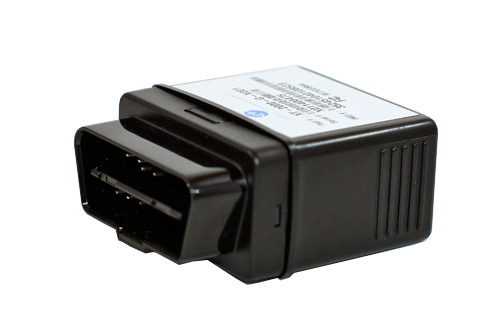

# Xirgo - XT-2000

El Xirgo XT-2000 es un módem OBD II plug and play con motor GPS integrado, diseñado para vehículos de pasajeros y de servicio ligero. Su factor de forma compacto y el conector estilo J1962 facilitan su uso para gestores de flota y despliegues posventa que requieren ubicación, velocidad y datos OBD II sin procesos de instalación complejos. Está pensado para aplicaciones como gestión de recursos móviles, telemática para consumidores, monitoreo de comportamiento de conductores y servicios automotrices posventa.

Como dispositivo compatible con Plaspy, el XT-2000 puede enviar la telemetría del vehículo y la ubicación a Plaspy para visualización, alertas e informes. Al exponer parámetros clave del vehículo a través de la interfaz OBD II e incluir un GPS de alta sensibilidad además de un acelerómetro para detección de movimiento, el XT-2000 es idóneo para proporcionar los datos que habitualmente consumen las flotas y proveedores de servicios en Plaspy para supervisión operativa y análisis.

## Características principales

- Módem OBD II plug and play que se alimenta desde el puerto del vehículo para implementaciones rápidas en vehículos de pasajeros y servicio ligero
- Motor GPS de alta precisión integrado y antenas embebidas para informes fiables de ubicación y velocidad
- Acelerómetro incorporado para detección de movimiento y señales básicas de comportamiento del conductor
- Acceso a parámetros OBD II como VIN, estado de ignición, velocidad del vehículo y códigos de diagnóstico para insights sobre la salud del vehículo
- Soporte para métodos comunes de transporte de datos y actualizaciones de firmware OTA para mantener los dispositivos al día
- Diseño compacto que reduce el tiempo de instalación y disminuye el costo de despliegue en grandes flotas

## Cómo funciona con Plaspy

Cuando se integra con Plaspy, el XT-2000 transmite sus datos de vehículo y ubicación a la plataforma, donde se combinan con mapas, alertas e informes para apoyar las operaciones diarias y el análisis a largo plazo. Plaspy presenta la telemetría del dispositivo para que los gestores de flota conviertan entradas crudas en información accionable.

- Seguimiento en tiempo real de ubicación y velocidad mostrado en los mapas de Plaspy para visibilidad de los movimientos de los vehículos
- Diagnóstico del vehículo y reporte de códigos de falla desde la interfaz OBD II expuestos para mantenimiento y triage
- Visibilidad de movimientos y eventos de conducción usando el acelerómetro y el estado de ignición para apoyar el monitoreo del comportamiento del conductor
- Alertas y notificaciones configurables en Plaspy para eventos como encendido/apagado, alertas de diagnóstico y movimiento fuera de ventanas programadas
- Informes históricos y datos exportables para análisis de desempeño de la flota y revisiones operativas

## Casos de uso típicos

- Rastreo de flotas de vehículos de servicio ligero y de pasajeros que requieren despliegues rápidos basados en OBD
- Telemática posventa para servicios de renta, leasing o gestión de flotas por terceros
- Programas de monitoreo y entrenamiento de conductores utilizando detección de movimiento y eventos de ignición
- Monitoreo de salud del vehículo y detección temprana de códigos de falla para apoyar la planificación del mantenimiento
- Servicios de rastreo y seguridad orientados al consumidor que se benefician de un dispositivo plug and play compacto

## Por qué elegir este rastreador con Plaspy

El XT-2000 es una opción práctica para organizaciones que necesitan una forma de baja fricción para recopilar ubicación del vehículo y datos OBD II. Su diseño plug and play reduce el esfuerzo y el costo de instalación, lo cual resulta útil en implementaciones a gran escala o en despliegues donde debe minimizarse el tiempo fuera de servicio de los vehículos. La combinación de GPS integrado, acelerómetro y acceso a parámetros OBD II proporciona un conjunto de datos valioso para tareas centrales de gestión de flotas.

Al usarlo con Plaspy, los datos del XT-2000 pueden organizarse en mapas, alertas e informes que respaldan las operaciones diarias de la flota y el análisis a largo plazo. La plataforma de Plaspy está diseñada para ingerir telemática de dispositivos compatibles como el XT-2000 y presentar esa información de forma que ayude a los equipos a monitorear vehículos, responder a incidentes y planear el mantenimiento de manera más eficiente.

To learn more about how the XT-2000 works with Plaspy and to explore capabilities in context, visit the Plaspy website at https://www.plaspy.com. Product specifications, availability, and manufacturer details can change over time, so please verify current technical information and compatibility on the official Xirgo site at https://xirgo.com/.
