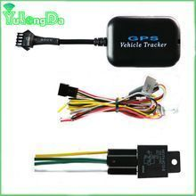

# YulongDa - H08

El YulongDa H08 es un rastreador GPS compacto diseñado para ubicación en tiempo real de vehículos y monitoreo básico de seguridad. Soporta GSM cuatribanda para cobertura celular amplia y funciona en un rango de voltaje de entrada de DC 9 a 24 V, lo que lo hace compatible con distintos autos y vehículos comerciales. El equipo incorpora funciones habituales en rastreo vehicular, como sensor de vibraciones para alertas antirrobo, detección ACC para reportar el estado de encendido, una pequeña batería interna de respaldo para avisar ante corte de alimentación principal y la opción de conexión a un relé externo para control remoto de bloqueo de motor o corte de combustible.

Como dispositivo compatible con Plaspy, el H08 puede enviar actualizaciones de ubicación y alertas de eventos a la plataforma de gestión de flotas y activos Plaspy. Integrado con Plaspy, el H08 forma parte de un entorno monitoreado donde su posición, eventos de movimiento, estado de alimentación y alertas por manipulación se traducen en visibilidad en tiempo real, supervisión operativa y reportes. Esta compatibilidad convierte al H08 en una opción práctica para organizaciones que requieren un rastreador discreto con funciones de seguridad esenciales integradas en Plaspy.

## Características principales

- Soporte GSM cuatribanda para amplia cobertura celular en varias regiones
- Rango de voltaje de entrada DC 9 a 24 V para adaptarse a diversos vehículos
- Sensor de vibraciones incorporado opcional para alertas antirrobo inteligentes
- Detección ACC para reportar el estado del motor o del encendido
- Batería interna de respaldo y alarma por corte de alimentación principal para continuidad en el monitoreo
- Capacidad para relé externo que permite control remoto de inmovilización o corte de combustible donde esté configurado
- Factor de forma compacto y diseño ligero para una instalación discreta

## Cómo funciona con Plaspy

El H08 envía posiciones GPS periódicas y notificaciones de eventos a Plaspy a través del enlace celular del dispositivo. Plaspy procesa esos mensajes de ubicación y estado y los presenta en mapas, líneas de tiempo y reglas de alerta configurables para que los administradores de flota puedan supervisar los vehículos y responder a incidentes.

- Actualizaciones de ubicación en tiempo real mostradas en los mapas de Plaspy para seguimiento en vivo
- Alertas por vibración y manipulación integradas en Plaspy para detección y respuesta ante robos
- Eventos de estado de encendido visibles en Plaspy para análisis operativo y reportes de uso
- Notificaciones de pérdida de energía y batería de respaldo enviadas a Plaspy para monitoreo de continuidad
- Control de relé integrado cuando está soportado, permitiendo comandos de inmovilización remota desde Plaspy según la configuración y permisos locales
- Historial de seguimiento y reportes básicos disponibles en Plaspy para revisión de rutas y análisis operativo

## Casos de uso típicos

- Rastreo de vehículos de flotas para operaciones comerciales pequeñas y medianas
- Monitoreo antirrobo y alertas para autos particulares o vehículos de servicio
- Supervisión de vehículos de renta y compartidos para controlar uso y estado
- Vehículos de entrega y logística donde se requiere visibilidad de ubicación
- Vehículos de servicio en campo y utilitarios que necesitan telemática básica y reporte de eventos

## Por qué elegir este rastreador con Plaspy

El H08 es una opción práctica cuando necesita un rastreador liviano y sencillo que cubra las necesidades esenciales de monitoreo vehicular. Su amplia tolerancia de voltaje y su tamaño compacto lo hacen adaptable a distintos tipos de vehículos, mientras que el sensor de vibraciones integrado, la detección de encendido y las opciones de respaldo de energía aportan funciones de seguridad y resiliencia útiles. Integrado con Plaspy, esas capacidades del dispositivo se traducen en visibilidad accionable, alertas y reportes para administradores de flota y propietarios de vehículos.

Al enfocarse en un rastreo fiable y funciones de seguridad fundamentales, el H08 es ideal para organizaciones que desean un equipo discreto combinado con las herramientas operativas de una plataforma de flota moderna. Plaspy convierte los mensajes de sensor y estado del H08 en paneles, alertas y registros que apoyan las operaciones diarias y la respuesta a incidentes.

Para saber más sobre cómo Plaspy puede trabajar con dispositivos como el YulongDa H08 visite https://www.plaspy.com. Tenga en cuenta que las especificaciones del producto, la disponibilidad y los datos del fabricante pueden cambiar con el tiempo y deben verificarse con la documentación oficial del fabricante en http://www.yulongdatechnology.com.
