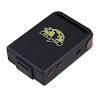

# YulongDa - TK102

El YulongDa TK102 es un rastreador GPS compacto y de peso reducido, diseñado para ofrecer ubicación precisa y confiable en diversas aplicaciones. Con unas dimensiones de 64 mm x 46 mm x 17 mm y un peso aproximado de 50 g, el TK102 es fácil de transportar y puede colocarse de forma discreta. Utiliza conectividad celular y un receptor GPS SIRF3 de alto rendimiento para proporcionar posicionamiento con precisión en el orden de metros. Incluye batería extraíble y accesorios de carga que permiten un uso flexible tanto en despliegues móviles como fijos.

Como dispositivo compatible con Plaspy, el TK102 puede enviar datos de ubicación a la plataforma de gestión de flotas Plaspy, de modo que usted pueda visualizar posiciones, monitorear desplazamientos y generar reportes operativos básicos. Su conectividad celular y el funcionamiento con batería lo hacen adecuado para despliegues temporales y seguimiento portátil cuando Plaspy se usa para centralizar la visibilidad, monitorear el estado y mantener registros históricos de ubicación.

## Aspectos destacados

- Factor de forma compacto y ligero, apto para colocación discreta y uso portátil
- Compatibilidad GSM GPRS en bandas comunes para amplia cobertura de red
- Chip GPS SIRF3 de alto rendimiento con buena sensibilidad y precisión a nivel de metros
- Batería reemplazable de 3.7V 800 mAh con capacidad de espera y varias horas de seguimiento continuo en intervalos típicos
- Incluye cargadores para auto y pared para recarga flexible en distintos entornos
- Amplio rango de temperaturas de operación y almacenamiento y alta tolerancia a humedad sin condensación
- Compatible con Plaspy para integración en flujos de trabajo de monitoreo de flotas y activos

## Cómo funciona con Plaspy

Cuando se emplea con Plaspy, el TK102 transmite actualizaciones de ubicación a través de la red celular que Plaspy procesa y presenta mediante sus herramientas de monitoreo y reporte. Esto le permite consolidar información de ubicación en tiempo real e histórica de unidades TK102 junto con otros dispositivos conectados para una supervisión operativa unificada.

- Visualización de la ubicación en vivo en los mapas de Plaspy para visibilidad en tiempo real de las unidades rastreadas
- Reproducción de rutas históricas y reportes de trayectos para revisar movimientos y decisiones de ruta pasadas
- Alertas y notificaciones configurables por movimiento, estado offline u otras condiciones monitorizadas
- Vistas centralizadas de la flota para agrupar y gestionar múltiples unidades TK102 dentro de Plaspy
- Informes operativos y exportación de datos para apoyar análisis y tareas administrativas

## Casos de uso típicos

- Seguimiento de flotas de vehículos pequeños y medianos para visibilidad de ubicación y supervisión operativa básica
- Rastreo de activos portátiles donde el tamaño compacto y la operación con batería son importantes
- Seguimiento personal para trabajadores solitarios o monitoreo temporal de seguridad durante traslados
- Control de equipos de alquiler para registrar uso y ubicación mientras están fuera del sitio
- Monitoreo en actividades al aire libre como senderismo o campamento donde la compacidad y la duración de batería son relevantes

## Por qué elegir este rastreador con Plaspy

El TK102 es una opción práctica para equipos que requieren un rastreador GPS pequeño y sencillo, con posicionamiento confiable y conectividad celular. Sus dimensiones compactas y las opciones de carga incluidas lo hacen versátil para instalaciones temporales o despliegues móviles donde la colocación y la recarga sencilla son prioritarias. Al combinarse con Plaspy, la unidad forma parte de una solución más amplia de visibilidad y reporte que ayuda a los responsables a rastrear activos y revisar movimientos históricos en una sola plataforma.

Dado que el TK102 combina portabilidad, sensibilidad GPS confiable y compatibilidad celular común, puede encajar bien en organizaciones que adoptan Plaspy para supervisión básica de flotas o activos. Si sus requerimientos incluyen sensores especializados o funciones de integración avanzadas, considere comparar capacidades entre dispositivos disponibles y consulte la documentación técnica más reciente del fabricante.

Para obtener más información sobre Plaspy y cómo funciona con rastreadores compatibles como el YulongDa TK102 visite https://www.plaspy.com. Las especificaciones del producto, la disponibilidad y los datos del fabricante pueden cambiar con el tiempo, por lo que le recomendamos verificar la información técnica más reciente en el sitio oficial de YulongDa http://www.yulongdatechnology.com.
