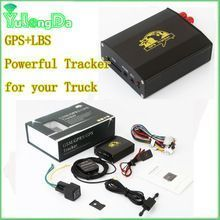

# YulongDa - TK103

El YulongDa TK103 es un rastreador GPS compacto para vehículos pensado para monitoreo de ubicación y funciones básicas de seguridad. Soporta las bandas GSM globales y funciona en un amplio rango de entrada DC 9–24V, lo que lo hace compatible con muchos tipos de vehículos. El equipo incluye un sensor de vibración integrado para alertas antirrobo, detección ACC para notificaciones del estado del motor, un botón SOS externo para emergencias y una batería interna de respaldo que permite continuar reportando si se corta la alimentación principal. Accesorios opcionales como relé externo, micrófono y altavoz amplían sus capacidades de seguridad y monitoreo.

Al ser compatible con Plaspy, el TK103 puede transmitir datos de ubicación y estado directamente a Plaspy para una visibilidad centralizada y supervisión de la flota. Al integrarlo con Plaspy, las alertas y actualizaciones de posición del rastreador se incorporan a un flujo de trabajo de monitoreo unificado, lo que permite a los administradores de flota y a los propietarios ver ubicaciones en tiempo real, recibir notificaciones de eventos y generar informes operativos. La compatibilidad con Plaspy convierte al TK103 en una opción práctica para organizaciones que buscan rastreo y alertas sencillos sin integraciones complejas.

## Características principales

- Soporte quad band GSM para amplia cobertura e uso internacional
- Rango de voltaje amplio DC 9–24V para compatibilidad con sistemas eléctricos de vehículos comunes
- Sensor de vibración integrado para detección de movimientos sospechosos y alertas por manipulación
- Detección ACC para reportar eventos de encendido y apagado del motor
- Botón SOS externo para alertas de emergencia iniciadas por el usuario
- Batería de respaldo integrada para mantener los reportes si se corta la energía principal
- Relé externo y accesorios de audio opcionales para soporte de inmovilización y monitoreo por voz

## Cómo funciona con Plaspy

El TK103 envía actualizaciones de posición y notificaciones de eventos que Plaspy procesa para ofrecer visibilidad en mapas, alertas e informes. Dentro de Plaspy el dispositivo puede gestionarse junto a otros rastreadores, de modo que la organización obtenga una vista única de sus activos e historial operativo.

- Visualización de ubicación en tiempo real en los mapas de Plaspy para monitorear el desplazamiento de vehículos
- Entrega de alertas de eventos como advertencias por vibración por manipulación, cambios en ACC y botones SOS a las notificaciones de Plaspy
- Paneles de flota e informes históricos para analizar viajes y patrones de actividad
- Listado centralizado de dispositivos para revisar estado, batería y conectividad
- Agrupación y filtrado de vehículos para apoyar la supervisión operativa y el despacho

## Casos de uso típicos

- Rastreo de vehículos personales y disuasión de robos para autos y motocicletas
- Monitoreo de flotas pequeñas y medianas para vehículos de reparto o servicio
- Supervisión de vehículos de alquiler y compartidos para controlar uso y eventos de seguridad
- Alertas remotas de emergencia para conductores mediante el botón SOS
- Monitoreo discreto y oculto gracias a un factor de forma compacto

## Por qué elegir este rastreador con Plaspy

El TK103 ofrece un conjunto equilibrado de funciones que se ajustan bien a organizaciones que necesitan rastreo confiable y funciones básicas de seguridad. Su sensor de vibración y detección ACC proporcionan alertas útiles para prevención de robos y control del estado del vehículo, mientras que la batería de respaldo y el relé opcional añaden resiliencia y control adicional cuando se requiere. Al ser compacto y ligero, el dispositivo es adecuado cuando se prioriza la discreción y un espacio reducido.

Usar el TK103 con Plaspy brinda a los administradores de flota y a los propietarios un camino sencillo para integrar los datos del dispositivo en una plataforma de seguimiento profesional. Plaspy consolida las actualizaciones de ubicación y las alertas de rastreadores compatibles como el TK103, de modo que los equipos puedan actuar con base en la información del vehículo, gestionar incidentes y generar informes sin manejar múltiples sistemas. Para conocer más sobre Plaspy y cómo soporta dispositivos como el TK103 visite https://www.plaspy.com. Las especificaciones del producto, la disponibilidad y los datos del fabricante pueden cambiar con el tiempo, por lo que le recomendamos verificar la información técnica actual en el sitio oficial de YulongDa http://www.yulongdatechnology.com.
