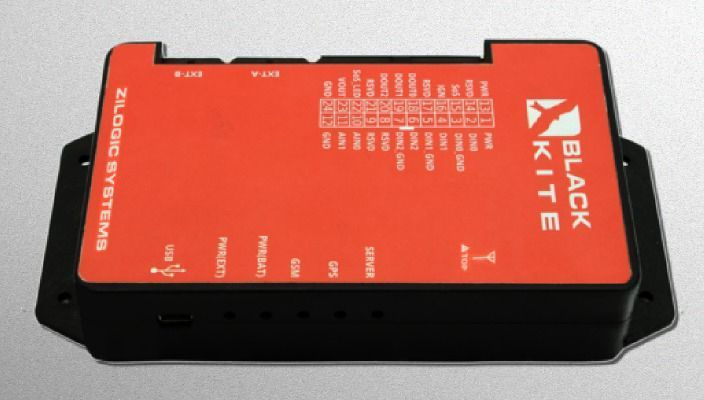

# Zilogic - Fleet Pro

El Zilogic Fleet Pro es un rastreador GPS potente y versátil diseñado para la telemática vehicular. Construido con un enfoque independiente de plataforma y una estructura robusta, el Fleet Pro ofrece seguimiento de ubicación fiable y recopilación de datos del vehículo. Entre sus características destacadas el fabricante incluye un acelerómetro integrado para monitorizar patrones de conducción, una interfaz OBD II opcional para acceder a información de salud del vehículo, intervalos de transmisión configurables desde 30 segundos, y seguimiento en línea o a demanda vía GPRS y SMS. El dispositivo también proporciona posicionamiento GPS de alta precisión, entradas y salidas digitales y analógicas, y LEDs de estado para fácil visibilidad del equipo.

Como dispositivo compatible con Plaspy, el Fleet Pro puede enviar su ubicación y señales del vehículo a Plaspy para apoyar la supervisión y generación de informes de la flota. Sus datos de acelerómetro y la información OBD II opcional son útiles para el monitoreo de comportamiento del conductor y flujos de trabajo de mantenimiento preventivo, mientras que los intervalos de datos configurables y el rastreo a pedido permiten equilibrar la frecuencia de actualización con el uso de datos. Los usuarios de Plaspy pueden incorporar los dispositivos Fleet Pro en paneles, alertas e informes operativos para mejorar la visibilidad y la toma de decisiones en flotas mixtas.

## Características principales

- Diseñado específicamente para telemática vehicular y gestión de flotas
- Acelerómetro integrado para detectar patrones de conducción y eventos
- Interfaz OBD II opcional para exponer diagnósticos del vehículo y datos relacionados con combustible
- Seguimiento en línea y a demanda vía GPRS y SMS con intervalos configurables desde 30 segundos
- Posicionamiento GPS de alta precisión y LEDs de estado para visibilidad del dispositivo
- Múltiples entradas y salidas digitales y analógicas para monitoreo y control remoto de elementos a bordo

## Cómo funciona con Plaspy

Al integrarse con Plaspy, el Fleet Pro transmite ubicación y señales a bordo hacia un entorno centralizado de gestión de flotas, habilitando supervisión en vivo, análisis histórico y alertas configurables. Plaspy puede aprovechar esos datos para optimizar rutas, apoyar la planificación de mantenimiento y monitorear tendencias de comportamiento del conductor en toda la flota.

- Visibilidad de ubicación en tiempo real y bajo demanda en los paneles de Plaspy
- Monitorización de patrones de conducción y eventos derivada del acelerómetro integrado
- Información sobre salud del vehículo y mantenimiento usando datos OBD II opcionales en los informes de Plaspy
- Intervalos de actualización configurables para equilibrar seguimiento casi en tiempo real con consumo de datos
- Mapeo de entradas y salidas en Plaspy para monitoreo de estados como nivel de combustible o dispositivos auxiliares
- Alertas y notificaciones para eventos clave, como umbrales de comportamiento o señales de diagnóstico

## Casos de uso típicos

- Seguimiento y supervisión operativa de vehículos de flota comercial
- Programas de capacitación y seguridad del conductor basados en eventos detectados por el acelerómetro
- Flujos de trabajo de mantenimiento preventivo usando diagnósticos del vehículo vía OBD II
- Monitoreo y optimización de rutas mediante actualizaciones frecuentes de ubicación
- Supervisión de equipos y estados a bordo mediante entradas analógicas y digitales

## Por qué elegir este rastreador con Plaspy

El Fleet Pro es una opción práctica para organizaciones que requieren un rastreador vehicular flexible con capacidades tanto para monitoreo de comportamiento como para diagnósticos del vehículo. Su combinación de acelerómetro integrado, acceso OBD II opcional e intervalos de reporte configurables lo hace adecuado para flotas que buscan integrar seguridad, eficiencia y planificación de mantenimiento. Al combinarlo con Plaspy, los datos del Fleet Pro se consolidan en paneles e informes unificados que apoyan las operaciones diarias y el análisis a largo plazo.

Si desea saber más sobre cómo Plaspy puede trabajar con el Zilogic Fleet Pro y otros dispositivos compatibles, visite https://www.plaspy.com. Tenga en cuenta que las especificaciones del producto, la disponibilidad y los detalles del fabricante pueden cambiar con el tiempo; verifique la información técnica y las opciones actuales con el fabricante en https://zilogic.com/.
