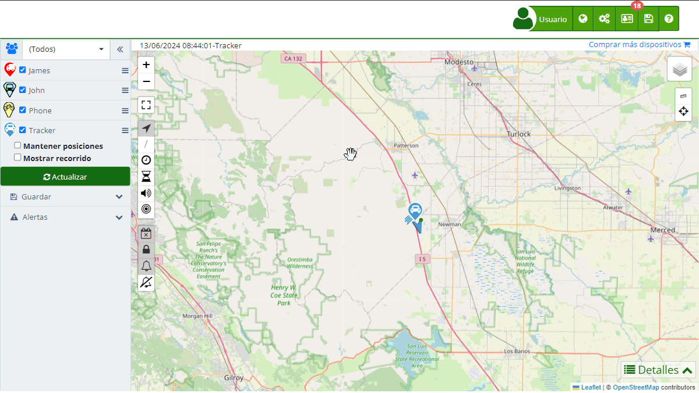

# Resumen de actividades
El [Resumen de Actividades](https://app.plaspy.com/Summary) en Plaspy es una herramienta esencial para monitorizar el comportamiento de los dispositivos rastreados durante un período específico. Esta función permite a los usuarios revisar recorridos, consumo de combustible y otros aspectos importantes de los vehículos o activos que están gestionando.

Para acceder al Resumen de Actividades, sigue estos pasos:

1. Dirígete a la icono  en la parte superior derecha.
2. Selecciona [**Resumen de Actividades**](https://app.plaspy.com/Summary).

#### Campos del Resumen de Actividades

- **Fecha**: Selecciona la fecha o rango de fechas que deseas analizar. Esto permitirá ver todas las actividades realizadas por los dispositivos en el período seleccionado.
- **Grupo**: Permite elegir un grupo específico de dispositivos para filtrar los resultados. Si no seleccionas ninguno, se mostrarán los datos de todos los dispositivos.
- **Dispositivo**: Selecciona el dispositivo específico del cual deseas ver el resumen de actividades. Puedes elegir múltiples dispositivos si es necesario.

#### Instrucciones Paso a Paso

1. **Seleccionar Fecha**: Haz clic en el icono del calendario \(\) para elegir la fecha o rango de fechas que quieres analizar.
2. **Elegir Grupo**: Usa el menú desplegable para seleccionar el grupo de dispositivos que deseas monitorizar.
3. **Seleccionar Dispositivo**: Utiliza la opción de selección múltiple para elegir uno o varios dispositivos específicos.
4. **Actualizar Datos**: Una vez hayas hecho tus selecciones, haz clic en el botón " **Actualizar"** para cargar la información correspondiente en el mapa y los gráficos.
5. **Guardar en Excel**: Si deseas guardar el resumen de actividades, haz clic en el icono de guardar \(\). Esta función permite exportar los datos a un archivo Excel para su posterior análisis.
6. **Notificaciones por Email**: Puedes configurar notificaciones para recibir resúmenes de actividades por correo electrónico. Esto se hace haciendo clic en el botón " **Notificaciones por email"** y llenando los detalles necesarios en la ventana emergente.

#### Interacción a través del Chat Incorporado con IA

En Plaspy, hemos integrado una función innovadora que permite a los usuarios interactuar con el Resumen de Actividades a través de un chat en línea potenciado por inteligencia artificial \(IA\). Esta herramienta proporciona una manera intuitiva y eficiente de obtener información y realizar consultas sobre los datos de tus dispositivos rastreados. A continuación, se describen las capacidades y ventajas de esta funcionalidad:

#### Funcionalidades del Chat Incorporado con IA

1. **Consultas en Tiempo Real:**

    - Puedes hacer preguntas directas sobre el estado actual de tus dispositivos, tales como "¿Cuál es el nivel de combustible del vehículo A?" o "¿Dónde se encuentra el dispositivo B en este momento?"
    - La IA responderá de inmediato con la información más reciente disponible en el sistema.
2. **Solicitar Nueva Información:**

    - Si necesitas generar un reporte específico o analizar un nuevo conjunto de datos, simplemente pide a la IA que lo haga por ti. Por ejemplo, "Genera un resumen de actividades para la última semana" o "Muestra el gráfico de velocidad del dispositivo C."
    - La IA procesará tu solicitud y te proporcionará el resultado deseado.
3. **Exploración Detallada de Datos:**

    - La IA puede desglosar la información contenida en los resúmenes de actividades y presentar datos específicos según tus necesidades. Puedes preguntar "¿Cuántas alertas de velocidad hubo ayer?" o "¿Cuál fue la velocidad máxima registrada hoy?"
    - Esto facilita una comprensión profunda y detallada de los datos sin necesidad de navegar manualmente por múltiples secciones.

#### Beneficios de Usar el Chat con IA

- La interacción directa con los datos a través del chat reduce el tiempo que normalmente tomaría buscar y analizar información.
- No se requieren conocimientos técnicos avanzados para usar esta herramienta. La IA está diseñada para entender y responder en lenguaje natural, facilitando su uso para todos los usuarios.
- Al estar integrada con el sistema de Plaspy, la IA proporciona datos actualizados en tiempo real, asegurando que siempre tengas la información más precisa a tu disposición.

#### Gráficos Generados

El Resumen de Actividades genera varios gráficos que proporcionan una visión detallada del rendimiento y comportamiento de los dispositivos rastreados. A continuación, se describen cada uno de estos gráficos y la información que incluyen:

1. **Mapa de Recorrido**:

    - **Descripción**: Muestra el recorrido realizado por el dispositivo durante el período seleccionado. Los puntos en el mapa indican las paradas.
    - **Datos Incluidos**: Kilómetros recorridos, tiempo en movimiento, número de paradas y consumo de combustible en tanques.
2. **Gráfico de Velocidad**:

    - **Descripción**: Presenta la velocidad del vehículo a lo largo del tiempo durante el período seleccionado.
    - **Datos Incluidos**: Velocidad máxima, velocidad promedio y las fluctuaciones de velocidad a lo largo del tiempo.
3. **Gráfico de Nivel de Combustible**:

    - **Descripción**: Muestra el nivel de combustible en porcentaje a lo largo del tiempo durante el período seleccionado.
    - **Datos Incluidos**: Nivel mínimo y máximo de combustible registrado y las variaciones del nivel de combustible a lo largo del tiempo.
4. **Tiempo en Movimiento**:

    - **Descripción**: Proporciona un desglose del tiempo en que el vehículo estuvo en movimiento, sin movimiento y en ralentí.
    - **Datos Incluidos**: Total de tiempo en movimiento, tiempo sin movimiento y tiempo en ralentí.
5. **Sensor 1**:

    - **Descripción**: Presenta datos específicos del sensor 1, como las veces que fue activado y desactivado.
    - **Datos Incluidos**: Tiempo total activo, tiempo total inactivo, primera activación y última desactivación.
6. **Alertas del Dispositivo**:

    - **Descripción**: Muestra las alertas generadas por el dispositivo durante el período seleccionado.
    - **Datos Incluidos**: Tipo de alerta \(velocidad, geocerca, etc.\), tiempo y fecha de cada alerta, y una descripción detallada de las mismas.

#### Notificaciones por Correo Electrónico

La funcionalidad de notificaciones por correo electrónico en Plaspy permite a los usuarios recibir reportes del resumen de actividades directamente en sus bandejas de entrada. Estas notificaciones pueden configurarse para enviarse diariamente o semanalmente, y se pueden definir los dispositivos o grupos específicos cuyos reportes deseas recibir.

#### Configuración de Notificaciones

1. **Acceder a la Configuración de Notificaciones**:

    - Haz clic en el botón **Notificaciones por email** en la sección de [Resumen de Actividades](https://app.plaspy.com/Summary).
    - Selecciona el botón de "".
2. **Completar los Detalles de la Notificación**:

    - **Nombre**: Introduce un nombre descriptivo para la notificación.
    - **Tipo**: Selecciona si deseas recibir el reporte **Diario** o **Semanal**.
    - **Grupo**: Elige el grupo de dispositivos del cual deseas recibir el reporte. Si deseas recibir reportes de todos los dispositivos, selecciona **\(Todos\)**.
    - **Email**: Ingresa las direcciones de correo electrónico a las que se enviarán los reportes. Puedes ingresar múltiples correos separados por comas o punto y coma.
3. **Guardar la Configuración**:

    - Haz clic en **Aceptar** para guardar la configuración de la notificación.
    - Si deseas cancelar, haz clic en **Cancelar**.

#### Ejemplo de Configuración de Notificaciones

- **Nombre**: Reporte Semanal de Flota
- **Tipo**: Semanal
- **Grupo**: Vehículos Comerciales
- **Email**: gerente@empresa.com, soporte@empresa.com; supervisor@empresa.com

Esta configuración enviará un correo electrónico semanal con el resumen de actividades del grupo "Vehículos Comerciales" a las direcciones de correo especificadas.

#### Validaciones y Restricciones

- **Fechas válidas**: Asegúrate de seleccionar fechas válidas y en el formato correcto para evitar errores en la generación de reportes.
- **Selección de dispositivos**: Si no se selecciona ningún dispositivo, el sistema puede no mostrar datos. Verifica que al menos un dispositivo esté seleccionado para la correcta generación del resumen.
- **Formato de correo electrónico**: Los correos electrónicos deben estar en un formato válido. Si ingresas múltiples correos, sepáralos por comas o punto y coma.

#### Preguntas Frecuentes

- **¿Cómo puedo ver el recorrido de mis vehículos en el mapa?**
    - El recorrido se muestra en el mapa con un trazo rojo, que indica los movimientos del vehículo durante el tiempo seleccionado. Además, se puede ver un resumen detallado de la distancia recorrida, las paradas y el consumo de combustible.
- **¿Puedo recibir notificaciones diarias del resumen de actividades?**

    - Sí, puedes configurar notificaciones para recibir el resumen de actividades por email a diario o en el intervalo de tiempo que prefieras.
- **¿Qué información se incluye en el resumen de actividades exportado a Excel?**

    - El archivo Excel incluye un resumen de las principales actividades y eventos de tu flota, como la velocidad promedio, máxima, distancia recorrida y el conteo de alertas generadas.
- **¿Cómo configuro las notificaciones por correo electrónico para múltiples usuarios?**

    - Ingresa las direcciones de correo electrónico separadas por comas o punto y coma en el campo correspondiente al configurar la notificación.
