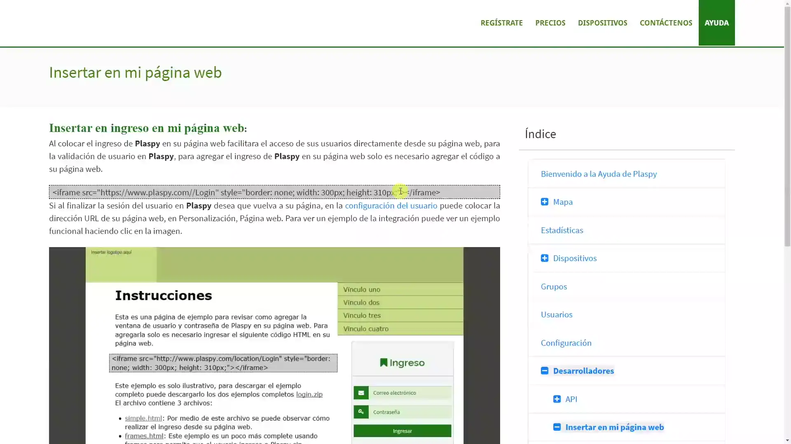

# Insertar en mi página web
Insertar el formulario de ingreso de Plaspy en tu página web puede facilitar el acceso de tus usuarios, permitiéndoles iniciar sesión directamente desde tu sitio. Esto mejora la experiencia del usuario y centraliza el acceso a Plaspy desde tu propia página web. A continuación, se detallan los pasos para agregar el formulario de ingreso de Plaspy utilizando un iframe.

##   
Instrucciones para insertar el iframe

### Paso a Paso

1. **Agregar el código iframe a tu página web:**

    - Copia el siguiente código iframe y pégalo en el lugar de tu página web donde deseas que aparezca el formulario de ingreso de Plaspy.

&lt;iframe src="https://app.plaspy.com/Login" style="border: none; width: 300px; height: 310px;"&gt;&lt;/iframe&gt;
2. **Configurar el retorno a tu página web:**

    - Si deseas que los usuarios regresen a tu página web después de cerrar sesión en Plaspy, puedes configurar la URL de retorno en la sección de personalización de usuario.
    - Ve a la configuración del usuario en Plaspy y añade la dirección URL de tu página web en el campo correspondiente bajo "[*fa-list* Personalización](https://app.plaspy.com/Settings)" y "Página web".

## Consideraciones Finales

- **Personalización:** Asegúrate de que el iframe esté bien integrado en el diseño de tu página web, ajustando el tamaño y el estilo según sea necesario.
- **Seguridad:** Verifica que tu sitio web esté configurado para manejar de manera segura la comunicación con el iframe de Plaspy.
- **Experiencia del Usuario:** Proporciona información clara y accesible para que tus usuarios comprendan que están iniciando sesión en Plaspy a través de tu sitio.

Insertar el formulario de ingreso de Plaspy en tu página web es una manera efectiva de mejorar la experiencia del usuario, permitiéndoles acceder a Plaspy directamente desde tu sitio. Siguiendo los pasos mencionados, puedes integrar fácilmente el formulario de ingreso utilizando un iframe, facilitando así el acceso y gestionando mejor la interacción con tus usuarios.
