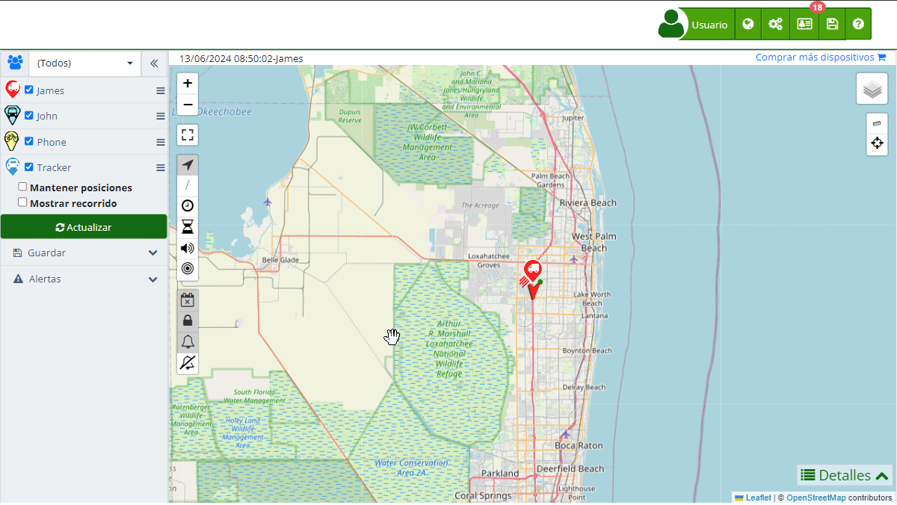

# Activación API
La API \(Interfaz de Programación de Aplicaciones\) es un conjunto de protocolos y herramientas que permiten la comunicación y el intercambio de datos entre diferentes software. Las APIs permiten que las aplicaciones se comuniquen entre sí de manera eficiente y segura, facilitando la integración y el desarrollo de nuevas funcionalidades. En el contexto, la API REST permite a los desarrolladores acceder a las funcionalidades del software desde sus propias aplicaciones o sitios web.

La API REST ofrece a los usuarios la capacidad de realizar integraciones profundas con el sistema, permitiendo personalizar y extender las capacidades de rastreo y monitoreo según las necesidades específicas de cada usuario. A continuación, se explican los pasos para habilitar y utilizar la API REST.

## Activación de la API

Para activar el servicio de API en tu cuenta, es necesario generar una API Key, que servirá como una credencial de acceso a la API REST. A continuación, se describen los pasos necesarios para realizar esta activación:

### Paso a Paso

1. **Acceder a la Sección de Cuenta:**
    - Inicia sesión en tu cuenta y dirígete a la esquina superior derecha.
    - Haz clic en el tu nombre de usuario y selecciona "[*fa-user* Mi cuenta](https://app.plaspy.com/Account)" en el menú desplegable.
    - También puedes acceder directamente a través de este [enlace](https://app.plaspy.com/Account).
2. **Navegar a la Información de la Cuenta:**
    - En la página de cuenta, busca la sección "*fa-user* Información de la cuenta".
    - Dentro de esta sección, localiza el apartado "API Key *fa-question-circle*".
3. **Generar la API Key:**
    - Haz clic en el icono de opciones \(*fa-ellipsis-v*\) ubicado al lado derecho de "API Key".
    - Selecciona la opción "*fa-refresh* Generar" del menú desplegable.
    - Esto generará una nueva llave de acceso que podrás utilizar para integrar la API en tu aplicación o sitio web.
4. **Copia y Guarda la API Key:**
    - Una vez generada la API Key, asegúrate de copiarla y guardarla en un lugar seguro. Esta llave será necesaria para autenticar las solicitudes a la API REST.

### Administración de la API Key

- **Eliminar la API Key:**
    - Si deseas eliminar la API Key, haz clic en el icono de los tres puntos \(*fa-ellipsis-v*\) junto a "API Key" y selecciona "*fa-trash-o* Eliminar". Esto revocará el acceso a cualquier usuario que esté utilizando esta clave.
- **Regenerar la API Key:**
    - Puedes generar una nueva API Key en cualquier momento. Al hacerlo, la clave anterior será invalidada automáticamente y los usuarios que estén usando esa clave perderán acceso inmediatamente.

## Qué es una API y para qué se usa

Una API \(Interfaz de Programación de Aplicaciones\) permite que diferentes aplicaciones se comuniquen entre sí, compartan datos y funcionalidad de manera estructurada. Las APIs son utilizadas para:

- **Integración de Sistemas:** Permitir que diferentes sistemas y aplicaciones trabajen juntos sin problemas.
- **Automatización de Procesos:** Facilitar la automatización de tareas repetitivas entre diferentes sistemas.
- **Extensión de Funcionalidades:** Agregar nuevas funcionalidades a una aplicación existente sin necesidad de modificar el código base.
- **Acceso Remoto:** Permitir el acceso a las funcionalidades de una aplicación desde otra aplicación ubicada en un entorno diferente.

En el caso, la API REST permite a los usuarios acceder a las funcionalidades de monitoreo y rastreo desde sus propias aplicaciones, ofreciendo una forma flexible y poderosa de personalizar y ampliar las capacidades del software.

## Consideraciones Adicionales

- **Uso de la API:** Con la API Key, podrás comenzar a realizar integraciones y desarrollos personalizados utilizando las capacidades del software.
- **Seguridad:** Mantén tu API Key segura y no la compartas con terceros no autorizados. El mal uso de la llave puede comprometer la seguridad de tus datos y los servicios proporcionados por.
- **Administración de Claves:** Recuerda que puedes eliminar o regenerar tu API Key en cualquier momento, lo que invalidará automáticamente la clave anterior y bloqueará el acceso a cualquier usuario que la esté utilizando.

## Conclusión

Habilitar la API es un proceso sencillo que permite a los desarrolladores integrar y personalizar las funcionalidades del software en sus propios dominios. Siguiendo los pasos mencionados, puedes generar una API Key y comenzar a aprovechar todas las ventajas de la integración API REST, permitiendo una integración profunda y flexible con el sistema.
