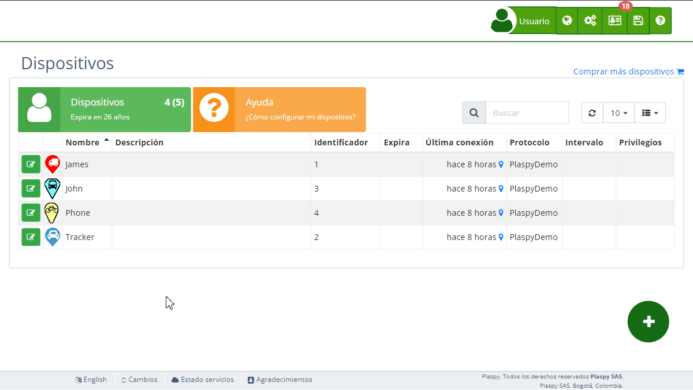

# Configuración
#### Notificaciones

En esta sección puedes especificar los diferentes canales por los cuales deseas recibir las alertas. Las opciones disponibles incluyen notificaciones push, Telegram, correo electrónico, SMS y WhatsApp. A continuación, se describen cada uno de los campos y opciones disponibles:

- **Aplicación móvil \(Push\)**: Activa esta opción para recibir notificaciones push a través de la aplicación móvil de Plaspy. Estas notificaciones aparecerán en la barra de estado de tu dispositivo móvil, similar a otras notificaciones de aplicaciones.
- **Telegram**: Selecciona esta opción para recibir alertas a través de [Telegram](../../settings/telegram_notifications). Debes asegurarte de haber configurado la integración con Telegram en tu cuenta de Plaspy previamente.
- **Correo electrónico**: Marca esta casilla para recibir notificaciones por correo electrónico. Al activarla, se habilitará un campo adicional para ingresar la dirección de correo electrónico donde deseas recibir las alertas.
- **SMS**: Activa esta opción para recibir notificaciones mediante mensajes de texto \([SMS](https://app.plaspy.com/SMS)\). Al seleccionar esta opción, se mostrará un campo adicional donde debes ingresar el número de teléfono en formato internacional \(iniciando con el signo más seguido del código del país y el número\). Es importante contar con saldo en tu cuenta de Plaspy para activar esta opción.
- **WhatsApp**: Selecciona esta opción para recibir notificaciones a través de WhatsApp. Al activar esta opción, se te pedirá ingresar el número de teléfono asociado a tu cuenta de WhatsApp en formato internacional. Al igual que con las notificaciones SMS, es necesario contar con saldo en tu cuenta de Plaspy para activar esta opción.

#### Horario

La configuración de horario permite definir los intervalos de tiempo durante los cuales deseas recibir notificaciones. Esta funcionalidad es útil para evitar recibir alertas fuera de tus horas laborales o durante la noche. A continuación, se describen los campos de esta sección:

- **Activar Horario**: Marca esta opción para habilitar la configuración de horarios específicos para la recepción de notificaciones.
- **Hora de inicio**: Define la hora a partir de la cual deseas empezar a recibir notificaciones. El formato de hora puede variar según la configuración regional de tu cuenta.
- **Hora de finalización**: Establece la hora en la que deseas dejar de recibir notificaciones. Este ajuste te permite limitar la recepción de alertas a un periodo específico del día.
- **Días de la semana**: Selecciona los días de la semana en los que deseas activar la recepción de notificaciones. Puedes elegir uno o varios días según tus necesidades.

#### Condiciones Adicionales

Las **Condiciones Adicionales** permiten especificar criterios adicionales que deben cumplirse para que se genere una alerta. Estas condiciones pueden basarse en diversos parámetros del dispositivo, proporcionando un control detallado sobre cuándo se activan las alertas. Es importante tener en cuenta que todas las condiciones configuradas deben cumplirse simultáneamente para que se active la alerta principal y las alertas adicionales.

**Ejemplo**: Supongamos que deseas recibir una alerta solo si el dispositivo se mueve a más de 80 km/h y está dentro de una zona específica llamada "Área de Control". Configuras la **Velocidad Máxima** a 80 km/h y seleccionas la **Zona Geográfica** "Área de Control". La alerta solo se activará si ambas condiciones se cumplen al mismo tiempo.

**Caso de Uso**: Imagina que gestionas una flota de vehículos y quieres asegurarte de que no excedan los límites de velocidad en zonas escolares. Configuras una alerta principal para detectar el exceso de velocidad y añades condiciones adicionales para que la alerta solo se active si el vehículo se encuentra en una zona escolar y excede los 30 km/h. De esta forma, puedes monitorear y asegurar el cumplimiento de las normativas de seguridad vial en zonas sensibles.

#### Comandos

La sección de **Comandos** permite configurar comandos automáticos que se enviarán al dispositivo cuando se cumplan ciertas condiciones. Estos comandos pueden realizar diversas acciones en el dispositivo, mejorando la respuesta y gestión remota. Los comandos pueden ser enviados por GPRS o SMS según las preferencias del usuario. Además, puedes establecer un retraso en segundos para el envío del comando o programar varios comandos con diferentes fechas y horarios. A continuación, se describen los campos y opciones disponibles:

- **Comando GPRS o SMS**: Especifica un comando que se enviará automáticamente al dispositivo cuando se active la alerta. Este comando puede ser utilizado para controlar remotamente ciertas funciones del dispositivo. Puedes seleccionar el comando de una lista de comandos disponibles para el rastreador.
- **Retraso en segundos**: Establece un retraso en segundos para el envío del comando después de que se haya activado la alerta. Esto puede ser útil si deseas dar tiempo al dispositivo para realizar otras acciones antes de ejecutar el comando.
- **Programar varios comandos**: Permite configurar varios comandos que se enviarán en diferentes momentos. Cada comando puede tener un horario específico de envío, proporcionando una mayor flexibilidad en la gestión de los dispositivos.

**Ejemplo**: Si configuras una alerta para cuando un vehículo excede los 100 km/h, puedes programar un comando para que corte el motor del vehículo 10 segundos después de que se active la alerta. También puedes programar un segundo comando para enviar una notificación al conductor 5 segundos después de que se active la alerta, advirtiéndole sobre la velocidad excesiva.

**Caso de Uso**: Considera un escenario donde administras una flota de camiones que transportan mercancías valiosas. Configuras una alerta para cuando un camión se detiene durante más de 10 minutos en un área no autorizada. Al activarse la alerta, envías automáticamente un comando para bloquear el motor del camión después de un retraso de 60 segundos, y otro comando para notificar al equipo de seguridad de la empresa sobre la situación.

#### Avanzado

La sección **Avanzado** dentro de la edición de alertas en Plaspy proporciona opciones adicionales para la configuración detallada y específica de alertas, permitiendo a los usuarios tener un control más granular sobre cómo y cuándo se generan y envían las notificaciones. Estas configuraciones avanzadas son ideales para usuarios que necesitan personalizar alertas de manera precisa y compleja.

- **Zona horaria:** Este campo permite seleccionar la zona horaria que se utilizará para las alertas. Esto asegura que todas las notificaciones y eventos se registren de acuerdo con la hora local del usuario. Es especialmente útil para usuarios que administran dispositivos en diferentes ubicaciones geográficas.
- **Usar texto sin formato:** Esta opción, cuando está marcada, envía las notificaciones de alerta en formato de texto simple en lugar de HTML. Es útil para sistemas que no soportan HTML o cuando se prefiere un formato de mensaje más sencillo.
- **Alerta crítica, Resaltar en el mapa:** Al seleccionar esta opción, la alerta se resaltará en el mapa, destacando su importancia. Esto ayuda a identificar rápidamente alertas críticas que requieren atención inmediata.
- **Notificar cuando termina la alerta:** Al activar esta opción, se enviará una notificación cuando la condición de la alerta haya finalizado. Es útil para mantener informados a los usuarios no solo del inicio, sino también del fin de un evento.
- **Título de la alerta cuando termina:** Aquí se puede especificar un título personalizado para la notificación que se enviará cuando termine la alerta. Esto permite una identificación clara y personalizada de cada alerta.
- **Notificar solo cuando finaliza la alerta:** Esta opción, si está seleccionada, asegurará que solo se enviará una notificación al final del evento de la alerta, en lugar de múltiples notificaciones durante su curso.
