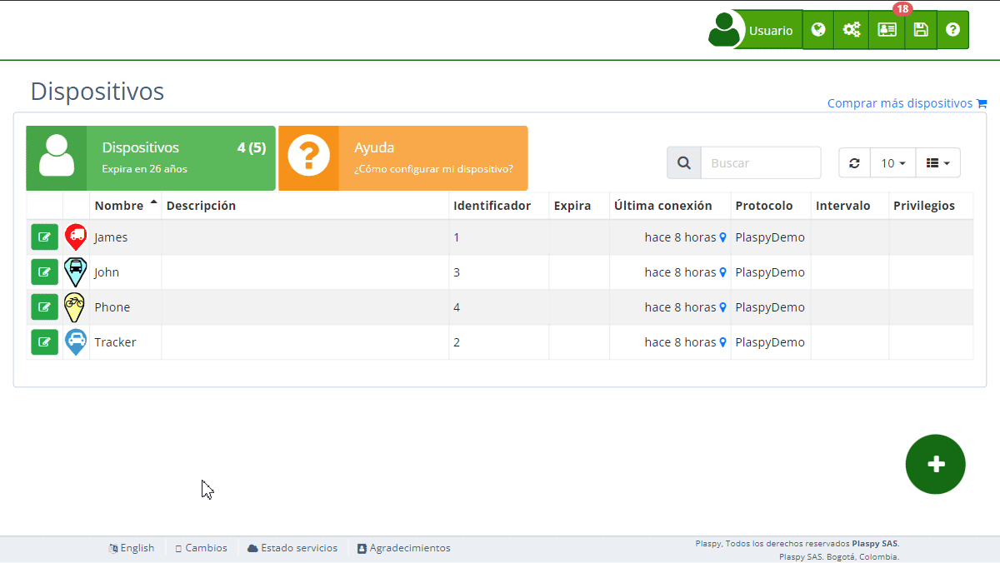

# Alertas
La sección de Alertas en Plaspy permite a los usuarios configurar notificaciones para diversos eventos relacionados con sus [dispositivos](https://app.plaspy.com/Devices) de rastreo. Estas alertas son fundamentales para mantener un seguimiento efectivo y recibir información en tiempo real sobre situaciones importantes, como movimientos inesperados, desconexiones del rastreador, o entrada y salida de zonas de control.

## Descripción General

Las alertas en Plaspy son notificaciones configurables que se envían a los usuarios para informarles sobre eventos específicos relacionados con sus dispositivos de rastreo. Estas alertas pueden ayudar a monitorear de manera eficiente los dispositivos, asegurando que se reciban avisos en tiempo real sobre cualquier evento importante.

### Funcionalidades de las Alertas

- **Nombre de la Alerta**: Permite identificar de manera descriptiva la alerta configurada.
- **Notificación por Email**: Envía una notificación a las direcciones de correo electrónico especificadas.
- **Notificación Push**: Envía una notificación push a la aplicación móvil.
- **Notificación por Telegram**: Envía una notificación a través de [Telegram](../../my_account/telegram_accounts).
- **Notificación por WhatsApp**: Envía una notificación a través de WhatsApp.
- **Notificación por SMS**: Envía una notificación por mensaje de texto.
- **Resaltar**: Resalta la alerta en la interfaz de usuario para una fácil identificación.
- **Programar**: Permite configurar la alerta para que solo se active en ciertos días o horas.

### Botones y Funciones

- **Agregar Alerta**: Para crear una nueva alerta, haz clic en el botón de agregar alerta \(*fa-plus*\). Se abrirá un formulario donde podrás ingresar los detalles de la nueva alerta.
- **Editar Alerta**: Para editar una alerta existente, haz clic en el ícono de edición \(*fa-pencil*\) junto a la alerta que deseas modificar. Se abrirá un formulario donde podrás actualizar los detalles de la alerta.
- **Eliminar Alerta**: Para eliminar una alerta, haz clic en el ícono de eliminación \(*fa-trash*\) junto a la alerta que deseas eliminar. Confirma la eliminación para completar el proceso.

## Instrucciones Paso a Paso

### Crear una Nueva Alerta

1. Selecciona el [dispositivo](https://app.plaspy.com/Devices) para el cual deseas configurar una alerta.
2. Haz clic en el botón de agregar alerta *fa-plus*.
3. Completa los campos necesarios en el formulario que se abre:
    - **Nombre de la Alerta**: Introduce un nombre descriptivo para la alerta.
    - **Email**: Ingresa la dirección de correo electrónico para recibir la notificación.
    - **Notificación por Email, Push, Telegram, WhatsApp y SMS**: Activa o desactiva según tus preferencias.
    - **Resaltar**: Activa si deseas resaltar la alerta en la interfaz.
    - **Programar**: Configura los días y horas en que la alerta debe estar activa.
4. Haz clic en "Aceptar" para crear la alerta.

### Editar una Alerta Existente

1. Selecciona el [dispositivo](https://app.plaspy.com/Devices) para el cual deseas editar una alerta.
2. Haz clic en el ícono de edición \(*fa-pencil*\) junto a la alerta que deseas modificar.
3. Realiza los cambios necesarios en el formulario que se abre.
4. Haz clic en "Aceptar" para actualizar la alerta.

### Eliminar una Alerta

1. Selecciona el [dispositivo](https://app.plaspy.com/Devices) para el cual deseas eliminar una alerta.
2. Haz clic en el ícono de eliminación \(*fa-trash*\) junto a la alerta que deseas eliminar.
3. Confirma la eliminación para completar el proceso.

## Importancia de las Alertas

Las alertas son esenciales para mantener un monitoreo constante y recibir información oportuna sobre cualquier evento relevante que ocurra con tus dispositivos de rastreo. Configurar adecuadamente las alertas te permitirá reaccionar rápidamente ante cualquier situación, mejorando así la seguridad y eficiencia de la gestión de tus activos.
