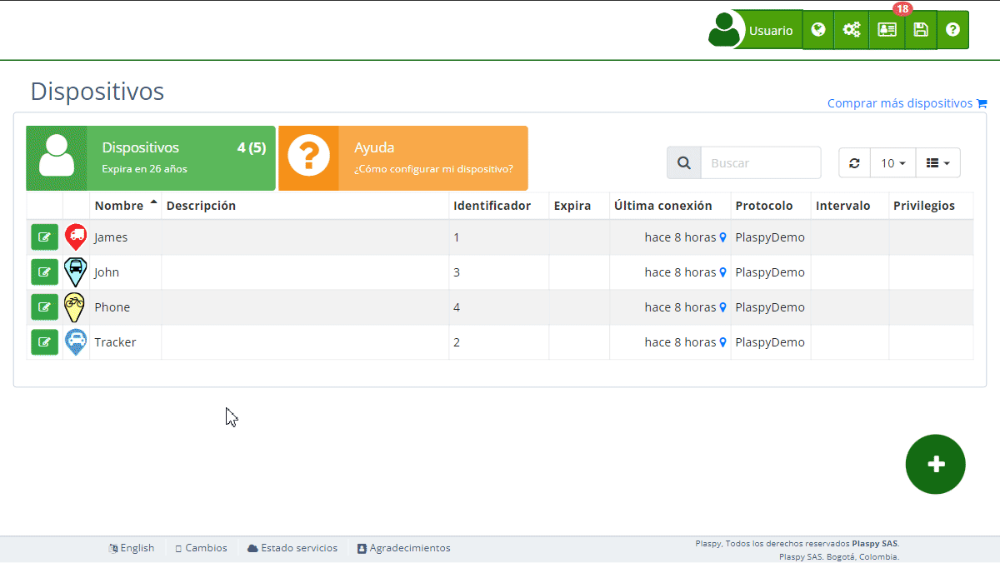

---
---
# Tipos
En Plaspy, la configuración de alertas en los dispositivos permite a los usuarios monitorear y gestionar diversos eventos y situaciones que puedan ocurrir con sus activos. A continuación, se detallan los tipos de alertas disponibles y cómo se pueden configurar para un seguimiento efectivo.

Una vez en la [sección de alertas](../../devices/alerts), puede agregar nuevas alertas seleccionando el tipo de alerta que mejor se adapte a sus necesidades. Es importante destacar que las geo-cercas y los puntos de control se dibujan directamente en el mapa, facilitando la visualización y gestión de las áreas monitoreadas.

#### Atributos

Los [atributos](../../map/atributes) son características no estándar que reportan ciertos dispositivos, y no son comunes a todas las ubicaciones. Estos atributos pueden variar entre dispositivos y su disponibilidad depende de la compatibilidad y configuración del hardware. Las alertas basadas en atributos permiten una monitorización avanzada y específica. A continuación se presentan las alertas disponibles en esta categoría:

- **Atributo de ubicación igual a:** Esta alerta se activa cuando un atributo específico del dispositivo, diferente a los estándares de ubicación, coincide con un valor predefinido. Esto es útil para monitorear características únicas del dispositivo, como el estado de una entrada digital específica o el nivel de voltaje en un sensor análogo.
- **Atributo de ubicación es mayor a:** Esta alerta se desencadena cuando el valor de un atributo no estándar del dispositivo supera un umbral establecido. Puede ser utilizada para monitorear condiciones críticas donde un aumento en valores específicos, como temperatura o voltaje, es relevante.
- **Atributo de ubicación es menor a:** Similar a la alerta anterior, pero se activa cuando el valor del atributo no estándar del dispositivo es menor que el umbral definido. Ideal para rastrear disminuciones en valores específicos, como el nivel de combustible o el voltaje de la batería.

#### Combustible

Las alertas relacionadas con el combustible son esenciales para mantener un control riguroso sobre el consumo y la seguridad del vehículo. A continuación se presentan las alertas disponibles en esta categoría:

- **Disminución del combustible \(%\):** Envía una alerta cuando el porcentaje de combustible disminuye más de un porcentaje predefinido. Es esencial para detectar fugas o consumos anómalos de combustible en tiempo real.
- **Disminución del combustible 2 \(%\):** Similar a la alerta anterior, pero aplicada a un segundo tanque de combustible o un segundo sistema de monitoreo de combustible. Útil en vehículos con tanques múltiples.
- **Aumento del combustible \(%\):** Esta alerta se activa cuando hay un incremento en el nivel de combustible que supera un porcentaje especificado. Es útil para verificar recargas de combustible y asegurar que no haya errores en el llenado.
- **Aumento del combustible 2 \(%\):** Monitorea el aumento en el segundo sistema de combustible, enviando una alerta cuando el incremento excede el porcentaje establecido.
- **Combustible menor a \(%\):** Envía una alerta cuando el nivel de combustible cae por debajo de un nivel específico. Crucial para evitar que los vehículos queden sin combustible.
- **Combustible 2 menor a \(%\):** Similar a la alerta anterior, pero para el segundo tanque de combustible. Garantiza que todos los sistemas de combustible estén monitoreados adecuadamente.

#### General

Las alertas de la categoría General cubren una amplia gama de eventos que pueden afectar la operación y seguridad del vehículo. Estas alertas son esenciales para el monitoreo diario y la gestión eficiente de la flota. A continuación se presentan las alertas disponibles en esta categoría:

- **Autenticación fallida:** Envía una alerta cuando hay un intento de autenticación fallido en el sistema. Esto puede indicar intentos no autorizados de acceder al dispositivo o sistema.
- **Voltaje de la batería menor a:** Se activa cuando el voltaje de la batería del vehículo es menor a un valor específico. Esto ayuda a prevenir problemas relacionados con baterías descargadas que pueden afectar el funcionamiento del vehículo.
- **Botón SOS:** Envía una alerta cuando se presiona el botón SOS. Este tipo de alerta es crucial para situaciones de emergencia donde se requiere asistencia inmediata.
- **Fecha vencida:** Envía una alerta cuando se supera una fecha programada, como el vencimiento de seguros o mantenimientos. Esto garantiza que los vehículos se mantengan al día con sus obligaciones legales y de mantenimiento.
- **Minutos en ralentí:** Indica el tiempo total que el vehículo ha permanecido en estado de ralentí. Esta alerta ayuda a monitorear y reducir el consumo innecesario de combustible y el desgaste del motor.
- **Kilometraje alcanzado \(Km\):** Envía una alerta cuando se alcanza un [kilometraje](../../map/mileage_calculation) específico. Esto es útil para programar mantenimientos basados en el uso del vehículo.
- **Batería baja:** Se activa cuando el nivel de batería alcanza un mínimo predefinido. Ayuda a garantizar que los dispositivos no se queden sin energía inesperadamente.
- **Dispositivo fuera de línea:** Se activa cuando el dispositivo se desconecta de los servidores por algún motivo y permanece fuera de conexión durante un tiempo específico. Esto es importante para detectar problemas de conectividad.
- **Límite de RPMs:** Define el máximo de RPM \(Revoluciones Por Minuto\) permitido para el motor. Ayuda a prevenir el sobrecalentamiento y el desgaste excesivo del motor.
- **Velocidad menor a \(Km/h\):** Define la velocidad mínima permitida en Km/h. Es útil para monitorear vehículos que deben mantener una velocidad mínima en ciertos tramos.
- **Minutos sin movimiento:** Envía una alerta cuando el vehículo permanece sin movimiento durante un tiempo específico. Esto puede ser útil para detectar inactividad no planificada o problemas de seguridad.
- **Límite de velocidad \(Km/h\):** Define la velocidad máxima permitida en Km/h. Ayuda a prevenir el exceso de velocidad y mejora la seguridad del vehículo.
- **Vibración:** Envía una alerta cuando se activa el G-Sensor del rastreador, indicando posibles movimientos bruscos o impactos.

#### GPS

Las alertas relacionadas con el GPS son esenciales para garantizar la correcta operación y monitoreo de los dispositivos de rastreo. A continuación se presentan las alertas disponibles en esta categoría:

- **GPS Apagado:** Envía una alerta cuando el GPS del dispositivo está apagado. Esto es crucial para asegurar que el rastreo se realice continuamente.
- **Rastreador Desconectado:** Envía una alerta cuando el rastreador se desconecta de la fuente de energía. Ayuda a detectar posibles intentos de sabotaje o fallas en el sistema de energía.
- **GPS sin señal:** Notifica cuando el GPS del dispositivo pierde señal. Esto puede ocurrir en áreas con poca cobertura satelital y es importante para asegurar la continuidad del monitoreo.

#### Sensores

Las alertas relacionadas con los sensores permiten una monitorización detallada de los diferentes estados y entradas del vehículo. Estas alertas son esenciales para mantener un control riguroso sobre la funcionalidad y el estado del vehículo. A continuación se presentan las alertas disponibles en esta categoría:

- **Tiempo acumulado activo de la entrada digital 1:** Se activa cuando el tiempo acumulado de la entrada digital 1 en estado activo es mayor a un valor predefinido. Es útil para monitorear el uso prolongado de ciertos sistemas eléctricos del vehículo.
- **Tiempo acumulado activo de la entrada digital 2:** Similar a la alerta anterior, pero aplicada a la segunda entrada digital. Permite un monitoreo detallado de varios sistemas.
- **Tiempo acumulado activo de la entrada digital 3:** Esta alerta se activa bajo las mismas condiciones que las anteriores, pero para la tercera entrada digital. Ayuda a identificar posibles problemas o usos inadecuados.
- **Tiempo acumulado activo de la entrada digital 4:** Monitorea el tiempo acumulado en estado activo de la cuarta entrada digital. Es ideal para vehículos con múltiples sistemas que requieren supervisión.
- **Entrada digital 1, ACC desactivada:** Envía una alerta cuando se desactiva la entrada digital del encendido ACC \(Access Control Center\). Es crucial para saber cuándo el vehículo ha sido apagado.
- **Entrada digital 2 desactivada:** Similar a la alerta anterior, pero aplicada a la segunda entrada digital. Permite monitorear varios puntos de entrada digital en el vehículo.
- **Entrada digital 3 desactivada:** Envía una alerta cuando se desactiva la tercera entrada digital. Es útil para vehículos con múltiples entradas digitales.
- **Entrada digital 4 desactivada:** Se activa cuando la cuarta entrada digital es desactivada. Ideal para monitorear el estado de diferentes sistemas del vehículo.
- **Entrada digital 1, ACC activado:** Envía una alerta cuando se activa la entrada digital del encendido ACC. Es útil para saber cuándo el vehículo ha sido encendido.
- **Entrada digital 2 activada:** Similar a la alerta anterior, pero para la segunda entrada digital. Permite monitorear varios puntos de entrada.
- **Entrada digital 3 activada:** Esta alerta se activa cuando la tercera entrada digital es activada. Ayuda a mantener un control sobre múltiples sistemas del vehículo.
- **Entrada digital 4 activada:** Se activa cuando la cuarta entrada digital es activada. Útil para vehículos con sistemas complejos que requieren monitoreo detallado.
- **Tiempo activo de la entrada digital 1:** Monitorea el tiempo activo de la primera entrada digital, enviando una alerta cuando este tiempo supera un valor específico. Es crucial para el control de sistemas que no deben estar activados por períodos prolongados.
- **Tiempo activo de la entrada digital 2:** Similar a la alerta anterior, pero aplicada a la segunda entrada digital. Ayuda a mantener un control sobre varios sistemas.
- **Tiempo activo de la entrada digital 3:** Envía una alerta cuando el tiempo activo de la tercera entrada digital es mayor a lo esperado. Ideal para detectar anomalías en el funcionamiento de los sistemas del vehículo.
- **Tiempo activo de la entrada digital 4:** Monitorea el tiempo activo de la cuarta entrada digital, enviando una alerta si este supera el umbral establecido. Es útil para vehículos con múltiples sistemas que requieren supervisión.

#### Temperatura

Las alertas relacionadas con la temperatura son esenciales para mantener un control sobre las condiciones operativas del vehículo, especialmente en entornos donde la temperatura puede afectar el rendimiento y la seguridad. A continuación se presentan las alertas disponibles en esta categoría:

- **Temperatura mayor a:** Envía una alerta cuando la temperatura del vehículo o de un componente específico sube por encima de un nivel predefinido. Esto es crucial para evitar el sobrecalentamiento y el daño a los componentes del vehículo.
- **Temperatura menor a:** Esta alerta se activa cuando la temperatura baja por debajo de un nivel específico. Es útil en situaciones donde las bajas temperaturas pueden afectar el funcionamiento del vehículo.
- **Temperatura 2 mayor a:** Similar a la alerta de temperatura mayor, pero aplicada a un segundo sensor de temperatura. Es ideal para vehículos con sistemas que requieren monitoreo de múltiples puntos de temperatura.
- **Temperatura 2 menor a:** Monitorea la segunda temperatura, enviando una alerta cuando baja por debajo de un nivel predefinido. Es útil para vehículos con múltiples áreas sensibles a la temperatura.

### Zonas Permitidas

Esta alerta se configura para asegurarse de que un dispositivo permanezca dentro de un área designada. Es útil para gestionar activos que deben operar dentro de límites geográficos específicos, como equipos en un sitio de construcción o vehículos dentro de una zona industrial. Cuando el dispositivo sale de la zona permitida, se envía una alerta inmediata.

### Zonas Prohibidas

La alerta de zonas prohibidas se utiliza para evitar que los dispositivos entren en áreas restringidas. Por ejemplo, puede configurarse para que un vehículo no entre en zonas peligrosas o no autorizadas. Esta alerta ayuda a prevenir accesos no autorizados y posibles incidentes de seguridad.

### Puntos de Control

Los puntos de control son ubicaciones específicas donde se necesita monitorear la presencia de un dispositivo. La alerta se activa cuando el dispositivo llega a o sale de un punto de control. Esto es útil para asegurar que los vehículos o activos lleguen a puntos críticos en su ruta, como paradas de carga o descarga.

### Zonas de Control

Las zonas de control son áreas más amplias que los puntos de control y se utilizan para monitorear la presencia del dispositivo en áreas geográficas mayores. Estas alertas son esenciales para gestionar la logística y asegurarse de que los activos se mantengan dentro de los límites operacionales permitidos.

### Rutas

La alerta de rutas permite verificar que un dispositivo siga el camino correcto durante un recorrido. Si el vehículo se desvía del trayecto esperado, el sistema envía una notificación inmediata para avisar que no está siguiendo la ruta planificada. Esta función es ideal para confirmar que los desplazamientos se realizan como deben y que cada equipo llega a los lugares indicados sin salirse del camino.
