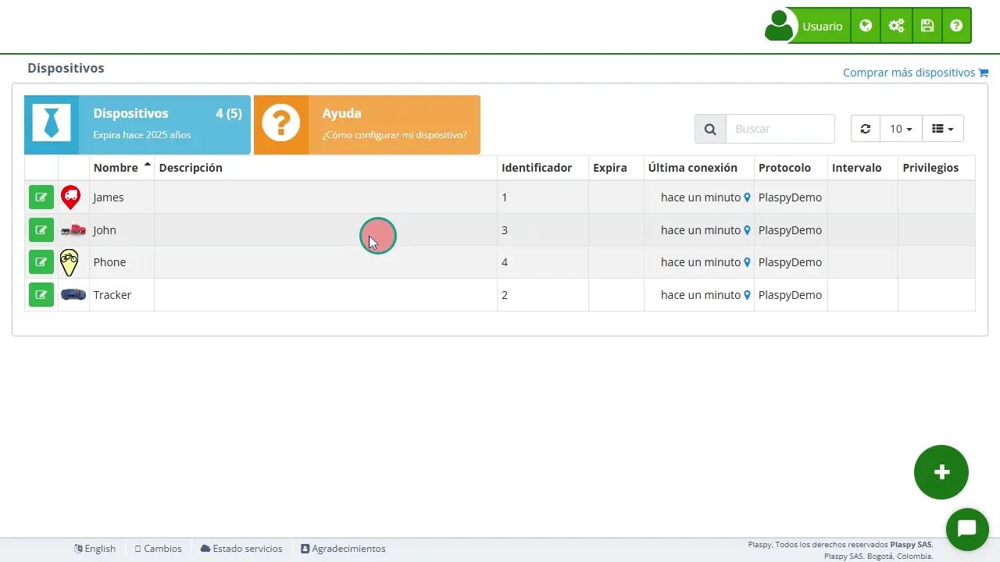

# Certificados
El **Certificado de un dispositivo** es un documento oficial que confirma que un dispositivo GPS está activo dentro del servicio de rastreo satelital, indicando datos esenciales como el nombre del usuario registrado, el modelo del equipo, su identificador, la fecha de inicio del servicio, el tiempo de uso acumulado y la vigencia actual de la cuenta. Este certificado puede entregarse a terceros para comprobar que el dispositivo se encuentra correctamente registrado y monitoreado.

## Paso a paso para generar el certificado

1. **Selecciona el dispositivo:** 
En el [panel de dispositivos](.)*fa-external-link*, elige el equipo del cual deseas obtener el certificado.
2. **Accede a la sección de Información:** 
Una vez seleccionado, aparecerá un menú con los datos principales del dispositivo y haces click en el apartado de "*fa-info-circle* **Información**".
3. **Haz clic en "*fa-print* C** **ertificado"** **:** 
Se encuentra ubicado en la parte de inferior izquierda. Solo debes pinchar ahí.
4. **Generación automática y guardado:** 
El sistema creará el certificado inmediatamente con toda la información relevante del dispositivo y podrá ser impresa o guardada.
