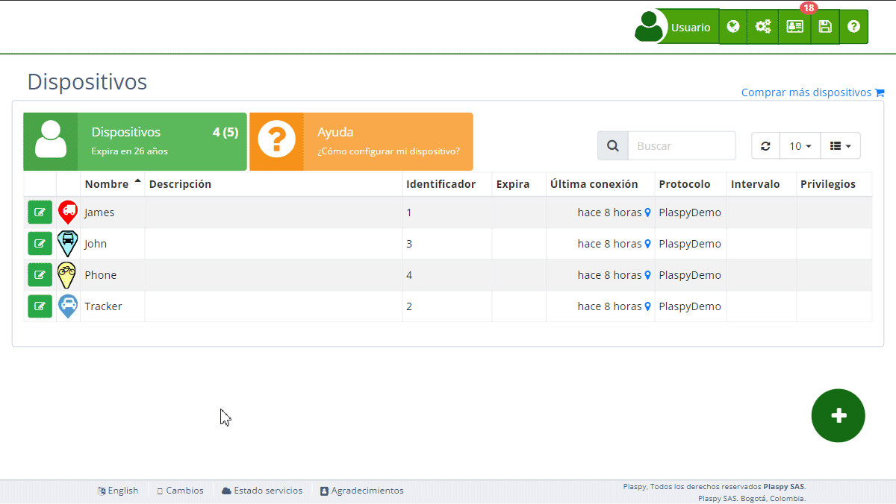

# Comandos
La sección de Comandos permite a los usuarios configurar los comandos disponibles para sus [dispositivos](https://app.plaspy.com/Devices) de rastreo. Esta configuración es fundamental para preparar los dispositivos para acciones específicas que se pueden ejecutar posteriormente desde el mapa. agrega automáticamente los comandos predeterminados del rastreador, pero los usuarios pueden modificarlos según sus necesidades.

## Descripción de Campos

- **Nombre del comando**: Este campo muestra el nombre del comando que se configurará para el dispositivo. Puede ser una acción específica como "Cortar energía" o "Restaurar energía".
- **Código del comando**: Este campo contiene el código exacto que el dispositivo reconocerá para ejecutar la acción correspondiente.
- **Tipo de comando**: Indica el tipo de comando que se está configurando \(SMS, GPRS, Llamadas\).

## Tipos de Comandos

- **Comandos SMS**: Estos comandos se envían como mensajes de texto SMS al dispositivo de rastreo. Si el usuario tiene saldo de SMS, los comandos se enviarán des. Si no, se enviarán desde la aplicación móvil utilizando el plan de telefonía móvil del usuario.
- **Comandos GPRS**: Estos comandos se envían a través de la red de datos GPRS. Son útiles para dispositivos con conexión a internet, permitiendo una comunicación más rápida y eficiente.
- **Comandos de Llamadas**: Estos comandos activan una llamada telefónica al dispositivo. La llamada se abrirá desde la aplicación predeterminada del teléfono con el número de teléfono configurado en el rastreador.

## Acceder a la Sección de Comandos

1. Navega a la sección "[Dispositivos](https://app.plaspy.com/Devices)" desde el panel principal.
2. Selecciona el dispositivo para el cual deseas configurar los comandos.
3. Haz clic en la opción "*fa-code* Comandos" para expandir esta sección y ver los comandos disponibles.

## Instrucciones Paso a Paso

### Configurar un Comando para el Dispositivo

1. Selecciona el dispositivo de la lista de [dispositivos](https://app.plaspy.com/Devices).
2. En la sección "*fa-code* Comandos", localiza el comando que deseas configurar.
3. Revisa el nombre, el código del comando y el tipo de comando para asegurarte de que es el correcto.
4. Haz clic en "Aceptar" para guardar la configuración del comando para el dispositivo.

### Ejemplo: Configurar el Comando "Cortar Energía"

1. Selecciona el dispositivo de la lista de dispositivos.
2. En la sección "*fa-code* Comandos", encuentra el comando "Cortar energía".
3. Verifica que el código del comando sea "stop123456" y que el tipo de comando sea SMS.
4. Haz clic en "Aceptar" para configurar el comando para el dispositivo.

### Deshabilitar Comandos

1. Selecciona el dispositivo de la lista de dispositivos.
2. En la sección "*fa-code* Comandos", identifica el comando que deseas deshabilitar.
3. Haz clic en la opción para deshabilitar el comando. Esto evitará que el comando aparezca en el mapa.
4. Haz clic en "Aceptar" para aplicar los cambios.

### Restaurar Comandos Predeterminados

1. Selecciona el dispositivo de la lista de dispositivos.
2. En la sección "*fa-code* Comandos", borra todos los comandos configurados.
3. automáticamente volverá a agregar los comandos predeterminados del rastreador.
4. Haz clic en "Aceptar" para confirmar la restauración de los comandos predeterminados.

### Guardar Comandos como Plantilla

1. Selecciona el dispositivo de la lista de dispositivos.
2. Configura los comandos necesarios.
3. Busca el campo llamado "**Guardar comandos como**".
4. Asigna un nombre a la plantilla y guarda en el botón "*fa-save*". Esta plantilla podrá aplicarse a otros dispositivos posteriormente para agregar los comandos desde la lista de comandos predeterminados.

### Consultar Comandos Enviados

1. Navega a la sección "Dispositivos" desde el panel principal.
2. Selecciona el dispositivo del cual deseas consultar los comandos enviados.
3. Haz clic en el enlace "Comandos enviados" para ver el historial de comandos enviados, incluyendo cuándo, quién los envió y el estado de los comandos.

## Preguntas Frecuentes

- **¿Qué son los comandos ?**
 - Los comandos son instrucciones específicas que se configuran para ser enviadas a los dispositivos de rastreo desde el mapa.
- **¿Cómo sé qué comandos están disponibles para mi dispositivo?**
 - La lista de comandos disponibles se muestra en la sección "*fa-code* Comandos" de cada dispositivo. Revisa esta lista para ver todas las acciones que puedes configurar.
- **¿Qué debo hacer si un comando no funciona?**
 - Si un comando no funciona, verifica que el código del comando sea correcto y que el dispositivo esté encendido y conectado. Si el problema persiste, contacta al soporte técnico.
- **¿Puedo agregar nuevos comandos?**
 - Los comandos disponibles dependen de las capacidades del dispositivo de rastreo. Si necesitas agregar un nuevo comando, consulta la documentación del dispositivo o contacta al soporte técnico para obtener ayuda.
- **¿Qué tipos de comandos se pueden configurar ?**
 - **SMS**: Mensajes de texto enviados al dispositivo.
 - **GPRS**: Comandos enviados a través de la red de datos.
 - **Llamadas**: Inician una llamada telefónica al dispositivo.
- **¿Cómo se envían los comandos en texto plano o hexadecimal?**
 - Los comandos pueden configurarse en texto plano, si el rastreador lo soporta, o en formato hexadecimal, por ejemplo, 0x686F6C61 para enviar "hola". Ambas opciones son soportadas por.
