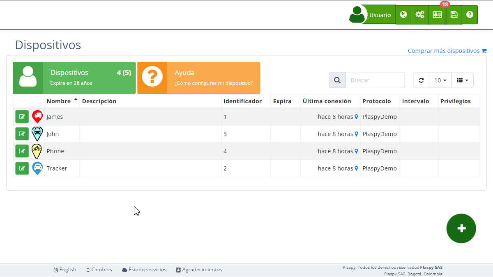

# Historial
La funcionalidad de historial de [dispositivos](https://app.plaspy.com/Devices) permite a los usuarios revisar y restaurar configuraciones anteriores de sus dispositivos de seguimiento. Esta herramienta es esencial para mantener un control detallado y solucionar problemas que puedan surgir debido a cambios recientes. Acceder al historial de un dispositivo es sencillo y proporciona una vista completa de todas las modificaciones realizadas, permitiendo restaurar el estado del dispositivo a cualquier fecha específica.

Para acceder al historial de un dispositivo:

1. Ve a la sección "[Dispositivos](https://app.plaspy.com/Devices)" desde el panel principal.
2. Selecciona el dispositivo cuyo historial deseas consultar.
3. Haz clic en el botón "*fa-list*Historial" para desplegar el menú con las fechas disponibles.
4. Selecciona la fecha de interés para ver el estado del dispositivo en ese momento y, si es necesario, restaurarlo.

#### Descripción de Campos

- **Historial**: Al seleccionar la opción de historial, se despliega un menú con las fechas de las modificaciones realizadas en el dispositivo. Esto permite consultar y restaurar configuraciones anteriores.
- **Fecha y Hora**: Cada entrada en el historial muestra la fecha y hora exacta en que se realizó una modificación. Esto es útil para identificar cuándo se hicieron cambios específicos y por quién.
- **Detalles de Modificación**: Incluye información detallada sobre los cambios realizados, como ajustes de configuración, comandos enviados, y alteraciones en los sensores o alertas.

#### Instrucciones Paso a Paso

1. **Acceder al Historial**:

 - En el panel principal, navega a "[Dispositivos](https://app.plaspy.com/Devices)".
 - Selecciona el dispositivo cuyo historial deseas revisar.
 - Haz clic en el botón "*fa-list*Historial" para abrir el menú de fechas.
2. **Consultar el Historial**:

 - En el menú desplegable, selecciona la fecha específica que deseas consultar.
 - Revisa los detalles del dispositivo en esa fecha para entender los cambios realizados.
3. **Restaurar una Configuración Anterior**:

 - Selecciona la fecha deseada en el historial.
 - Haz clic en la opción de "*fa-undo* restaurar" para revertir el dispositivo a ese estado.
 - Confirma la restauración para aplicar los cambios.

#### Validaciones y Restricciones

- **Acceso**: Solo los usuarios con permisos adecuados pueden acceder y modificar el historial de los dispositivos.
- **Consistencia de Datos**: Al restaurar un estado anterior, se debe asegurar que la información es consistente y no afecta negativamente la operación del dispositivo.
- **Restricciones de Restauración**: Algunas configuraciones pueden no ser reversibles si implican cambios críticos en la infraestructura o el hardware del dispositivo.

#### Preguntas Frecuentes 

- **¿Qué puedo ver en el historial de un dispositivo?**

 - En el historial, puedes ver todas las modificaciones realizadas al dispositivo, incluyendo ajustes de configuración, comandos enviados y alteraciones en los sensores o alertas.
- **¿Cómo puedo restaurar un dispositivo a un estado anterior?**

 - Accede al historial del dispositivo, selecciona la fecha deseada y utiliza la opción de restaurar para revertir el dispositivo a ese estado.
- **¿Quién puede acceder al historial de dispositivos?**

 - Solo los usuarios con los permisos adecuados pueden acceder y modificar el historial de los dispositivos.

Esta funcionalidad es crucial para la gestión efectiva de dispositivos, permitiendo a los administradores mantener un control detallado y asegurar la continuidad operacional sin problemas.
