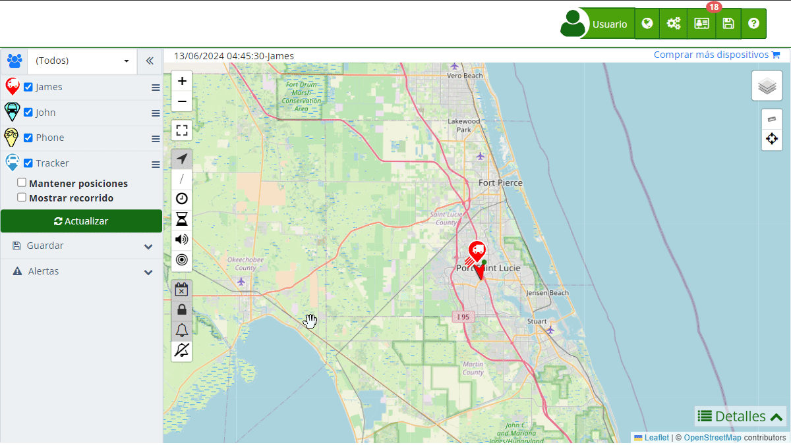

# Dispositivos
La sección de [Dispositivos](https://app.plaspy.com/Device) en Plaspy te permite gestionar y monitorear los dispositivos de seguimiento satelital asociados a tu cuenta. Desde aquí, puedes agregar nuevos rastreadores, ver el estado de los actuales, y configurar diversas opciones para cada uno. Esta funcionalidad es esencial para mantener un control preciso y actualizado de los vehículos, activos o personas que estás monitoreando. Para acceder a esta sección, navega a "[Dispositivos](https://app.plaspy.com/Devices)" desde el panel principal.

Plaspy detecta automáticamente qué tipo de dispositivo está conectado en su cuenta, y esta información puede variar según el dispositivo. Algunos ejemplos de tipos de dispositivos son: Android, IOS, Xexun, TK103, Wanway GS900, Boxtrack, entre otros. Esta detección se basa en el protocolo de comunicación que utiliza el rastreador y no necesariamente coincide con la marca y el modelo del dispositivo.

**Solo para teléfonos:** Es necesario descargar nuestra [App](../mobile_application) Plaspy desde la tienda de aplicaciones de tu dispositivo móvil. Una vez abierta la aplicación, ingresa a tu cuenta o regístrate en Plaspy, de esta manera agregarás nuevos dispositivos a tu servicio de rastreo. La aplicación Plaspy para teléfonos ofrece opciones adicionales como tiempo de transmisión, la posibilidad de rastrear el teléfono, o utilizar la aplicación para mantener seguimiento y control de otros dispositivos. La aplicación tendrá los permisos sobre tu cuenta desactivados por defecto, y es necesario que autorices los permisos que se ajusten al perfil deseado. Los perfiles los puedes crear y configurar en la opción de asignación al dispositivo o usuario.

## Descripción de Campos

- **Nombre**: Este campo representa el nombre del dispositivo y es utilizado para identificarlo fácilmente dentro de la lista de dispositivos. Asegúrate de usar un nombre descriptivo y único para facilitar su identificación.
- **IMEI o Identificador**: El IMEI \(International Mobile Equipment Identity\) o identificador único del dispositivo es crucial para su correcta configuración y comunicación con el sistema Plaspy. Este código suele tener 15 dígitos, aunque algunos rastreadores usan los últimos 11.
- **Descripción**: Aquí puedes ingresar información adicional que describa al dispositivo, como su ubicación, tipo de vehículo o cualquier detalle relevante.
- **marker_icon](marker_icon)**: Permite seleccionar un icono específico que representará al dispositivo en el mapa. Esto ayuda a diferenciar visualmente entre distintos tipos de dispositivos.
- **[Información](information)**: Incluye detalles sobre la fecha de creación del dispositivo, última conexión, protocolo usado, número de teléfono asociado, y texto del marcador.
- **[Sensores](sensors)**: Aquí puedes configurar y monitorear los diferentes sensores asociados al dispositivo, como kilometraje, consumo de combustible, y capacidad del tanque.
- **[Reasignar sensores digitales](reassign_digital_sensors)**: Opción para reasignar entradas digitales del dispositivo a diferentes funciones o propósitos.
- **commands](commands)**: Permite enviar comandos personalizados al dispositivo, ya sea por GPRS o SMS, y ver el historial de comandos enviados.
- **[Recordatorios](reminders)**: Función para programar alertas o avisos que llegarán por correo electrónico basados en fechas específicas o kilometraje, por ejemplo, fecha del cambio de aceite.
- **[Alertas](alerts)**: Configuración de notificaciones que se activan según eventos específicos definidos por el usuario.
- **limits](limits)**: Establece límites diarios para el envío de emails y SMS desde el dispositivo.

## Instrucciones Paso a Paso

### Agregar un Nuevo Dispositivo

1. Accede a la sección "[Dispositivos](https://app.plaspy.com/Devices)" desde el panel principal.
2. Haz clic en el botón verde con el simbolo "" en la parte inferior derecha
3. Rellena los campos requeridos:
    - **Nombre**: Introduce un nombre descriptivo para el dispositivo.
    - **IMEI o Identificador**: Ingresa el número IMEI del dispositivo.
    - **Descripción**: Añade cualquier información adicional relevante.
4. Selecciona un marcador si lo deseas para diferenciar visualmente el dispositivo en el mapa.
5. Configura los sensores y comandos según tus necesidades.
6. Programa recordatorios y alertas si es necesario.
7. Establece límites de emails y SMS diarios.
8. Haz clic en "Aceptar" para guardar la configuración del dispositivo.

### Editar un Dispositivo Existente

1. En la lista de [dispositivos](https://app.plaspy.com/Devices), selecciona el dispositivo que deseas editar haciendo clic en el ícono de edición \(\) ubicado al lado de su nombre.
2. Realiza los cambios necesarios en los campos disponibles.
3. Haz clic en "Aceptar" para guardar los cambios.

### Eliminar un Dispositivo

1. En la lista de [dispositivos](https://app.plaspy.com/Devices), selecciona el dispositivo que deseas editar haciendo clic en el ícono de edición \(\) ubicado al lado de su nombre.
2. Haz clic en " Eliminar" en la esquina inferior izquierda.
3. Confirma la eliminación del dispositivo.

### Agregar un Teléfono Móvil

1. Descarga e instala la [aplicación móvil](../mobile_application) de Plaspy desde la tienda de aplicaciones de tu dispositivo móvil.
2. Abre la aplicación y accede a tu cuenta de Plaspy.
3. Navega a la sección de agregar dispositivo dentro de la aplicación móvil.
4. Sigue las instrucciones en pantalla para agregar tu teléfono móvil como un dispositivo de seguimiento.

## Validaciones y Restricciones

- **Nombre**: Campo obligatorio. Debe ser único y descriptivo.
- **IMEI o Identificador**: Campo obligatorio. Debe contener un número válido de 15 o 11 dígitos.
- **Descripción**: Campo opcional, pero recomendado para un mejor seguimiento y organización.
- **Marcador**: Selección opcional para facilitar la identificación visual.
- **Comandos**: Al enviar comandos, asegúrate de que sean compatibles con el protocolo del dispositivo.
- **Límites**: Configura límites realistas para evitar exceder la capacidad diaria de emails y SMS.

## Preguntas Frecuentes

- **¿Qué es el IMEI y por qué es importante?**
    - El IMEI \(International Mobile Equipment Identity\) es un número único que identifica un dispositivo móvil. Es crucial para la configuración y comunicación con el sistema de seguimiento de Plaspy, asegurando que los datos enviados y recibidos correspondan al dispositivo correcto.
- **¿Puedo cambiar el nombre de un dispositivo después de agregarlo?**
    - Sí, puedes editar el nombre y otros detalles del dispositivo en cualquier momento desde la sección de Dispositivos.
- **¿Cómo puedo agregar un nuevo marcador personalizado?**
    - Al seleccionar la opción de [marcador](marker_icon), puedes elegir entre los íconos disponibles o subir uno nuevo desde tu equipo para personalizar la visualización en el mapa.
- **¿Qué tipo de alertas puedo configurar?**
    - Puedes configurar [alertas](alerts) para eventos específicos como cuando el dispositivo se desconecta, cruza una zona de control, o necesita mantenimiento. Estas alertas se pueden recibir por correo electrónico, notificaciones push, Telegram, entre otros.
- **¿Cómo agrego un teléfono móvil como dispositivo de seguimiento?**
    - Los teléfonos móviles solo se pueden agregar directamente desde la [aplicación móvil](../mobile_application) de Plaspy. Descarga la aplicación desde la tienda de aplicaciones de tu dispositivo móvil y sigue las instrucciones para agregar el teléfono como dispositivo.
