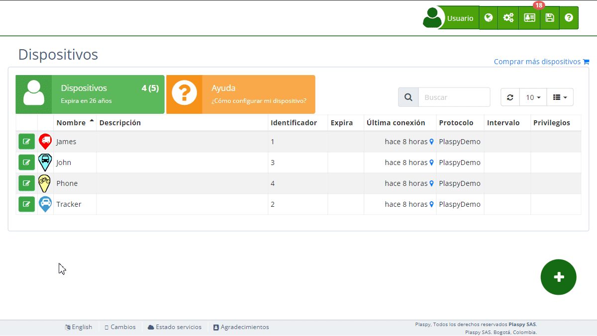

# Información
La sección de Información del [dispositivo](https://app.plaspy.com/Devices) proporciona detalles clave sobre el estado y las características del dispositivo seleccionado. Esta información es crucial para el monitoreo efectivo y la gestión de cada dispositivo en tu cuenta. Aquí encontrarás datos como la fecha de creación del dispositivo, su última conexión, el protocolo utilizado, el número de teléfono asociado, entre otros.

## Descripción de Campos

- **Creación**: Este campo muestra la fecha y hora en que el dispositivo fue añadido a tu cuenta. Esta información es útil para llevar un registro del tiempo que el dispositivo ha estado en uso.
- **Última conexión**: Indica la fecha y hora de la última vez que el dispositivo se conectó a la red. Esto te ayuda a verificar si el dispositivo está activo y funcionando correctamente.
- **Protocolo**: Muestra el protocolo de comunicación que utiliza el dispositivo. detecta automáticamente el protocolo, pero si hay protocolos similares o compatibles con tu dispositivo, aparecerá una lista de protocolos compatibles. Normalmente, detecta el protocolo de los rastreadores y no es necesario modificarlo en la mayoría de los casos.
- **Número de teléfono**: Si tu dispositivo está asociado a un número de teléfono, esta sección mostrará el número correspondiente. Este número es crucial para dispositivos que envían y reciben datos a través de redes móviles.
- **Texto del marcador**: Información adicional que se mostrará en el marcador del dispositivo en el mapa. Puedes utilizar este campo para agregar notas importantes o información específica que necesites visualizar rápidamente.
- ***fa-list* Etiquetas**: Permite al usuario ingresar etiquetas personalizadas que describan información relevante del dispositivo, como su ubicación, tipo de vehículo, o notas sobre el mantenimiento. Las etiquetas ayudan a organizar y controlar mejor tus dispositivos.
- ***fa-print* Certificado **: Genera un certificado oficial para el dispositivo, indicando información relevante que puedes entregar a terceros para mostrar que el dispositivo está siendo rastreado por.
- ***fa-bug* Depurar Dispositivo**: Esta opción permite revisar la conexión del rastreador en tiempo real. La información se muestra en bruto, y si es posible, en formato de texto. Si no es posible, se mostrará en formato hexadecimal, por ejemplo, 0x686F6C61 para información binaria.

## Acceder a la Sección de Información del Dispositivo

1. Navega a la sección "[*fa-cogs* Dispositivos](https://app.plaspy.com/Device)" desde el panel superior derecho pinchando en el icono *fa-cogs*.
2. Selecciona el dispositivo del cual deseas ver la información.
3. Haz clic en la opción "Información" para expandir esta sección y ver los detalles relevantes.

## Paso a Paso: Verificar Información del Dispositivo

### Ver la Fecha de Creación

1. Selecciona el dispositivo en la lista de [dispositivos](https://app.plaspy.com/Devices).
2. En la sección de "*fa-info-circle* Información", busca el campo etiquetado como "Creación".
3. Aquí verás la fecha y hora exacta en que el dispositivo fue añadido a tu cuenta.

### Verificar la Última Conexión

1. Selecciona el dispositivo en cuestión.
2. Dentro de la sección "*fa-info-circle* Información", localiza el campo "Última conexión".
3. Este campo te mostrará cuándo el dispositivo se conectó por última vez, lo cual es útil para asegurarte de que esté operativo.

### Consultar el Protocolo Utilizado

1. Selecciona el [dispositivo](https://app.plaspy.com/Devices) desde la lista.
2. Expande la sección "*fa-info-circle* Información" y encuentra el campo "Protocolo".
3. Verás el protocolo que el dispositivo utiliza para comunicarse. Si hay protocolos similares o compatibles, aparecerá una lista de opciones. Normalmente, no es necesario modificar el protocolo detectado por.

### Revisar el Número de Teléfono Asociado

1. Selecciona el dispositivo deseado.
2. En la sección "*fa-info-circle* Información", busca el campo "Número de teléfono".
3. Aquí se mostrará el número de teléfono asociado al dispositivo, si aplica.

### Ver el Texto del Marcador

1. Selecciona el dispositivo en la lista.
2. En la sección "*fa-info-circle* Información", localiza el campo "Texto del marcador".
3. Aquí puedes agregar o editar el texto que se mostrará en el marcador del dispositivo en el mapa.

### Añadir y Administrar Etiquetas

1. Selecciona el dispositivo desde la lista.
2. Expande la sección "*fa-list* Etiquetas".
3. Ingresa las etiquetas que describen información relevante del dispositivo, como "Cliente Juan", "Paga cada mes", etc.
4. Haz clic en "Guardar" para aplicar las etiquetas al dispositivo.

### Generar un Certificado 

1. Selecciona el dispositivo desde la lista.
2. En la sección de "*fa-info-circle* Información".
3. Haz clic en "*fa-print* Certificado".
4. El certificado incluirá información relevante del dispositivo y estará listo para ser entregado a terceros.

### Depurar un Dispositivo

1. Selecciona el dispositivo desde la lista.
2. En la sección de "*fa-info-circle* Información".
3. Haz clic en "*fa-bug* Depurar dispositivo".
4. La conexión del rastreador se revisará en tiempo real, mostrando la información en bruto. Si es posible, la información se mostrará en formato de texto; de lo contrario, se mostrará en formato hexadecimal.

## Preguntas Frecuentes

- **¿Por qué es importante la fecha de creación del dispositivo?**
 - Conocer la fecha de creación te ayuda a llevar un registro del tiempo que el dispositivo ha estado en uso y a planificar mantenimientos o reemplazos.
- **¿Qué debo hacer si la última conexión del dispositivo es antigua?**
 - Si la última conexión es antigua, verifica el estado del dispositivo, la cobertura de red y asegúrate de que esté encendido y correctamente configurado.
- **¿Cómo sé si el protocolo del dispositivo es correcto?**
 - El protocolo debe coincidir con el tipo de dispositivo y su configuración. detecta automáticamente el protocolo y, en la mayoría de los casos, no es necesario modificarlo.
- **¿Qué hago si el número de teléfono no es correcto?**
 - Si el número de teléfono asociado no es correcto, edita la configuración del dispositivo y actualiza el número. Asegúrate de que el dispositivo esté utilizando el número correcto para la transmisión de datos.
- **¿Cómo puedo utilizar el texto del marcador?**
 - El texto del marcador te permite añadir notas visibles directamente en el marcador del dispositivo en el mapa, lo que puede facilitar la identificación rápida y la gestión de los dispositivos.
- **¿Cómo me ayudan las etiquetas?**
 - Las etiquetas te permiten organizar y describir mejor tus dispositivos, facilitando su administración y control.
- **¿Qué es el Certificado y para qué sirve?**
 - El Certificado es un documento que puedes generar para mostrar a terceros que el dispositivo está siendo rastreado por. Incluye información relevante del dispositivo.
- **¿Qué significa depurar un dispositivo?**
 - Depurar un dispositivo implica revisar su conexión en tiempo real, mostrando la información en bruto. Esto puede ayudarte a identificar problemas de conexión o configuración.
