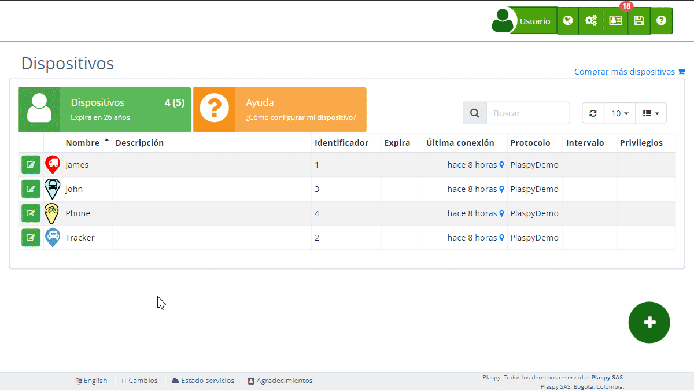

# Personalizar marcador
Cambiar el ícono del marcador en Plaspy te permite personalizar cómo se representan visualmente tus [dispositivos](https://app.plaspy.com/Devices)en el mapa. Esto puede ser particularmente útil para diferenciar entre diferentes tipos de dispositivos o para ajustar la vista del mapa a tus necesidades específicas.

## Accediendo a la Configuración del Ícono del Marcador

1. Navega a la sección "[Dispositivos](https://app.plaspy.com/Devices)" desde el panel principal superior derecho en "".
2. Selecciona el dispositivo para el cual deseas cambiar el ícono del marcador con el icono de edición \(\), junto al nombre del dispositivo.
3. Haz clic en el campo "Marcador" en la configuración del dispositivo. Esto abrirá la ventana de selección de íconos de marcador.

## Elegir un Nuevo Ícono de Marcador

### Pasos para Seleccionar un Ícono de Marcador Predefinido

1. **Selección de Ícono**: En la ventana de selección de íconos de marcador, verás varios íconos mostrados en un formato de cuadrícula.
2. **Navegar por los Íconos**: Desplázate por los íconos disponibles. Los íconos están categorizados según diferentes formas y colores.
3. **Seleccionar Ícono**: Haz clic en el ícono que deseas utilizar. El ícono seleccionado se resaltará.
4. **Confirmar Selección**: Haz clic en "Aceptar" o el botón equivalente para confirmar tu selección. El nuevo ícono ahora representará tu dispositivo en el mapa.

### Personalización de Colores del Ícono

1. **Color del Ícono**: Debajo de la cuadrícula de selección de íconos, hay opciones para personalizar el color del ícono.
    - Localiza la sección "Ícono".
    - Usa el selector de color para elegir un nuevo color para el ícono.
    - El color seleccionado se aplicará al ícono.
2. **Color del Texto**: De manera similar, puedes personalizar el color del texto que aparece dentro o junto al ícono.
    - Localiza la sección "Texto".
    - Usa el selector de color para elegir un nuevo color de texto.
    - El color seleccionado se aplicará al texto en el ícono.

### Añadir Texto al Ícono

1. **Campo de Texto**: Puedes añadir texto al ícono para una mayor personalización.
    - Localiza el campo "Texto".
    - Ingresa el texto deseado \(hasta 8 caracteres\).
    - El texto aparecerá en el ícono.

### Tipos de Íconos

1. **Íconos 3D**: Estos íconos tienen una apariencia tridimensional y pueden rotar en 3D.
2. **Íconos 2D**: Estos íconos rotan desde una perspectiva superior.
3. **Íconos Estáticos**: Estos íconos están fijos en posición y se ven desde un lado.
4. **Íconos Predeterminados**: Íconos estándar proporcionados por el sistema.

Cambia entre los tipos de íconos haciendo clic en las pestañas respectivas en la parte superior de la ventana de selección de íconos.

### Subir Íconos Personalizados

1. **Iconos 2D y Estáticos**: Además de seleccionar íconos predefinidos, puedes subir tus propios íconos personalizados del tipo 2D y estáticos.
2. **Subir Ícono**:
    - Navega a la pestaña correspondiente a íconos 2D o estáticos.
    - Haz clic en el botón "Subir Ícono".
    - Selecciona el archivo de ícono desde tu dispositivo. Asegúrate de que el archivo esté en un formato compatible \(por ejemplo, PNG o SVG\).
    - Una vez subido, el nuevo ícono aparecerá en la lista de íconos disponibles.
3. **Seleccionar y Confirmar**: Selecciona tu ícono personalizado de la lista y haz clic en "Aceptar" para aplicarlo al dispositivo.

## Guardar los Cambios

1. Después de seleccionar y personalizar tu ícono de marcador, haz clic en el botón "Aceptar" para guardar los cambios.
2. El nuevo ícono de marcador se mostrará ahora en el mapa para el dispositivo seleccionado.

## Preguntas Comunes

- **¿Puedo subir un ícono de marcador personalizado?**
    - Sí, Plaspy permite subir íconos personalizados del tipo 2D y estáticos. Sigue los pasos mencionados para subir y aplicar tu ícono personalizado.
- **¿Qué pasa si cambio de opinión sobre el ícono?**
    - Puedes cambiar el ícono del marcador tantas veces como desees. Simplemente sigue los pasos anteriores para seleccionar un nuevo ícono.
- **¿Cómo ayuda el texto en el ícono?**
    - Añadir texto al ícono puede ayudar a identificar rápidamente dispositivos específicos en el mapa, especialmente cuando se trata de múltiples dispositivos.
